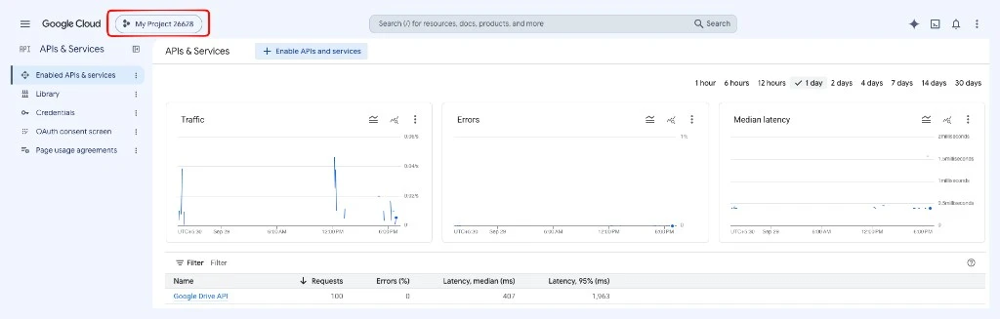
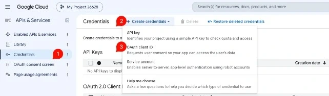
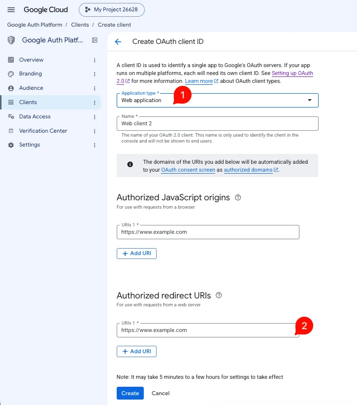
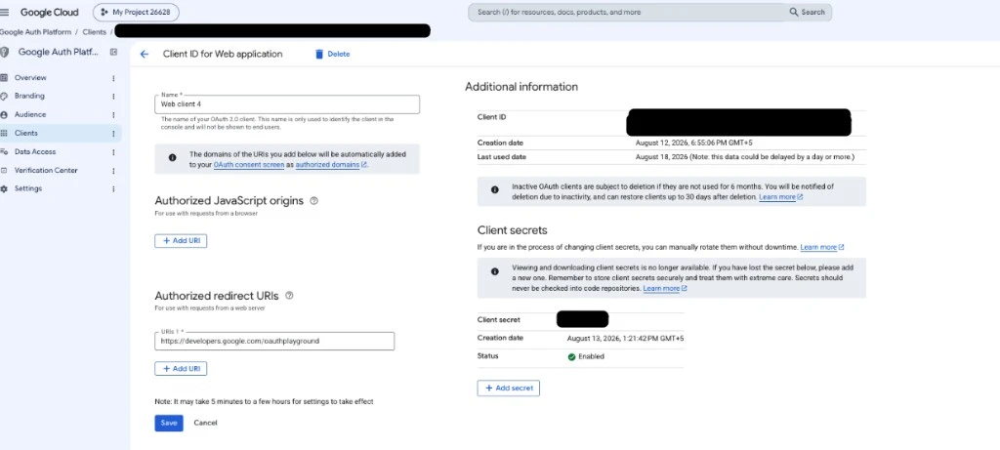
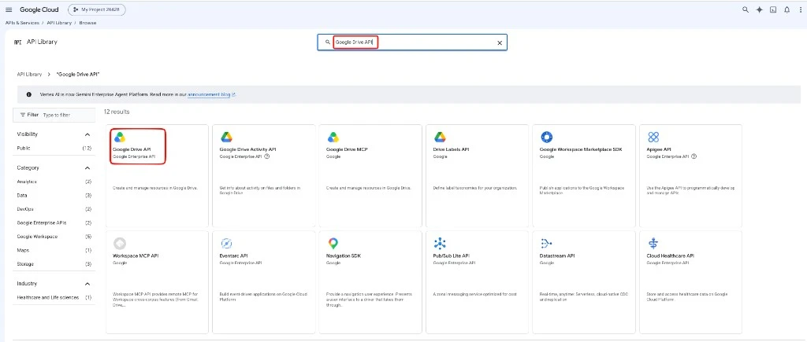
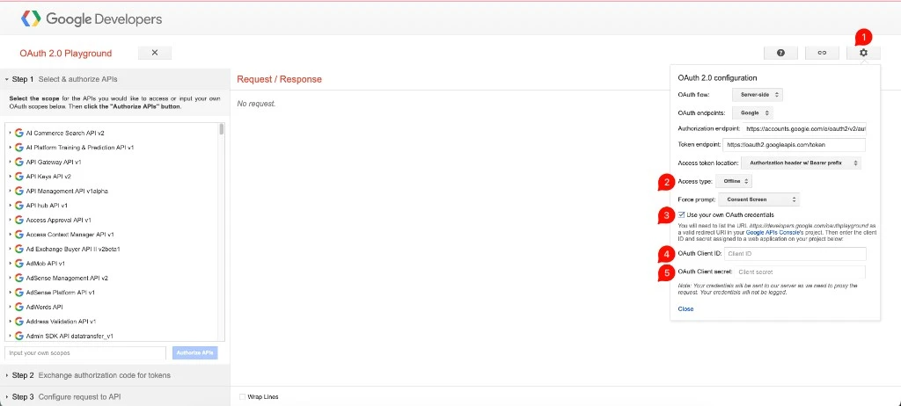
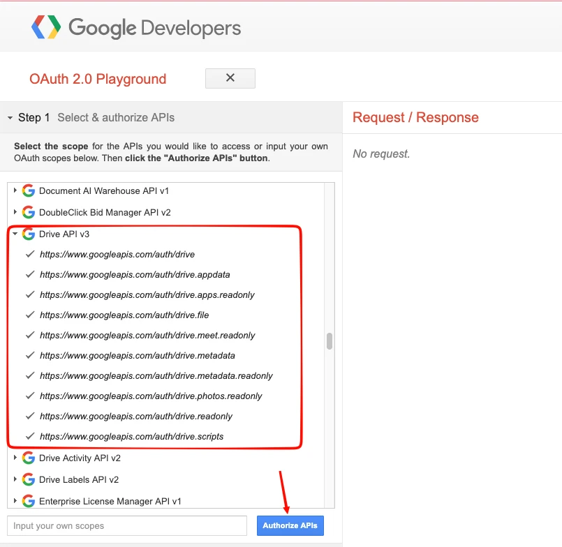
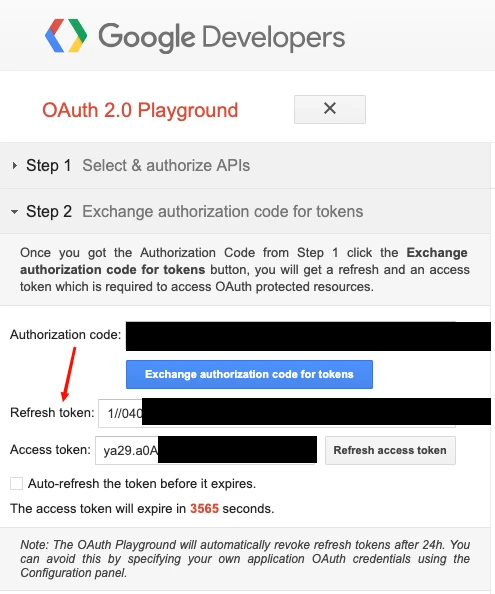

Google Docs (EXT:ns_googledocs) needs a Google Client ID, Client Secret and Refresh Token to read the Docs in your Google account. Create them once, then enter them in the [Global Settings](/ExtNsGoogleDocs/NSGoogleDocsModule/Index#global-settings) of the extension.

1. Open the Google Cloud console: https://console.developers.google.com
2. Create a new project or select an existing one.

   

3. Open **Credentials**, click **Create credentials** and choose **OAuth client ID**.

   

4. Select the application type **Web application** and add `https://developers.google.com/oauthplayground` under **Authorized redirect URIs**.

   

5. Google creates your **Client ID** and **Client Secret**.

   

6. Open **Library**, search for **Google Drive API**, select it and click **Enable**.

   

7. Open the OAuth 2.0 Playground: https://developers.google.com/oauthplayground/
8. Open the settings (gear icon), tick **Use your own OAuth credentials** and enter your Client ID and Client Secret.

   

9. In **Step 1**, enter this scope in **Input your own scopes** (or tick only this scope under **Drive API v3**) and click **Authorize APIs**:

   ```text
   https://www.googleapis.com/auth/drive.readonly
   ```

   The extension makes only two Google Drive calls: it lists the Google Docs files in your Drive and exports a Doc as HTML. Read-only access is enough, so do not select the other Drive scopes.

   

   Sign in with the Google account that owns or can read the Docs, and click **Allow**.

10. In **Step 2**, click **Exchange authorization code for tokens**. Copy the **Refresh token** (it starts with `1//`). Do not copy the **Access token**.

    

Enter the Client ID, Client Secret and Refresh Token in the [Global Settings](/ExtNsGoogleDocs/NSGoogleDocsModule/Index#global-settings) of EXT:ns_googledocs.

## Refresh token validity

### Access token and refresh token

The OAuth Playground shows two tokens:

| Token | Valid for | Do you need it? |
| --- | --- | --- |
| **Access token** | About **1 hour**. The Playground shows a countdown. | No. The extension requests a new access token from Google for every request. |
| **Refresh token** | No fixed expiry (see the cases below) | Yes. Enter it in the Global Settings. |

The countdown in the Playground is for the access token only. When it reaches zero, the extension keeps working. You do not need to generate a new token.

### When the refresh token stops working

Google stops accepting the refresh token in these cases:

| Case | When the token stops working |
| --- | --- |
| OAuth consent screen with user type **External** and publishing status **Testing** | **7 days** after it was created |
| Token not used | After **6 months** without use |
| Access removed in your Google account (**Security › Third-party apps & services**) | Immediately |
| More than 100 refresh tokens for the same Google account and Client ID | The oldest token stops working when a new one is created |

To avoid the 7-day limit, set the publishing status to **In production** in the Google Cloud console (**Google Auth Platform › Audience**, in older consoles **OAuth consent screen**). The 24-hour limit mentioned in the OAuth Playground does not apply, because you use your own OAuth credentials (step 8).

### Generate a new refresh token

When the refresh token has stopped working, the Google Docs module lists no Docs or shows an error.

1. Repeat steps 7 to 10 above to get a new refresh token.
2. Replace the old value in **Google Refresh Token** in the [Global Settings](/ExtNsGoogleDocs/NSGoogleDocsModule/Index#global-settings) and save.

Your Client ID and Client Secret stay the same.
