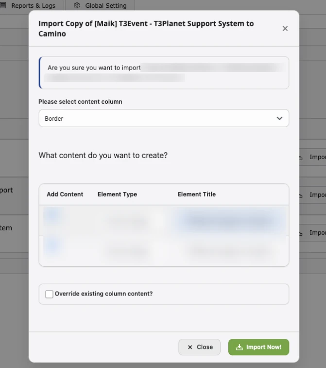

Make sure your Google account is connected ([Global Settings](/ExtNsGoogleDocs/NSGoogleDocsModule/Index#global-settings)) and your licence is active.

## Three ways to start an import

1. **Google Docs module:** select a page in the page tree, open the **Import Google Docs** tab and click **Import Now** next to a Doc.
2. **Page or List module:** open a page and click the **Import Google Docs** button in the toolbar (DocHeader).
3. **Page tree context menu:** right-click a page and choose **Import Google Docs**. This **creates a new subpage** named after the Doc and imports the content into it.

## The import dialog

1. **Choose the Doc** (when you started from the toolbar button or context menu). Use the search to find it.
2. **Wait for the sections to load.** The **Import** button stays disabled until the Doc has been read.
3. **Review the sections.** Each [Heading 1 / Heading 2 section](/ExtNsGoogleDocs/PrepareGoogleDocWithMarkers/Index) is one row:

   | Column | Description |
   | --- | --- |
   | **Add Content** | Tick to import this section, untick to skip it |
   | **Element Type** | Header, Text Element, Text & Image or Image Only (preselected from the [extension configuration](#extension-configuration), default Text & Image) |
   | **Element Title** | The header of the element. You can edit it |

4. **Choose the content column** of the page. Only columns that accept the selected element types are offered. A page with a single column shows "Content".
5. **Override existing column content?** Tick to replace the column's content (see the [warning below](#override-existing-column-content-warning)). Leave it unticked to add the new elements after the existing ones.
6. Click **Import**.

After a successful import you are taken to the Page module (List module for news), and the page cache is cleared, so the content appears on the frontend straight away.

## Element types

| Element Type | TYPO3 content element | Title | Text | Images |
| --- | --- | --- | --- | --- |
| **Header** | Header | Section title | Not imported | Not imported |
| **Text Element** | Text | Section title | Section content | Inline in the text |
| **Text & Image** | Text & Images | Section title | Section content | Attached to the element (media field) |
| **Image Only** | Images | Section title | Not imported | Attached to the element (media field) |

The **Image Setting** values from Global Settings (alignment, enlarge on click, number of columns) are applied to Text & Image and Image Only elements. The **Publish Status** applies to every created record.

## Import into blog posts (EXT:blog)

Select a blog post page and import like a normal page.

## Import into news (EXT:news)

1. Select the **news storage folder** in the page tree.
2. Start the import and confirm **Import News**.
3. One news record is created per Doc: the title is the Doc name, the body text is the Doc content with its images, and the record is visible or hidden according to **Publish Status**.

Importing into news requires EXT:news to be installed and active.

## Override existing column content: warning

<Warning>

When **Override existing column content?** is ticked, **all** content elements in the selected column of that page are **permanently deleted** before the import, including elements that were not created by an import. This cannot be undone from the Recycler. Take a backup first if you are unsure.

</Warning>

## Images

- Images from the Doc are copied to `fileadmin/ns_googledocs/`.
- Importing the same Doc again creates new copies of its images.
- Images that cannot be downloaded are skipped, and the import continues.

## Extension configuration

- TYPO3 14: **System › Settings › Extension Configuration › ns_googledocs**
- TYPO3 12 and 13: **Admin Tools › Settings › Extension Configuration › ns_googledocs**

| Setting | Description | Default |
| --- | --- | --- |
| **Default content element type** (`googleDocsContentElementType`) | Element type preselected for each section in the import dialog: Header, Text Element, Text & Image or Image Only | Text & Image |
