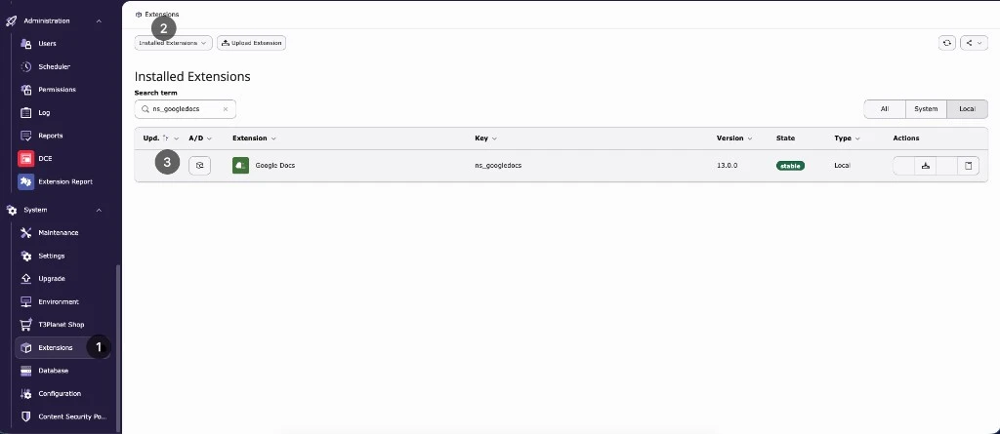

Google Docs version 14 is a premium extension. There is no free installation path: imports only work with a valid license that matches your domain.

## Requirements

| Requirement | Version |
| --- | --- |
| TYPO3 | 12.4, 13.4 or 14 |
| PHP | 8.1 or newer |
| EXT:ns_license (T3Planet Shop) | 14.5.x (14.5.0 up to 14.9.x). Composer: `nitsan/ns-license:^14.5`. |
| EXT:news (optional) | Only if you import into news records |
| EXT:blog (optional) | Only if you import into blog posts |

<Warning>
If EXT:ns_license is missing, the license key is invalid, or the key does not match the current domain, the Google Docs module blocks all imports.
</Warning>

## Step 1: Install EXT:ns_license and activate your license

Install EXT:ns_license and add your license key in the **T3Planet Shop** module (TYPO3 14: **System › T3Planet Shop**; TYPO3 12 and 13: **Admin Tools › T3Planet Shop**). For a trial or purchase, see [License Activation](/License/LicenseActivation/Index).

Register every domain you work on (production, staging, local). See [Register and manage domains](/License/RegisterAndManageDomains/Index).

## Step 2: Install EXT:ns_googledocs

<Tabs>
<Tab title="Composer">

Use the Composer credentials (username and license key) from your license email.

```bash
composer config repositories.t3planet '{
   "type": "composer",
   "url": "https://composer.t3planet.cloud",
   "only": ["nitsan/ns-googledocs"]
}'
```

```bash
composer config http-basic.composer.t3planet.cloud <USERNAME> <LICENSE-KEY>
```

```bash
composer require nitsan/ns-license:^14.5 nitsan/ns-googledocs --with-all-dependencies
```

```bash
vendor/bin/typo3 extension:setup
```

Optional: install `netresearch/rte-ckeditor-image` for inline image editing in imported text. Google Docs detects it and uses a matching RTE preset.

```bash
composer require netresearch/rte-ckeditor-image
```

</Tab>
<Tab title="Non-Composer">

1. Activate your license in the **T3Planet Shop** module. This downloads EXT:ns_googledocs.
2. Activate **Google Docs (ns_googledocs)** in the extension list:
   - TYPO3 14: **System › Extensions**
   - TYPO3 12 and 13: **Admin Tools › Extensions**

   

Optional: install and activate EXT:rte_ckeditor_image for inline image editing in imported text.

</Tab>
</Tabs>

## Step 3: Update the database

Open **Analyze Database Structure** and apply all changes:

- TYPO3 14: **System › Maintenance**
- TYPO3 12 and 13: **Admin Tools › Maintenance**

Composer users can run `vendor/bin/typo3 extension:setup` instead.

## Step 4: Include the TypoScript

Include **one** of the following on your root page:

- **Site set (TYPO3 13 and 14):** in **Site Management › Sites**, edit your site and add the set **EXT:GoogleDocs :: Basic Setup** (`nitsan/ns-googledocs`).
- **Static template (TYPO3 12, or sites without site sets):** in your TypoScript record, add **Google Docs (ns_googledocs)** under **Include TypoScript sets / static templates**.

Without it, the RTE parser removes the classes and colours of imported content.

The stylesheet for imported content is always added, with or without the TypoScript.

## Step 5: Check the extension configuration

The setting **googleDocsContentElementType** sets the default content element for imported sections (default **Text & Image**). You can still change the type per section in the import dialog.

- TYPO3 14: **System › Settings › Extension Configuration › ns_googledocs**
- TYPO3 12 and 13: **Admin Tools › Settings › Extension Configuration › ns_googledocs**

## Next step

Connect your Google account: [How to get Google Client ID, Secret Key & Refresh Token?](/ExtNsGoogleDocs/GoogleDocsConfiguration/Index)
