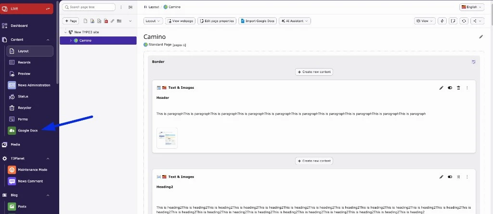
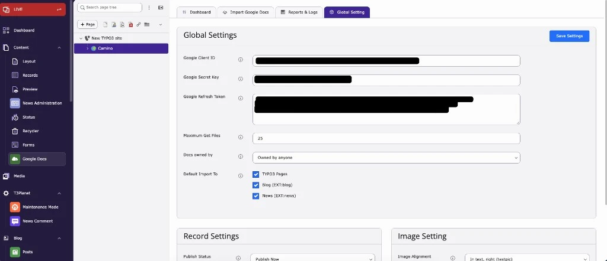
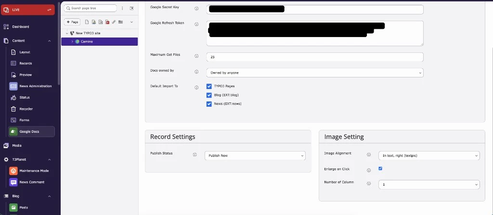

After installation you find the **Google Docs** module in the backend menu, under **Web** (TYPO3 12/13) or **Content** (TYPO3 14). Select a page in the page tree on the left to work with it.

<iframe src="https://app.supademo.com/embed/cmumlc44e16jyqmfh7fl8zbpe?embed_v=2&utm_source=embed" loading="lazy" title="Import and configure Google Docs in TYPO3" allow="clipboard-write; fullscreen" frameBorder="0" webkitallowfullscreen="true" mozallowfullscreen="true" allowfullscreen></iframe>

The module has four tabs.

## Dashboard

- Shows your latest three imports, with links to the Doc and the TYPO3 page
- Shows the step-by-step instructions for importing into pages, blog posts and news

## Import Google Docs

- Lists the Google Docs of your connected account, with document name, last modified date, owner and size
- **Search** (top right) finds Docs by name. It searches up to 1,000 Google Docs of the connected account
- **View/Edit Doc** opens the Doc in Google Docs
- **Import Now** opens the import dialog for the selected page (see [How to import Google Docs](/ExtNsGoogleDocs/ImportGoogleDocToPage/Index))

The number of Docs listed and which owners are shown come from [Global Settings](#global-settings).

## Reports & Logs

- Lists every import: import type (TYPO3 Page, Blog Page, News), Doc name, target page or news folder, date and the backend user who imported
- Search and pagination

The action buttons depend on the import type:

| Import type | Actions |
| --- | --- |
| TYPO3 Page | **View Docs**, **View Page**, **Edit Page** |
| Blog Page | **View Docs**, **View Page**, **Edit Blog** |
| News (into a news folder) | **View Docs**, **Edit News** |

The screenshot shows page imports, so only **View Docs**, **View Page** and **Edit Page** are visible.

## Global Settings

Set these once before your first import. All values are saved for **your** backend user.

### Google account

| Field | Description |
| --- | --- |
| **Google Client ID** | The Client ID from your Google Cloud project |
| **Google Secret Key** | The Client Secret from your Google Cloud project |
| **Google Refresh Token** | The refresh token from the OAuth 2.0 Playground |
| **Maximum Get Files** | How many Docs are listed in the Import tab: 1 to 1,000 (default 10) |
| **Docs owned by** | Which Docs are listed: **Owned by anyone**, **Owned by me** or **Not owned by me** |
| **Default Import To** | Which targets imports are allowed for: **TYPO3 Pages**, **Blog (EXT:blog)**, **News (EXT:news)**. Default: all three |

### Record Settings

| Field | Description |
| --- | --- |
| **Publish Status** | **Publish Now** creates visible records. **Save as Draft** creates hidden records that you enable after review. Applies to content elements, news records and new pages |

### Image Setting

Used for Text & Image and Image Only elements.

| Field | Options |
| --- | --- |
| **Image Alignment** | Above, center · Above, right · Above, left · Below, center · Below, right · Below, left · In text, right · In text, left · Beside Text, Right · Beside Text, Left |
| **Enlarge on Click** | Adds click-to-enlarge to imported images |
| **Number of Column** | 1–6 image columns |

Click **Save Settings**.

<Note>

The image settings are stored on the content element. How they look on the frontend depends on your site package or theme CSS for Fluid Styled Content (classes such as `ce-left`, `ce-intext`, `ce-column`).

</Note>

<Tip>

To check your connection, open the **Import Google Docs** tab. If it lists the Docs of your Google account, the settings are correct.

</Tip>
