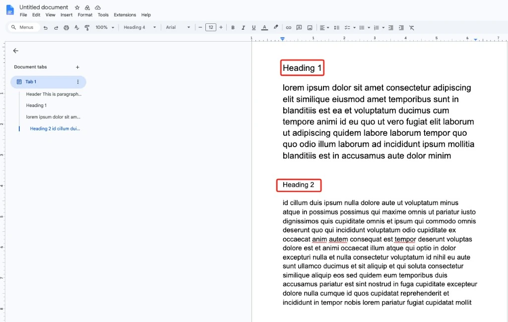
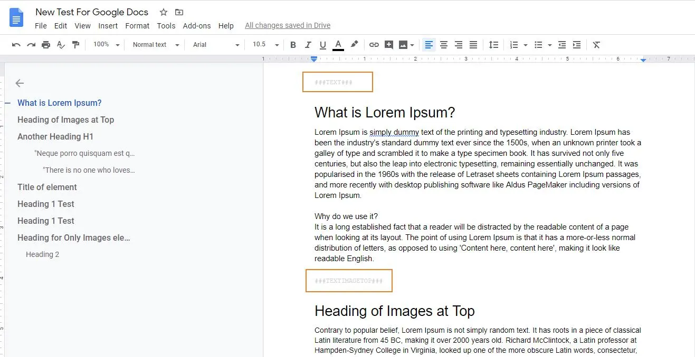

Version 14 changes how you prepare a Google Doc for the import. Older versions (2.x) needed markers in the Doc. Version 14 reads the headings of the Doc instead.

## Old and new at a glance

| | Older versions (2.x) | Version 14 |
| --- | --- | --- |
| **Start of a content element** | A marker line, for example `###TEXT###` | A **Heading 1** or **Heading 2** |
| **Element type** | Set by the marker in the Doc | Chosen per section in the import dialog |
| **Element title** | A Heading 1 directly after the marker | The heading text, editable in the import dialog |

## New way: headings (version 14)

Use the built-in **Heading 1** and **Heading 2** styles of Google Docs. Each of these headings starts a new content element, and all content below it belongs to that element, up to the next Heading 1 or Heading 2. You do not add any markers.

When you import the Doc, the import dialog lists one row per heading. Choose the element type for each section, edit the title or untick a section to skip it.

For all details, see:

- [How to prepare Google Docs with headers?](/ExtNsGoogleDocs/PrepareGoogleDocWithMarkers/Index)
- [The import dialog](/ExtNsGoogleDocs/ImportGoogleDocToPage/Index#the-import-dialog)

## Old way: markers (versions 2.x)

In the older versions, a marker line inside the Google Doc told the extension which content element to create.

| Marker | Content element in older versions |
| --- | --- |
| `###TEXT###` | Text (RTE) |
| `###TEXTIMAGETOP###` | Text & Images, image on top |
| `###TEXTIMAGELEFT###` | Text & Images, image on the left |
| `###TEXTIMAGERIGHT###` | Text & Images, image on the right |
| `###TEXTIMAGEBOTTOM###` | Text & Images, image at the bottom |
| `###IMAGES###` | Images only |

All content between two markers became one content element. A Heading 1 directly after a marker became the header of the element.

## Move a Doc from markers to headings

1. Remove the marker lines (for example `###TEXT###`) from the Doc.
2. Give each section a **Heading 1** or **Heading 2**.
3. Import the Doc and choose the element type for each section in the import dialog.

To update the extension itself, see [Updating to version 14 from 2.x](/ExtNsGoogleDocs/UpdateVersion/Index#updating-to-version-14-from-2-x-marker-based-versions).

## Other changes in version 14

- **More ways to import.** Start an import from the **Page** module, the **List** module or the page tree context menu. See [Three ways to start an import](/ExtNsGoogleDocs/ImportGoogleDocToPage/Index#three-ways-to-start-an-import).
- **Default settings.** Set default record and image settings once in [Global Settings](/ExtNsGoogleDocs/NSGoogleDocsModule/Index#global-settings).
- **"Docs owned by" filter.** Choose which Docs appear in the import list: **Owned by anyone**, **Owned by me** or **Not owned by me**.
- **New TYPO3 and PHP versions.** Supports TYPO3 12.4, 13.4 and 14, with PHP 8.1 or newer.
- **Official Google API client.** The extension now uses the official Google API client library.
