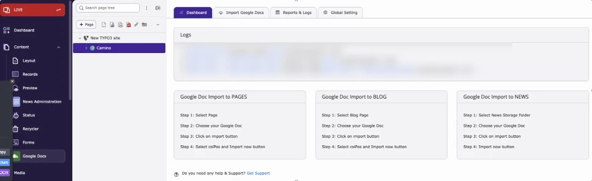
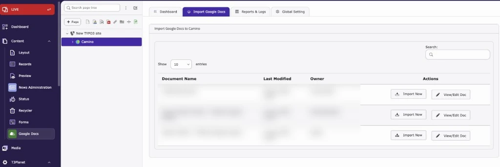
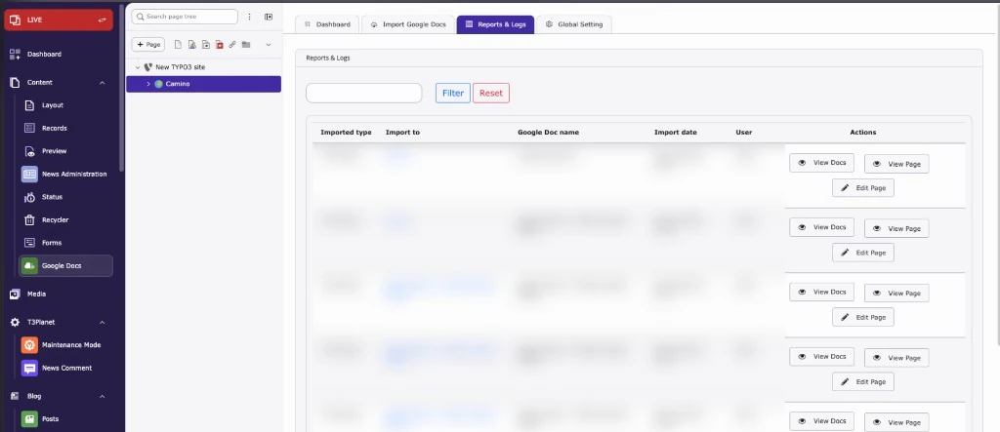

Full steps: [Google Docs Backend Module](/ExtNsGoogleDocs/NSGoogleDocsModule/Index).

### 1. Dashboard

Shows your latest imports and short steps for importing into pages, blog posts and news.

### 2. Import Google Docs

Lists the Docs from your connected Google account. Click **Import Now** to import a Doc into the selected page, or **View/Edit Doc** to open it in Google Docs.

### 3. Reports & Logs

Lists all past imports with type, target, Doc name, date and user. The screenshot shows page imports with **View Docs**, **View Page** and **Edit Page**. Blog imports show **Edit Blog** instead of **Edit Page**. News imports show **View Docs** and **Edit News** only.

### 4. Global Settings

Connect your Google account, set how many Docs to load, which Docs to show and where imports can go.

**Record Settings** set the publish status of imported records. **Image Setting** controls image alignment, enlarge on click and the number of columns. See [Global Settings](/ExtNsGoogleDocs/NSGoogleDocsModule/Index#global-settings).
