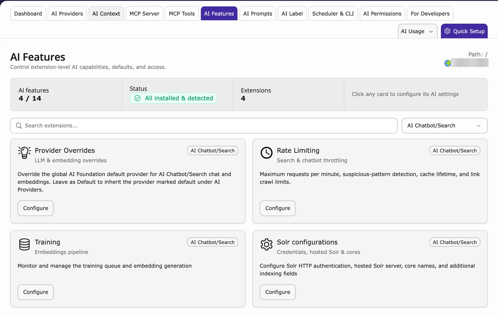

{/* ## Step 1: Open AI Features in T3AF

<iframe src="https://app.supademo.com/embed/cmrabse4l0btvqmhx59tvn83q?utm_source=link" loading="lazy" title="AI FileMeta Overview Demo" allow="clipboard-write; fullscreen" frameBorder="0" webkitallowfullscreen="true" mozallowfullscreen="true" allowfullscreen></iframe>

Shared AI settings for T3AC are managed in T3AF — not under **Admin Tools > Settings > Configure Extensions**.

1. Go to the **TYPO3 backend**.
2. Open **T3AF** → **AI Features**.
3. Open the **T3AC** (`ns_t3ac`) feature card.
4. Configure provider/model overrides and feature options used for chatbot and training workflows.
5. Click **Save**.
6. Return to the **T3AC** module for chatbot, data source, and training-specific settings.

For the shared module overview, see [T3AF AI Features](/en/latest/ExtNsT3AF/Configuration/AIFeatures/Index). */}

## Step 1: Check the AI settings in AI Foundation

<iframe src="https://app.supademo.com/embed/cmrabse4l0btvqmhx59tvn83q?utm_source=link" loading="lazy" title="AI Features for AI Chatbot" allow="clipboard-write; fullscreen" frameBorder="0" webkitallowfullscreen="true" mozallowfullscreen="true" allowfullscreen></iframe>

{/* SUPADEMO NEEDED: AI Features cards for AI Chatbot/Search */}

Some settings are shared by AI Chatbot and AI Search. They are in AI Foundation. Most websites can keep the defaults.

1. Go to **AI Universe → AI Foundation → AI Features**.
2. Look for the cards with the badge **AI Chatbot/Search**: **Provider Overrides**, **Rate Limiting**, **Training** and **Solr configurations**.
3. Click **Configure** on a card.
4. Change the settings.
5. Click **Save**.

<Note>
A change on these cards affects both AI Chatbot and AI Search. More: [AI Foundation AI Features](/en/latest/ExtNsT3AF/Configuration/AIFeatures/Index).
</Note>

{/* ## Step 2: Add Required API Keys

Ensure that the required provider API keys are configured in T3AF.

- **OpenAI** — [Create an API key](https://platform.openai.com/api-keys) in your OpenAI account. For full technical details, see the [OpenAI API reference](https://platform.openai.com/docs/api-reference/introduction). */}

## Step 2: Set up your AI provider

AI Chatbot uses the AI service you connected in AI Foundation, for example OpenAI, Google Gemini, Mistral, Anthropic Claude, Azure, Ollama or your own custom AI model (custom LLM).

- To add or change it, see [AI Providers](/en/latest/ExtNsT3AF/Configuration/AIProviders/Index).
- To use a different AI service only for the chatbot, use the **Provider Overrides** card (Step 1).
