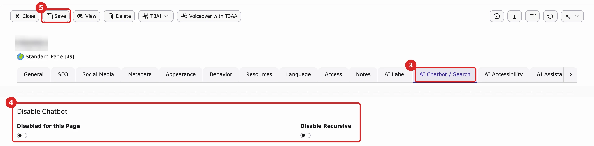

You can hide the chatbot on a single page with one switch. This is useful on pages where the chat button would get in the way, for example a checkout, login or payment page.

## Two ways to hide the chatbot

- **One page (and, if you want, its subpages):** use the switch in the page properties. This page explains how.
- **Several pages at once:** list the page IDs in the chatbot settings, under **AI Universe → AI Chatbot/Search → Chatbot → General → Page Visibility → Hide Chatbot on Specific Pages**. See [Page Visibility](/en/latest/ExtNsT3AC/FeatureGuide/Chatbot/Index#page-visibility).

## Steps

1. In the page tree, open the page in the **Page** module (on TYPO3 v14: **Content → Layout**).
2. Click **Edit page properties**.
3. Open the tab **AI Chatbot / Search**. If only AI Chatbot is installed, the tab is called **AI Chatbot**.
4. Under **Disable Chatbot**, turn on **Disabled for this Page**. To hide it on all subpages as well, also turn on **Disable Recursive**.
5. Click **Save**.

{/* SUPADEMO NEEDED: Page properties: source groups and Disable Chatbot */}

## Good to know

- **Subpages:** **Disabled for this Page** hides the chatbot on this page only. **Disable Recursive** hides it on this page and on every page below it in the page tree.
- **This switch always wins.** The chatbot stays hidden even if the page is listed under **Show Chatbot on Specific Pages** in the chatbot settings. To show it again, turn the switch off and save.
- **How to check:** open the page on your website in a private browser window. The chat button should be gone. If you still see it, clear the cache (or ask your administrator) and reload the page.

<Accordion title="For developers">
The two switches are normal fields of the page record, so you can also set them in an import or a script. AI Chatbot checks them on every page request.

- Fields: `disable_chatbot_this_page` and `disable_chatbot_recursive_page`.
- **Disable Recursive** also covers all subpages.
- The page switch always wins over the page lists on the **General** tab.
- A page that is already cached can still show the chatbot until you clear its cache.
</Accordion>

## Related

- [Chatbot settings: Page Visibility](/en/latest/ExtNsT3AC/FeatureGuide/Chatbot/Index#page-visibility)
- [Configuration overview](/en/latest/ExtNsT3AC/Configuration/Index)

{/* Detailed developer notes (moved here on 2026-10-08 to keep the page short; not shown on the website):

<Accordion title="For developers">
- The switches are the checkbox fields `disable_chatbot_this_page` ("Disabled for this Page") and `disable_chatbot_recursive_page` ("Disable Recursive") in the table `pages`, in the palette **Disable Chatbot** (from `ns_t3ac`). The tab name depends on the installed extensions: **AI Chatbot / Search** (AI Chatbot and AI Search), **AI Chatbot** (only AI Chatbot).
- The check runs in the frontend middleware `CheckChatbotRenderMiddleware` (`ns_t3ac`) on each page request. If the chatbot is off, the chatbot scripts and styles are not added to the page.
- Order of the checks:
  1. If **Show Chatbot on Specific Pages** (`enable_chatbot_pages`) has entries, the chatbot shows only on those pages. Otherwise **Hide Chatbot on Specific Pages** (`disable_chatbot_pages`) is used.
  2. The page switches are checked after that and always win: `disable_chatbot_this_page` on the current page, and `disable_chatbot_recursive_page` on the current page or any page above it (rootline).
- The ID lists in the module match exact page IDs only (not subpages). An ID of a translated page record only matches that language. The page switches are read with the language overlay of the current language.
- Because the scripts are added while the page is rendered, a page that is already in the page cache can still show the chatbot until its cache is cleared.
</Accordion>
*/}
