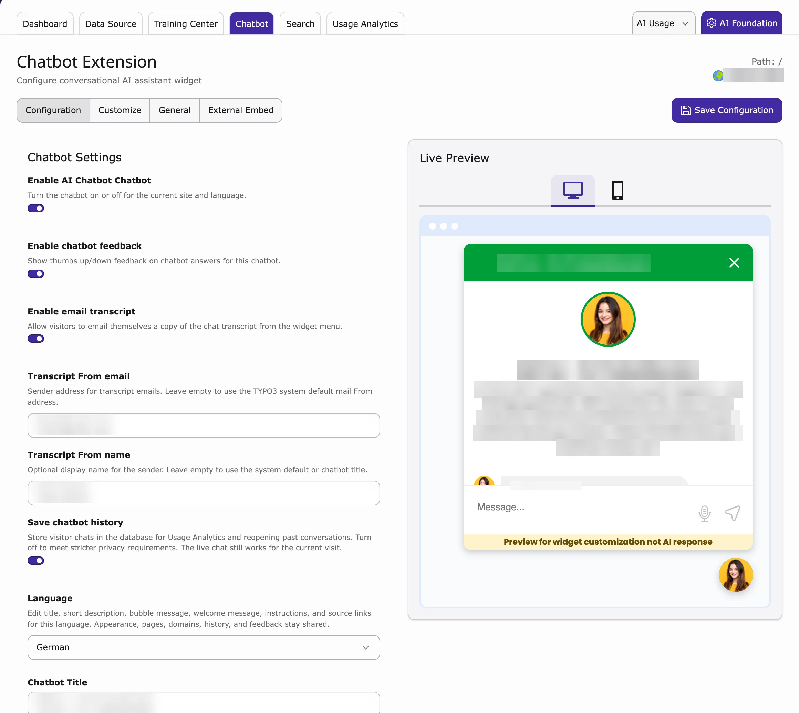
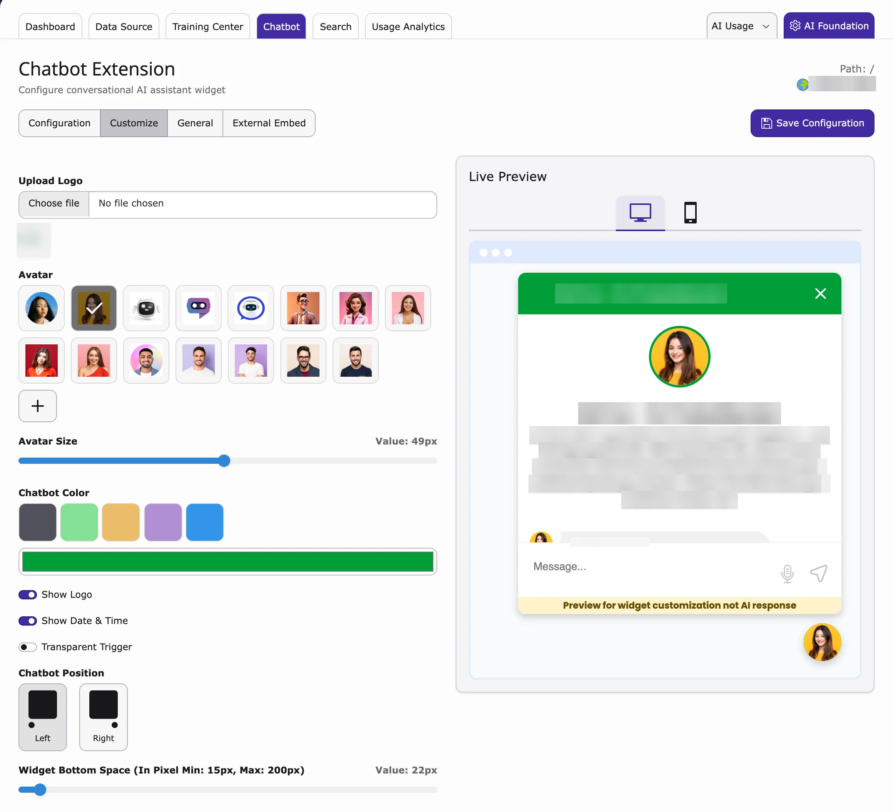
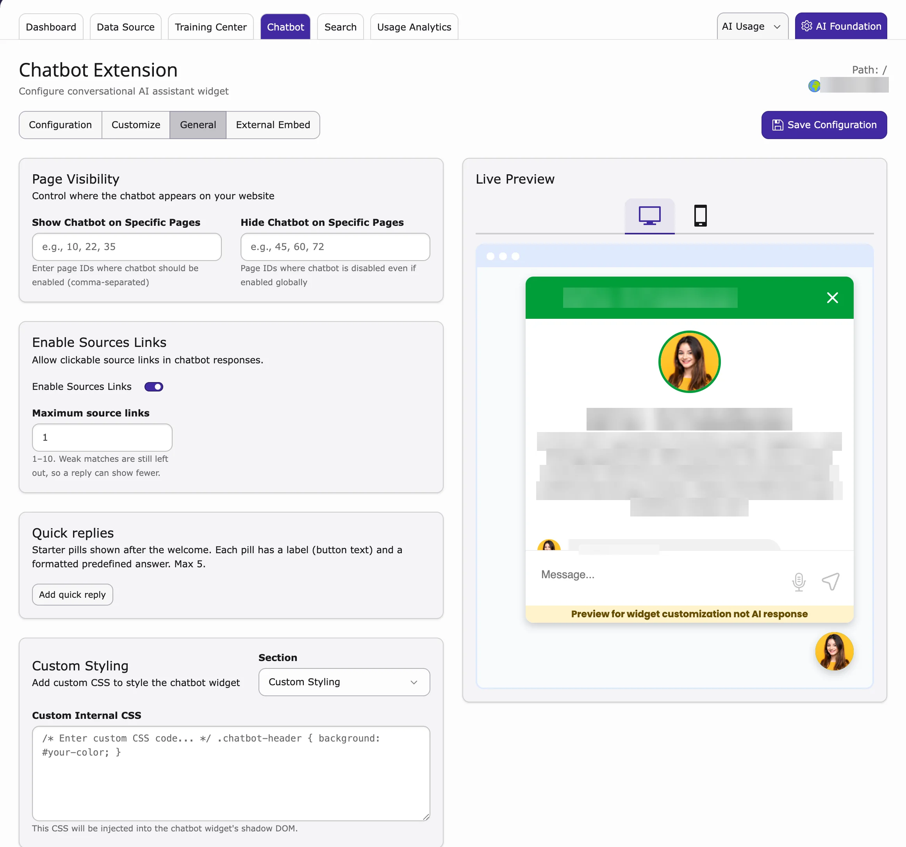
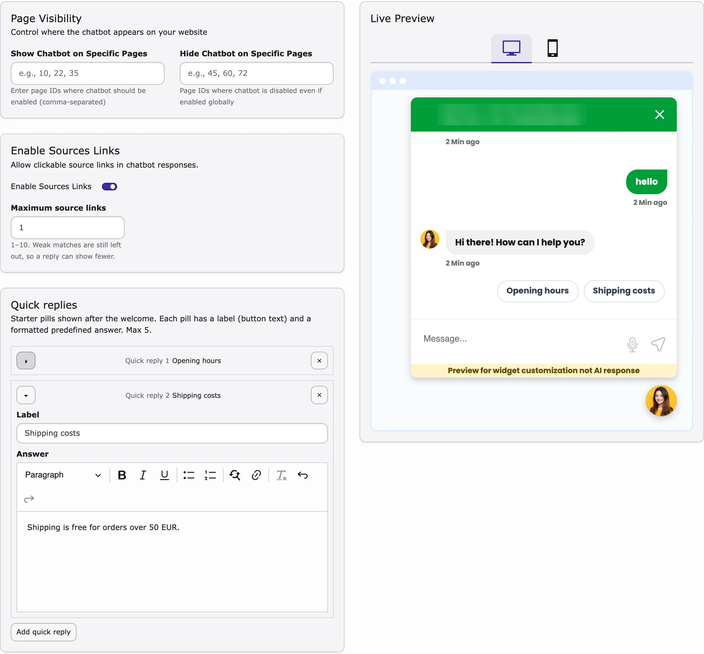
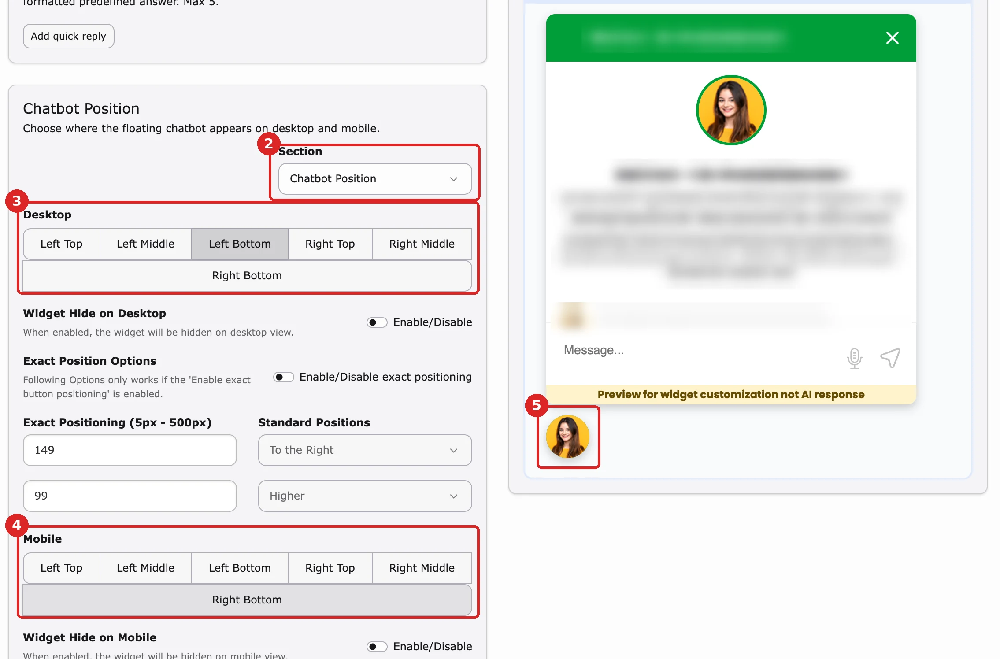
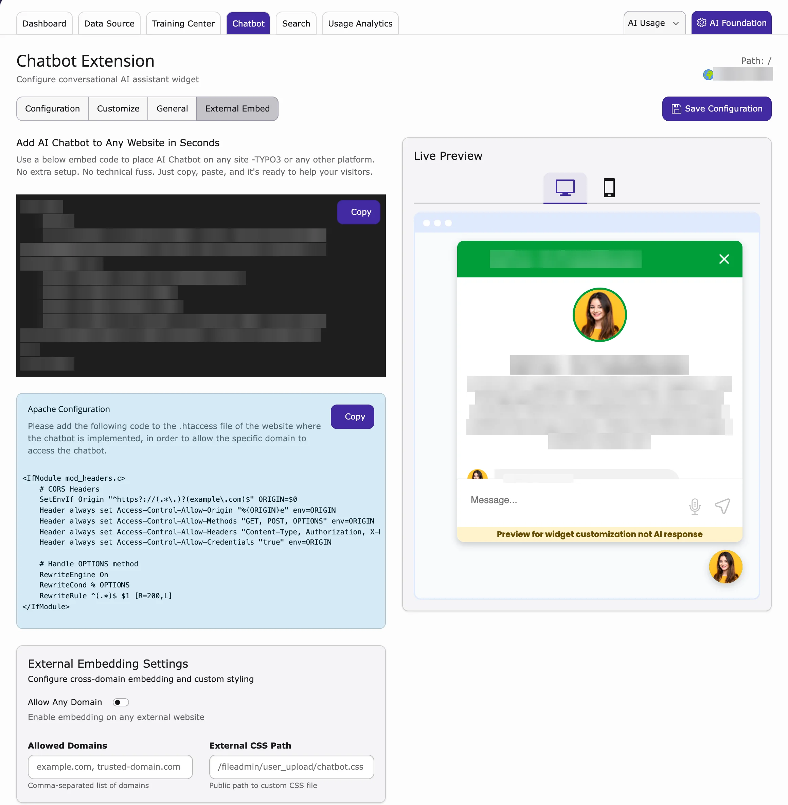

On the **Chatbot** tab you decide what your chatbot says, how it looks and where it appears. You see every change in the **Live Preview** before you save.

<div className="t3-embed"><iframe src="https://app.supademo.com/embed/cmragm93i0mj0qmhx6fir2bke?utm_source=link&embed_v=2&utm_source=embed" loading="lazy" title="T3AC Chatbot Functionality Demo" allow="clipboard-write; fullscreen" frameBorder="0" webkitallowfullscreen="true" mozallowfullscreen="true" allowfullscreen></iframe></div>

<a id="quick-setup"></a>

## Quick setup

1. Go to **AI Universe → AI Chatbot/Search**.
2. Click the **Chatbot** tab.
3. On **Configuration**, turn on **Enable AI Chatbot**, choose the **Language** and write the title and welcome messages.
4. On **Customize**, choose your logo, avatar, colour and position.
5. On **General**, choose on which pages the chatbot shows.
6. Check the **Live Preview** on the right.
7. Click **Save Configuration**.

All fields are explained below.

{/* SUPADEMO NEEDED: Set up the chatbot (Configuration, email transcript, Language) */}

{/* ## Step 4: Chatbot Configuration

<div className="t3-embed"><iframe src="https://app.supademo.com/embed/cmjcy43b44pnzf6zpnlmzp7nj?embed_v=2&utm_source=embed" loading="lazy" title="AI FileMeta Overview Demo" allow="clipboard-write; fullscreen" frameBorder="0" webkitallowfullscreen="true" mozallowfullscreen="true" allowfullscreen></iframe></div>

- **Show and Hide Chatbot on Specific Pages**

Configure page visibility, source links, and custom CSS under **Chatbot → General**, with Live Preview on the right.

- **Show Chatbot on Specific Pages**
  - Enter the Page IDs where the chatbot should be visible (e.g., 10, 22, 35).
- **Hide Chatbot on Specific Pages**
  - Enter the Page IDs where the chatbot should be hidden, even if it is enabled globally (e.g., 45, 60, 72).
- **Internal CSS Configuration**
- **Custom CSS**
  - Use your own styles to customize the chatbot appearance.

<Note>
Make sure your CSS files are available inside the public directory, and the path should start with `fileadmin/`.
</Note> */}

## Configuration

1. Go to **AI Universe → AI Chatbot/Search**.
2. Click the **Chatbot** tab. The **Configuration** sub-tab opens.
3. Fill in the fields below.
4. Click the chatbot avatar in the **Live Preview** to test it.
5. Click **Save Configuration**.



{/* **Step 1:** Open **AI Chatbot** in the TYPO3 backend.

**Step 2:** Click the **Chatbot** tab.

**Step 3:** Enable the chatbot, then configure feedback, **Save chatbot history**, messages, and instructions. */}

### Settings {#t3ac-save-chatbot-history}

{/* - **Enable AI Chatbot** — Activates the chatbot on your site
- **Chatbot Feedback** — Shows thumbs up/down on responses; ratings appear in **Usage Analytics**
- **Save chatbot history** — Saves conversations for analytics and past chats. Turn this off for stricter privacy.
- **Title** — Name shown in the chatbot (e.g. AI Chatbot)
- **Short Description** — Brief text describing the assistant
- **Bubble Message** — Trigger bubble text (e.g. "Hey there, How can I help you?")
- **Welcome Message** — First message visitors see (e.g. "Hi, how can I help you?")
- **Chatbot Language** — Default language for the chatbot
- **Chatbot Instructions** — Custom rules for how the chatbot should answer */}

- **Enable AI Chatbot** – switches the chatbot on or off for this website and language. (The label currently reads "Enable AI Chatbot Chatbot".)
- **Enable chatbot feedback** – thumbs up / down under answers. You see the ratings in **Usage Analytics**.
- **Enable email transcript** – visitors can email themselves a copy of the chat. See [Email transcript](#email-transcript).
- **Transcript From email** / **Transcript From name** – the sender of these emails. Leave empty to use the default.
- **Save chatbot history** – saves conversations, so you can read them in **Usage Analytics** and visitors can reopen past chats. Switch off for stricter privacy.
- **Language** – which language you are editing. **Default (site default language)** is your main language. See [Multilanguage](#multilanguage).
- **Chatbot Title** – the name at the top of the chat window.
- **Short Description** – a short line under the title.
- **Bubble Message** – the small speech bubble next to the chat button, for example "Hey there, how can I help you?"
- **Welcome Message** – the first message visitors see.
- **Chatbot Instructions** – rules for the answers, for example "Answer friendly and in max. 3 sentences".

### Email transcript {#email-transcript}

Visitors can email themselves a copy of the chat, for example to keep opening hours or a price.

**Turn it on**

1. Go to **AI Universe → AI Chatbot/Search → Chatbot → Configuration**.
2. Turn on **Enable email transcript**.
3. Optional: enter a **Transcript From email** and **Transcript From name**.
4. Click **Save Configuration**.

**What visitors see**

1. The visitor opens the menu in the chatbot and clicks **Email transcript**.
2. The chatbot says: "We will send a copy of this chat conversation to the email address you provide."
3. The visitor enters an email address and clicks **Send**.
4. The chatbot shows "Transcript sent. Please check your inbox."

<Note>
TYPO3 must be able to send emails. If no sender address is set here or in the TYPO3 mail settings, visitors see an error.
</Note>

<Warning>
The visitor's email address is personal data. Mention this feature in your privacy policy.
</Warning>

{/* SUPADEMO NEEDED: Email transcript (backend setting + visitor menu) */}

## AI Prompts

**AI Prompts** are standing instructions for the AI, for example "always answer politely" or "never give prices". Use them to keep all answers in the same tone.

<div className="t3-embed"><iframe src="https://app.supademo.com/embed/cmrbodcvo0dj7qmo5ds4mf5m4?utm_source=link&embed_v=2&utm_source=embed" loading="lazy" title="T3AC AI Prompts Demo" allow="clipboard-write; fullscreen" frameBorder="0" webkitallowfullscreen="true" mozallowfullscreen="true" allowfullscreen></iframe></div>

**Tips**

- Keep instructions short and easy to test.
- Test them with real visitor questions.
- For instructions shared by all AI extensions, see [AI Foundation AI Prompts](/en/latest/ExtNsT3AF/Configuration/AIPrompts/Index).

{/* - Review [AI Foundation AI Prompts](/en/latest/ExtNsT3AF/AIPrompts/Index) when you want shared prompt behavior across multiple AI Universe extensions. */}

## Customization

On the **Customize** tab you make the chatbot match your website.

{/* - **Upload Logo** — Add your company logo to the chatbot header
- **Upload Avatar** — Set the chatbot profile image
- **Avatar Size** — Adjust the profile image size with the slider, then check the preview
- **Chatbot Color** — Choose the chatbot appearance color
- **Show Logo** — Show or hide the logo in the chatbot
- **Show Date & Time** — Display the current date and time in the chat
- **Transparent Trigger** — Make the chatbot trigger appear more discreetly on the page
- **Chatbot Position** — Reposition the widget (e.g., bottom-right)
- **Widget Bottom Space** — Set the distance from the bottom of the page (min: 15px, max: 200px) */}

- **Upload Logo** – your logo in the chat header.
- **Show Logo** – show or hide the logo.
- **Avatar** – the chatbot's profile picture. **Avatar Size** makes it bigger or smaller.
- **Chatbot Color** – one of five colour themes.
- **Show Date & Time** – show the time of each message.
- **Transparent Trigger** – makes the chat button less visible.
- **Chatbot Position** – **Left** or **Right**.
- **Widget Bottom Space** – distance from the bottom of the screen (15 to 200 pixels).



<Tip>
To put the chatbot in another corner or side (for desktop and mobile separately), see [Change the widget position](#widget-position).
</Tip>

## General

On the **General** tab you choose on which pages the chatbot appears, source links, [quick replies](#quick-replies) and the exact position.

<Note>
These settings used to be in the site configuration. See [Upgrading? Where your old settings moved](/en/latest/ExtNsT3AC/Configuration/WhereToFindIt/Index)
</Note>



### Page Visibility

By default, the chatbot shows on all pages. To change that:

### Show Chatbot on Specific Pages

Enter the page IDs (the number of each page in the page tree), separated by commas, for example `10, 22, 35`. The chatbot shows **only** on these pages.

### Hide Chatbot on Specific Pages

Enter the page IDs where the chatbot should **not** show, for example `45, 60, 72`.

<Tip>
To hide the chatbot on one page (and its subpages), you can also use a switch in the page properties. See [Hide the chatbot on a page](/en/latest/ExtNsT3AC/Configuration/DisableChatbotOnPage/Index).
</Tip>

### Sources Links

{/* Enable **Source Links** to attach reference URLs to chatbot responses based on the data used. */}

1. Turn on **Enable Sources Links**.
2. In **Maximum source links**, choose how many links an answer may show (1–10).

The chatbot then adds links to the pages or files the answer is based on, so visitors can read more. Weak matches are left out, so an answer can show fewer links.

{/* ### Custom Styling

Use Custom Styling to match the chatbot design with your website style.

- Add your custom CSS for colors, spacing, and font styles.
- Keep styling simple for better readability and user experience.

### Custom Internal CSS

Use this field when you want to apply CSS directly inside the chatbot widget. */}

### Quick replies

**Quick replies** are buttons that visitors see under the welcome message, for example "Opening hours" or "Shipping costs". When a visitor clicks one, the chatbot shows the answer you prepared. No AI is used, so the answer comes at once and costs nothing.



**Add a quick reply**

1. Go to **AI Universe → AI Chatbot/Search → Chatbot → General**.
2. Find the box **Quick replies**.
3. Click **Add quick reply**. A new row (for example **Quick reply 1**) opens.
4. In **Label**, enter the button text, for example `Opening hours`. Keep it short (max. 120 characters).
5. In **Answer**, write the reply. You can use bold, italic, underline, lists and links.
6. Check the buttons in the **Live Preview** on the right.
7. Click **Save Configuration**.

You can add up to **5** quick replies. After the fifth one, **Add quick reply** can no longer be clicked.

**Edit or remove a quick reply**

- Saved quick replies are shown closed, with their label (for example **Quick reply 1 Opening hours**). Click the row or the small arrow to open or close it.
- Change the **Label** or the **Answer**, then click **Save Configuration**.
- Click **×** at the end of a row to remove it, then click **Save Configuration**.

**Change the order**

The buttons are shown in the same order as the rows. You cannot drag rows to move them. To change the order, remove a quick reply and add it again at the end.

**What visitors see**

1. The visitor opens the chatbot. The quick replies are shown as buttons under the welcome message.
2. The visitor clicks a button. The label appears as the visitor's message, and your answer appears as the chatbot's reply.
3. After the first message (a click or a typed question), the buttons are hidden. Typed questions are answered by the AI as usual.

<Note>
A quick reply is only saved if it has both a **Label** and an **Answer**. Quick replies are the same for all languages of the chatbot, so write them in the language most of your visitors use.
</Note>

{/* SUPADEMO NEEDED: Chatbot quick replies (General → Quick replies: add, edit, remove; Live Preview; visitor clicks a button on the website) */}

### Custom Styling and Chatbot Position {#custom-styling-and-widget-position}

At the bottom of the **General** tab, the **Section** list has two panels: **Custom Styling** and **Chatbot Position**.

### Custom Styling

In **Custom Internal CSS** you (or your web designer) can change the chatbot design with CSS code. It only changes the chatbot, not the rest of your website.

```css
.chatbot-header {
  background: #your-color;
}
```

{/* This CSS is injected inside the chatbot widget, so it affects only chatbot UI elements. */}

### Change the widget position {#widget-position}

By default, the chat button sits at the bottom right of the screen. You can move it to another corner or side, separately for desktop and mobile.

1. Go to **AI Universe → AI Chatbot/Search → Chatbot** and open **General**.
2. Scroll down to the **Chatbot Position** card. If you see **Custom Styling** instead, choose **Chatbot Position** in the **Section** list.
3. Under **Desktop**, click a place: **Left Top**, **Left Middle**, **Left Bottom**, **Right Top**, **Right Middle** or **Right Bottom**.
4. Under **Mobile**, click a place for phones.
5. Check the **Live Preview** on the right: the chat button moves to the new place. Use the computer and phone icons above the preview to see both.
6. Click **Save Configuration**.



**More options**

- **Widget Hide on Desktop** / **Widget Hide on Mobile** – hide the chatbot on that kind of device.
- **Exact Position Options** – turn on **Enable/Disable exact positioning** and enter the distance in pixels (5 to 500). With **Standard Positions** you choose **To the Left** or **To the Right** and **Lower** or **Higher**. This replaces the place you clicked. For phones, use **Exact Position Mobile Options**.

<Tip>
The **Customize** tab also has **Chatbot Position** (**Left** / **Right**). Set it to the same side as your **Desktop** choice, so your website looks like the Live Preview.
</Tip>

{/* SUPADEMO NEEDED: Chatbot widget position (desktop / mobile) */}

## External Embed

{/* If you would like to use this chatbot on another domain, follow these steps:

- Open the **External Embed** area in T3AC.
- Add the allowed domain, or enable the option that allows any approved domain policy used by your project.
- Copy the embed code.
- Paste the code inside the `<body>` tag of your website.

For the full setup flow, see [Configuration](/en/latest/ExtNsT3AC/Configuration/Index). */}

Show the chatbot on another website, for example your shop. All steps, the allowed websites and the server setting (`.htaccess`) are on the [External Embed](/en/latest/ExtNsT3AC/Configuration/ExternalEmbed/Index) page.



AI Search has the same feature: [AI Search External Embed](/en/latest/ExtNsT3AS/Configuration/ExternalEmbed/Index).

{/* Short steps before the 8 Oct 2026 Configuration split (full steps are now on Configuration → External Embed):

1. Save the chatbot on the **Configuration** tab first.
2. Go to **Chatbot → External Embed**.
3. Click **Copy** to copy the embed code.
4. The person who manages the other website pastes it just before the closing `</body>` tag.
5. Under **External Embedding Settings**, choose **Allow Any Domain** or list the websites in **Allowed Domains**. Optional: add an **External CSS Path**.
6. Your developer adds the **Apache Configuration** code from the tab to the `.htaccess` file of your TYPO3 website.

Full steps: [Configuration → Step 4](/en/latest/ExtNsT3AC/Configuration/ExternalEmbed/Index). AI Search has the same feature: [AI Search External Embed](/en/latest/ExtNsT3AS/Configuration/ExternalEmbed/Index).
*/}

## Multilanguage

{/* Configure your chatbot to support multiple languages directly from the **Configuration** tab by selecting the default language from the dropdown menu. Only the languages that have already been added to your domain will be available for selection. */}

On the **Configuration** tab, use **Language** to choose which language version you are editing. **Default (site default language)** is the main language of your site. The list only shows languages that exist in your site configuration (**Languages** tab in **Site Management → Sites** on TYPO3 v12 and v13, **Sites → Setup** on TYPO3 v14).

- **Per language:** Chatbot Title, Short Description, Bubble Message, Welcome Message, Chatbot Instructions, source links and chatbot feedback.
- **Same for all languages:** the look (Customize), page visibility, quick replies, allowed websites and chat history. Change them once.

{/* ## Basic Authentication Support

If you want to crawl URLs protected by htaccess / HTTP Basic Authentication, enable **Basic Authentication Support** and enter the username and password.

Open **T3AF → AI Features → Access & Notifications**, then enable the option and save your changes.

Configure Basic Authentication under **T3AF → AI Features → Access & Notifications**.

## Configurable Database Chunking for various types of Dataset Processing

**Overview**

- This feature provides configurable database chunking to efficiently process large datasets while maintaining optimal performance and stability. Instead of loading all records in a single query, data is fetched and processed in smaller chunks, reducing memory usage and preventing execution timeouts.
- The chunk size is configurable via the T3AF feature settings, allowing administrators to adjust it according to server capacity and dataset size.

**Default Configuration**

- By default, database chunking is enabled with a chunk size of 1000 records.
- If required, this value can be modified in **T3AF → AI Features → Training** to better suit the execution environment.

Configure **Chunk Size**, **Batch Size**, and **Retention Days** under **T3AF → AI Features → Training**. */}

## Crawling protected websites and large data

- **Pages behind a browser login?** Go to **AI Universe → AI Foundation → AI Features → Access & Notifications**. See [Basic authentication](/en/latest/ExtNsT3AS/BasicAuthentication/Index).
- **Very large website?** Open the **Training** card in **AI Features** and change **Chunk Size** (default 1000). See [Database chunking](/en/latest/ExtNsT3AS/DatabaseChunking/Index).


## Related

- [Hide the chatbot on a page](/en/latest/ExtNsT3AC/Configuration/DisableChatbotOnPage/Index)
- [Permissions](/en/latest/ExtNsT3AC/Configuration/Permissions/Index) and [MCP tools](/en/latest/ExtNsT3AC/Configuration/MCPTools/Index)
- [AI Prompts in AI Foundation](/en/latest/ExtNsT3AF/Configuration/AIPrompts/Index)
- [AI Search widget](/en/latest/ExtNsT3AS/Configuration/Search/Index#search-widget) and [AI Search plugin](/en/latest/ExtNsT3AS/FrontendPlugin/Index), if you also want an AI search box

{/* Original text before the 8 Oct 2026 simplification (kept for reference):

Turn the chatbot on and control how it greets visitors and whether **Save chatbot history** is enabled.

Use the live preview panel (click the chatbot avatar) to check title, messages, and appearance before you click **Save Configuration**.

Use AI Prompts when you want to refine how the chatbot greets users, answers questions, follows project-specific rules, or stays within the right tone. This is useful when different websites or teams need chatbot output to stay consistent without editing the answer manually every time.

Best practices:

Open the **Customize** tab to match the chatbot appearance to your website. Changes appear in the live preview panel.

Open the **General** tab to control where the chatbot appears, whether source links are shown, and how custom CSS is applied.

Use Page Visibility to decide on which pages the chatbot is shown.

- You can show the chatbot only on selected pages.
- You can also hide it on selected pages, even when it is enabled globally.

Use this option to show the chatbot only on pages you choose.

- Enter page IDs in a comma-separated list.
- Example: `10, 22, 35`
- The chatbot will be visible on these pages.

Use this option to hide the chatbot on specific pages.

- Enter page IDs in a comma-separated list.
- Example: `45, 60, 72`
- These pages stay hidden even if chatbot is enabled globally.

When enabled, the chatbot adds clickable links from indexed sources (for example TYPO3 pages or documents) used to generate the answer.

**How it works:**

- The system retrieves relevant content from configured data sources.
- The response is generated using this content.
- Source URLs are mapped and added as clickable links.

This allows users to verify information and access the original content. If disabled, no source links are shown.

Example:
*/}
