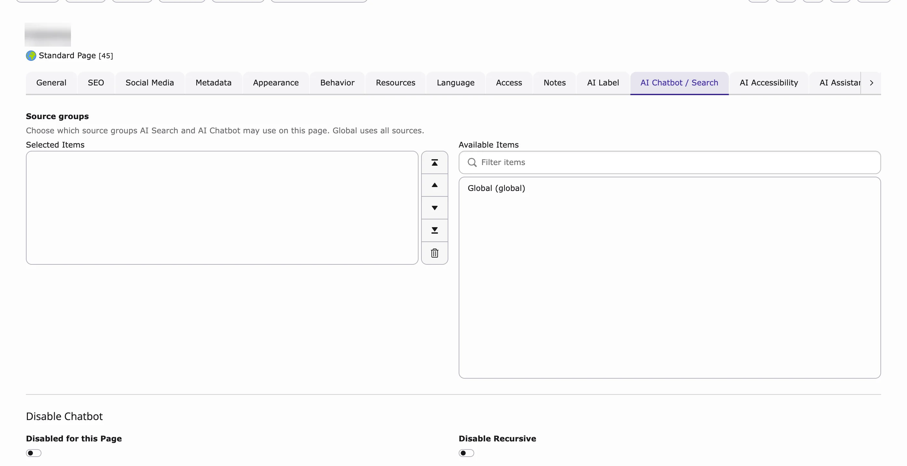
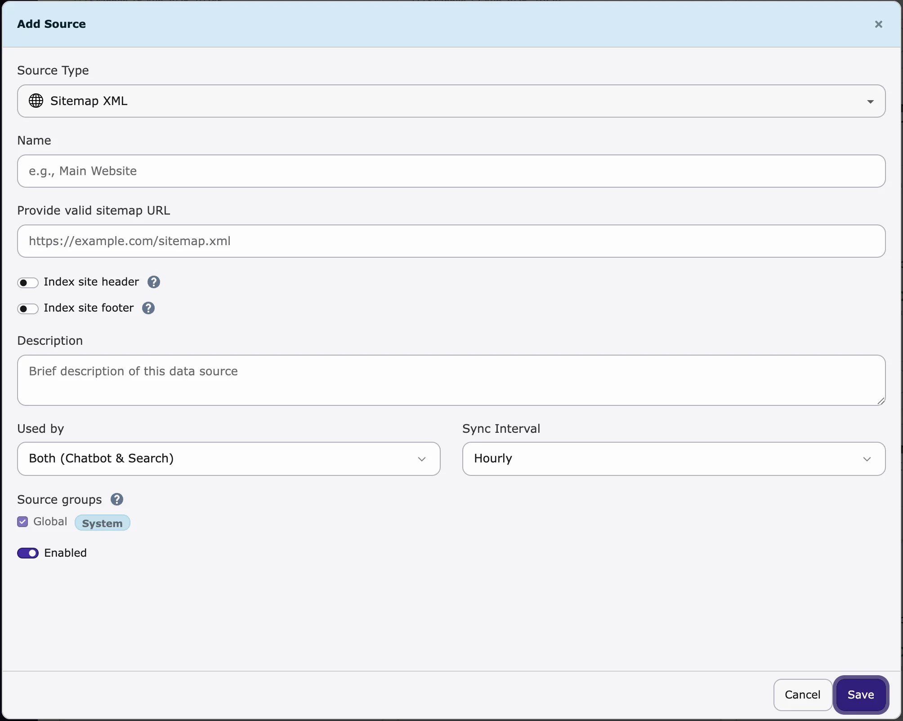

## Purpose

A **data source** is content the chatbot (and AI Search) may learn from: your TYPO3 pages, a sitemap, PDFs, questions and answers, or plain text. The chatbot only answers from the content you add here.

You find it in **AI Universe → AI Chatbot/Search → Data Source**.

<div className="t3-embed"><iframe src="https://app.supademo.com/embed/cmraclzms0e0pqmhxm0sztm2a?embed_v=2&utm_source=embed" loading="lazy" title="Add a data source" allow="clipboard-write; fullscreen" frameBorder="0" webkitallowfullscreen="true" mozallowfullscreen="true" allowfullscreen></iframe></div>

## Adding a data source

{/* 1. Click **+ Add Source**.
2. Choose the **type of source**, for example:
  - **Sitemap XML** – Your sitemap URL(s) (e.g. `https://example.com/sitemap.xml`).
  - **PDF Documents** – Folder path where PDFs are stored (and optionally upload PDFs).
  - **TYPO3 Pages** – Content from specific TYPO3 pages.
  - **Web Pages** – A website URL; optionally limit to a path (e.g. `https://example.com/blog/*`).
  - **Q&A Pairs** – Manual question-and-answer content.
  - **Indexed Search / Ke Search / Solr** – If the corresponding extensions are installed and indexed content is available.
3. Fill in the requested details (URLs, folder path, page selection, etc.) and give the source a **Name** (e.g. `Main Website`) and optional **Description**.
4. Set **Sync interval**: how often content should be refreshed (e.g. **Hourly**, **Daily**, **Weekly**). **Custom** means no automatic schedule (manual sync only).
5. Set **Used by** (formerly **Type**) to control whether this source is available for **AI Search**, **AI Chatbot**, or **Both**.
6. Set **Enabled** to on if the source should be active.
7. Click **Save**.

After saving, T3AC will:

- Create or update the data source.
- Sync content into the training queue (new or changed items).
- **Automatically create** the **T3AF Training** Scheduler task for this site (if it does not exist yet) and **run it at the frequency you set** (e.g. Hourly, Daily, Weekly). You do not need to create the scheduler task manually—it is created when the source is saved and will execute according to the chosen sync interval. */}

1. Click **+ Add Source**.
2. Choose the **Source Type**:
   - **Sitemap XML** – the address of your sitemap, for example `https://example.com/sitemap.xml`.
   - **PDF Documents** – a folder with PDF files. Click **Browse** to pick it, or **Upload PDF** (max. 25 MB).
   - **TYPO3 Pages** – page IDs, separated by commas. Also choose **Recursive** (how many sub-page levels: **Infinite levels**, **Provided pages only**, or 1 to 4 levels) and **Index mode** (see the tip below).
   - **Web Pages** – a website address. Add `/*` at the end to include only one part, for example `https://example.com/blog/*`. Turn on **Single URL** to read only this one page.
   - **Q&A Pairs** – type a **Question** and an **Answer**. Click **Add Q&A pair** for more.
   - **Text** – paste any text the AI should know.
   - **Indexed Search**, **ke_search** and **Solr** – only shown if that extension is installed.
3. Enter a **Name** (for example `Main Website`) and, if you like, a **Description**.
4. Choose **Used by**: **Both (Chatbot & Search)**, **Chatbot** or **Search**.
5. Choose how often the content is read again (**Sync Interval**): **Hourly**, **Daily**, **Weekly** or **Custom cron expression** (your own schedule, for example `0 0 * * 0` = every Sunday at midnight).
6. Choose the **Source groups**. **Global** is always included.
7. Turn on **Enabled**.
8. Click **Save**.


<Tip>
**Index mode** for TYPO3 Pages: **Frontend (rendered page HTML)** reads the page as visitors see it and is recommended on TYPO3 13.4 and newer. **Legacy (database columns only)** reads only the text stored in the page records.
</Tip>

**What happens next?** The source is marked for reading. The background task **T3CS Training (Site N)** is created for your website if it doesn't exist yet – you don't need to create it yourself. See [Scheduler](#scheduler).

<Note>
There is only **one** training task per site. Its schedule comes from the data source you saved last. If your sources use different intervals, save the one with the interval you want last.
</Note>

{/* SUPADEMO NEEDED: Add a TYPO3 Pages data source */}

{/* SUPADEMO NEEDED: Add PDF, Q&A and Text sources */}

## Editing or deleting a source

Use the buttons next to each data source to **edit** or **delete** it.

<Info>
Deleting a data source also removes its training queue and embedded data for that source.
</Info>

<a id="source-groups"></a>

## Source Groups | Page-Level Source Configuration

**Source groups** let you choose which content the chatbot and AI Search may use on which page. Example: on product pages, only product content is used; on HR pages, only HR content.

### Backend Configuration

#### Manage Source Groups

1. Go to **Data Source → Source Groups**.
2. Create, edit or delete groups.


<Note>
The **Global** Source Group is a system group and cannot be edited or deleted.
</Note>

#### Assign Source Groups to Data Sources

When you add or edit a data source, choose one or more **Source groups**. **Global** is always added. **Used by** (**Both (Chatbot & Search)**, **Chatbot** or **Search**) decides which tool may use the source.

{/* - **AI Search**
- **AI Chatbot**
- **Both AI Search and AI Chatbot** */}

#### Page-Level Configuration (T3AS / T3AC)

{/* 1. Open the desired TYPO3 page.
2. Open **Page Properties**.
3. Go to the **AI Search** tab.
4. Find the **Source groups** field.
5. Select the Source Groups that should be available on that page. */}

1. Open the page in the page module (**Web → Page**, on TYPO3 v14 **Content → Layout**).
2. Click **Edit page properties**.
3. Open the tab **AI Chatbot / Search** (or **AI Chatbot** if only AI Chatbot is installed).
4. In **Source groups**, choose the groups this page may use. **Global** uses all sources.
5. Click **Save**.



{/* Choose Source Groups under **Page Properties → AI Search** so AI Search and AI Chatbot use only those sources on that page. */}

The choice also applies to all sub-pages, for both AI Search and AI Chatbot.

#### Practical Example

A company has three groups: **Products**, **HR** and **Internal**. Product pages use only **Products**, so answers are about products. HR pages use only **HR**.

<Note>
Source groups only filter which content is used for answers. They don't change training or the background task.
</Note>

### Header / Footer for Sitemap and Web-Page Source Types

Most websites repeat the same header and footer on every page. With these switches, that text is learned only once instead of on every page.



- **Index site header** – learn the page header once (useful if it contains helpful text, for example your services).
- **Index site footer** – learn the page footer once (useful for contact details, company info or policy links).

Turn them on in the data source form for **Sitemap XML** or **Web Pages** sources.

## Sync

{/* **Sync** (per source or **Sync all**) refreshes content from the source into the training queue.

- Sync does **not** run AI training by itself.
- Training is performed by the Scheduler task or manually (see **Training Center**). */}

**Sync Now** (one source) and **Sync All** (all sources) mark the content to be read again. The actual reading and learning happens when the background task runs (see below).

<div className="t3-embed"><iframe src="https://app.supademo.com/embed/cmragsj3t0n4vqmhx0pe4jtgt?embed_v=2&utm_source=embed" loading="lazy" title="Sync and train a data source" allow="clipboard-write; fullscreen" frameBorder="0" webkitallowfullscreen="true" mozallowfullscreen="true" allowfullscreen></iframe></div>

## Scheduler

{/* **T3AF Training** is the shared console command `nst3af:training` (AI Foundation / T3CS). It powers automatic indexing for **AI Chatbot (T3AC)**.

When you create a data source, T3AC will automatically create the **T3AF Training** Scheduler task for this site (if it does not exist yet) and **run it at the frequency you set** (e.g. Hourly, Daily, Weekly). You do not need to create the scheduler task manually—it is created when the source is saved and will execute according to the chosen sync interval.

From the Dashboard you can open the TYPO3 Scheduler and locate the automatic training task (typically named **T3AF Training** for this site). Use **Run All** or **Run Task Now** to process the training queue immediately.

When the scheduler runs this task for a site, it:

1. **Syncs** enabled data sources for that site (crawl or refresh content into the **training queue**).
2. **Trains** pending queue items (chunks content and **generates embeddings** via your configured AI provider or T3Planet Credits).
3. **Cleans up** old completed/failed queue rows according to the retention setting (optional archive to CSV).

<Note>
**Sync** in the Data Sources UI only marks content for refresh. It does **not** call the AI or create embeddings by itself. Embeddings are created when **T3AF Training** runs (scheduler, CLI, or **Training Center** actions that trigger the same pipeline).
</Note> */}

The **Scheduler** is TYPO3's tool for background tasks. Each website has one task called **T3CS Training (Site N)** (N = the ID of the website's start page). It is created for you when you save your first data source.

When it runs, it:

1. **Reads** the sources marked for sync again.
2. **Trains** all items with status **Pending** – the AI learns the content.
3. **Cleans up** old **Failed** items after the number of days in **Retention Days**. Learned (**Completed**) items are kept.

<Tip>
Don't want to wait? Click **Run All** on the [Dashboard](/en/latest/ExtNsT3AC/FeatureGuide/Dashboard/Index) or **Run Task Now** in the [Training Center](/en/latest/ExtNsT3AC/FeatureGuide/TrainingCenter/Index).
</Tip>

<Warning>
The Scheduler must run on your server (a cron job). If nothing is ever trained, ask your hosting provider or developer to set it up.
</Warning>

{/* SUPADEMO NEEDED: Scheduler task T3CS Training (Site N) */}

### Settings used by training

{/* ### Extension settings used by training (AI Foundation → AI Features)

These **T3CS / AI Chatbot & Search** settings are applied when the scheduler task is configured:

- **Batch size** → `--batch-size` on the task
- **Retention days** → `--retention-days` on the task
- **Chunk size**, **Max link crawl**, rate limits — affect sync and embedding behavior during the run
- **Log archive path** (optional) — where cleanup CSV archives are stored */}

Most websites can keep the defaults. You find them in **AI Universe → AI Foundation → AI Features**, on the **Training** and **Rate Limiting** cards (badge **AI Chatbot/Search**).

<Accordion title="All training settings and their defaults">

| Setting | Default | What it does |
|---|---|---|
| Chunk Size | 1000 | How many records are read from the database at a time. Lower it if your server runs out of memory. |
| Batch Size | 100 | How many items are sent to the AI provider in one go. |
| Retention Days | 30 | After how many days old **Failed** queue items are archived or deleted. Completed (trained) items are kept. |
| Retrieval confidence threshold | 0.62 | How well the best match must fit (0.40–0.90) before the AI answers with your content. Higher = stricter. |
| Embedding cache lifetime | 2592000 | How long (in seconds) search and chat questions are cached. 2592000 = 30 days. |
| Retrieval shortlist size | 300 | How many likely matches are first picked by keyword search and then compared with the AI data. |
| Retrieval vector scan cap | 2000 | The maximum number of stored items compared when the keyword shortlist finds nothing useful. |
| Minimum shortlist top score | 0.55 | If the best shortlist match scores below this (0.40–0.90), a wider search runs (up to the scan cap). |
| Maximum Requests per Minute | 10 | How many search or chat requests one visitor may send per minute. |
| Suspicious Pattern Threshold | 3 | How many suspicious requests are allowed before a visitor is blocked. |
| Cache Lifetime (seconds) | 60 | How long the rate limit counter is kept. |
| Maximum Links to Crawl | 30 | How many links are read per sitemap or web page source in one run. |

**Batch Size** and **Retention Days** are also written to the Scheduler task as `--batch-size` and `--retention-days`.

<Note>
The archive folder for cleanup CSV files is `var/log/t3cs` by default. There is no backend field for it.
</Note>

</Accordion>

<Accordion title="For developers: run training on the command line">
You can start the training yourself on the command line instead of waiting for the Scheduler, for example to test it or to train everything again.

- `nst3af:training <rootPageId>` – train the content of one site (`<rootPageId>` = ID of the site root page).
- `--dry-run` – only show what would happen. `--source=ID` – only one data source. `--force` – train everything again.
- `scheduler:run --task=<taskUid>` – run the Scheduler task itself (the task UID is shown in the Scheduler module).
- See all options with `typo3 nst3af:training --help`.

```bash
ddev typo3 nst3af:training <rootPageId> --detailed
```
</Accordion>

More AI Foundation background tasks are listed under **AI Foundation → Scheduler & CLI** in the backend.

{/* <div className="t3-embed"><iframe src="https://app.supademo.com/embed/cmraclzms0e0pqmhxm0sztm2a?embed_v=2&utm_source=embed" loading="lazy" title="Interactive demo" allow="clipboard-write; fullscreen" frameBorder="0" webkitallowfullscreen="true" mozallowfullscreen="true" allowfullscreen></iframe></div> */}

{/* <div className="t3-embed"><iframe src="https://app.supademo.com/embed/cmragsj3t0n4vqmhx0pe4jtgt?embed_v=2&utm_source=embed" loading="lazy" title="Interactive demo" allow="clipboard-write; fullscreen" frameBorder="0" webkitallowfullscreen="true" mozallowfullscreen="true" allowfullscreen></iframe></div> */}

<a id="t3as-history-cleanup"></a>

{/* Delete or archive queue rows older than *N* days (default: extension **Retention days** or 30). **Set on the scheduler task** from extension settings. */}

## History cleanup

Delete old visitor conversations and searches automatically, for example everything older than 90 days. This helps you follow your privacy rules. It is separate from the training cleanup above.

1. Go to the **Scheduler** module (**System → Scheduler** on TYPO3 v12 and v13, **Administration → Scheduler** on TYPO3 v14).
2. Create a new task.
3. Choose **Execute console commands**.
4. Choose `t3af:history:cleanup`.
5. Set **days** (how old entries must be before they are deleted; default 90).
6. Set how often it runs on the **Timing** tab.
7. Save the task.


<Accordion title="For developers: run history cleanup on the command line">
You can delete old usage history on the command line, for example in your own cron job.

- `t3af:history:cleanup` – deletes history older than 90 days.
- `t3af:history:cleanup 3` – deletes history older than 3 days (use any number of days).

```bash
ddev typo3 t3af:history:cleanup 90
```
</Accordion>

## Related

- [Training Center](/en/latest/ExtNsT3AC/FeatureGuide/TrainingCenter/Index) – see and re-queue trained items
- [Dashboard](/en/latest/ExtNsT3AC/FeatureGuide/Dashboard/Index) – training status and **Run All**
- [Scheduler & CLI in AI Foundation](/en/latest/ExtNsT3AF/Configuration/Index#scheduler-and-cli) – all AI Scheduler tasks
- [AI Search data sources](/en/latest/ExtNsT3AS/Configuration/DataSource/Index) – the same data sources, used by AI Search

{/* Original text before the 8 Oct 2026 simplification (kept for reference):

Add and manage the sources of content that will be used for AI search and the AI chatbot (e.g. website pages, PDFs, Q&A).

Use the actions next to each data source to **edit** (type, URLs, interval, usage) or **delete** it.

Source Groups allow administrators and editors to organize data sources and control which content is available to AI Search and the AI Chatbot on a page-by-page basis.
This gives you precise control over retrieval because only the selected Source Groups are considered for that page.

Source Groups are used only during content retrieval.
They do **not** affect AI training, vector indexing, Scheduler execution, embedding generation, or data synchronization.
The filtering is applied by the **VectorService** during retrieval.

Go to **Data Sources -> Source Groups** to manage Source Groups.
Administrators can:

- create Source Groups
- edit Source Groups
- delete Source Groups

Create, edit, or delete Source Groups. The **Global** group is a system default and cannot be changed.

When creating or editing a data source, users can:

- select one or more Source Groups
- rely on the **Global** Source Group, which is assigned automatically
- configure the **Used by** field (formerly **Type**) to control where the source is available

Available **Used by** options:

This setting controls where the data source can be used after retrieval starts.

Only data sources assigned to the selected Source Groups are used on that page and their child/recursive pages.
This filtering applies to both **AI Search** and **AI Chatbot**, and different pages can use different Source Groups.

A company has separate documentation for **Products**, **HR**, and **Internal Policies**.

Three Source Groups are created:

- **Products**
- **HR**
- **Internal**

On product pages, only the **Products** Source Group is selected, so AI Search and AI Chatbot return product-related information.
On HR pages, only the **HR** Source Group is selected, so HR content is used while product information is excluded.

<Note>
Source Groups only affect content retrieval. Existing training data, embeddings, vector indexing, and scheduled synchronization continue to operate normally.
</Note>

<Note>
If no custom Source Groups are selected, the **Global** Source Group remains available according to the configured behavior.
</Note>

These options help you keep repeated layout content out of the main page body while still making shared site information available to chatbot and search retrieval.

Enable **Index site header** and **Index site footer** when adding or editing a Sitemap XML or Web Pages data source.

**Index Site Header**

Use **Index Site Header** when the site header contains useful shared information that should be indexed only once.

Purpose:

- extract the website `<header>` content one time for each unique header
- store that content as a separate training item
- remove the same header content from the page body before indexing

Benefits:

- reduces duplicate information across many pages
- keeps repeated navigation or shared header text from being indexed over and over
- preserves useful shared site information for retrieval

When to enable:

- when the header contains meaningful text that supports AI answers
- when many pages share the same header content

Recommended use cases:

- websites with shared product navigation or service overviews in the header
- websites where the header contains reusable company or category information

**Index Site Footer**

Use **Index Site Footer** when the site footer contains shared information that should be indexed only once.

Purpose:

- extract the website `<footer>` content one time for each unique footer
- store that content as a separate training item
- exclude that footer content from the page body during indexing

Benefits:

- prevents duplicate footer text from being trained again on every page
- keeps the main page content cleaner for retrieval
- preserves useful global site information such as company details or support links

When to enable:

- when the footer contains helpful shared text for chatbot or search answers
- when the same footer appears on many pages

Recommended use cases:

- websites with shared contact details, policy references, or company summaries in the footer
- large sites where repeated footer content would otherwise be indexed many times

<Note>
Enable **Index Site Header** and/or **Index Site Footer** in the data source form when creating or editing a **Sitemap XML** or **Web Pages** source.
</Note>

You can run the same command manually from the project root (for example with DDEV). Replace `<rootPageId>` with your site root page ID and `<taskUid>` with the numeric UID from the Scheduler module (do **not** assume a fixed ID such as `9`).

**Argument**

**`rootPageId` (optional when using `scheduler:run --task=`)**
Site root page ID. Required for direct CLI runs unless the scheduler passes it via the task.

**`--source=ID`**
Process only one data source (must belong to the site).

**`--detailed`**
Verbose output (each URL, PDF, and similar). **Enabled by default** on the automatic scheduler task. It will show the detailed progress in the CLI command.

**`--dry-run`**
Preview only — no API calls and no database updates.

**`--limit=N`**
Process at most *N* queue items per data source.

**`--batch-size=N`**
Embedding batch size (default: extension **Batch size** or 100). **Set on the scheduler task** from extension settings when the task is created or updated.

**`--skip-cleanup`**
Skip the post-training cleanup phase.

**`--cleanup-only`**
Run cleanup only (no sync, no embedding).

**`--no-archive`**
Delete old queue rows without writing a CSV archive first.

**`--optimize-db`**
Run `OPTIMIZE TABLE` after cleanup.

**`--queue-failed`**
Move **Failed** queue items back to **Pending** before processing.

**`--force` / `-f`**
Re-train all: set all queue items (completed/failed/processing) back to **Pending** and process.

It does **not** automatically set `sync_requested`. Sync still requires the **Sync** action from the DataSource tab.

**What the automatic scheduler task uses**

Only `rootPageId`, `--batch-size`, `--retention-days`, and `--detailed`. All other options are for **manual CLI** or custom scheduler tasks you create yourself.

**Example commands**

Composer / TYPO3 v13+ (typical):

Example of scheduler task output in the terminal.

Example showing queue processing and training completion summary.

More options for other AI Foundation scheduler commands (MCP cleanup, and so on) are listed under **AI Foundation → Scheduler & CLI** in the TYPO3 backend.

## Command `t3af:history:cleanup` — history log cleanup {#t3as-history-cleanup}

**T3AF History Cleanup** is the shared console command `t3af:history:cleanup` (AI Foundation / T3CS). It deletes **AI Search** and **Chatbot** usage history older than the retention period.

This is separate from training-queue cleanup (`--retention-days` on `nst3af:training`). Use it to keep **Usage Analytics** history within a privacy or storage limit.

1. Create a new task and select **Execute console commands**.
2. Choose `t3af:history:cleanup`.
3. Set the **days** argument and the frequency on the **Timing** tab.
4. Save the task.

**Argument**

`days`
: Retention in days before deletion. Edit this argument on the scheduler task. Default is `90` when omitted.

**Example commands**

Composer / TYPO3 v13+ (typical):

*Configure **days** on the `t3af:history:cleanup` scheduler task. Default retention is 90 days when the argument is omitted.*

More options for other AI Foundation scheduler commands (MCP cleanup, and so on) are listed under **AI Foundation → Scheduler & CLI** in the TYPO3 backend.
*/}

{/* Detailed developer notes (moved here on 2026-10-08 to keep the page short; not shown on the website):

<Accordion title="For developers: run training on the command line">

The task runs the console command `nst3af:training`. You can run it manually from the project root (for example with DDEV). Replace `<rootPageId>` with your site root page ID and `<taskUid>` with the numeric UID from the Scheduler module (do **not** assume a fixed ID such as `9`).

**Argument:** `rootPageId` – site root page ID (optional when using `scheduler:run --task=`).

**Options**

| Option | What it does |
|---|---|
| `--source=ID` | Process only one data source (must belong to the site) |
| `--detailed` | Verbose output (each URL, PDF and so on). On by default on the automatic task |
| `--dry-run` | Preview only – no API calls and no database updates |
| `--limit=N` | Process at most N queue items per data source |
| `--batch-size=N` | Embedding batch size (default: **Batch Size** setting or 100) |
| `--skip-cleanup` | Skip the cleanup after training |
| `--cleanup-only` | Run cleanup only (no sync, no embedding) |
| `--retention-days=N` | Archive or delete **Failed** queue rows older than N days (default: **Retention Days** or 30). Completed rows are kept |
| `--no-archive` | Delete old queue rows without writing a CSV archive first |
| `--optimize-db` | Run `OPTIMIZE TABLE` after cleanup |
| `--queue-failed` | Move **Failed** items back to **Pending** before processing |
| `--force` / `-f` | Re-train all: set all items back to **Pending** and process |

`--force` does not set `sync_requested`; sync still needs the **Sync** action. The automatic task only uses `rootPageId`, `--batch-size`, `--retention-days` and `--detailed`.

```bash
ddev typo3 scheduler:run --task=<taskUid> -f
ddev typo3 nst3af:training <rootPageId> --detailed
ddev typo3 nst3af:training <rootPageId> --dry-run
ddev typo3 nst3af:training <rootPageId> --source=5 --limit=20
ddev typo3 nst3af:training <rootPageId> --cleanup-only
```

Legacy non-Composer installs may use `scheduler:execute` instead of `scheduler:run`; see [TYPO3 Scheduler CLI documentation](https://docs.typo3.org/c/typo3/cms-scheduler/13.4/en-us/Administration/ConsoleTools/Running.html).


</Accordion>

<Accordion title="For developers: run history cleanup on the command line">

```bash
ddev typo3 t3af:history:cleanup
ddev typo3 t3af:history:cleanup 3
ddev typo3 t3af:history:cleanup 90
```

The first command uses the default of **90** days. Setting `days` to `3` deletes usage history older than 3 days (CLI: `t3af:history:cleanup 3`).

</Accordion>
*/}
