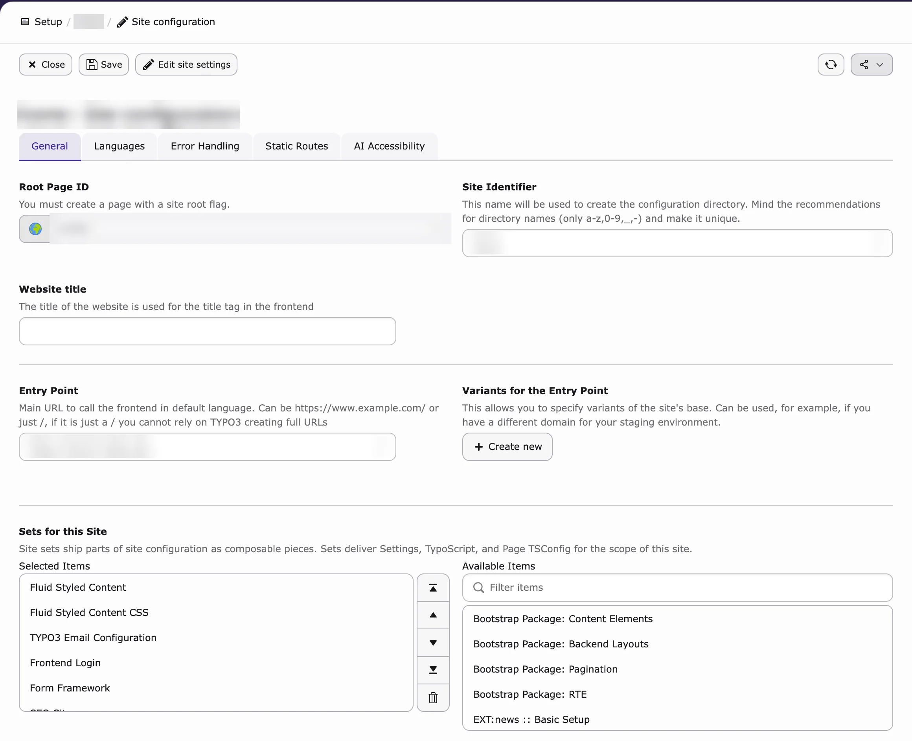
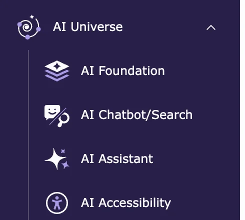

This guide shows you how to install AI Chatbot on your TYPO3 website for the first time. It takes about 15 minutes.

AI Chatbot needs a second, free extension called **AI Foundation**. AI Foundation connects TYPO3 to an AI service (for example OpenAI). Keep both extensions switched on.

<Info>
Upgrading from an older version (before v14)? Follow [Reinstall After Upgrading](/en/latest/ExtNsT3AC/ReInstallEverything/Index) instead.
</Info>

<Note>
AI Chatbot works with **TYPO3 v12, v13 and v14**. On TYPO3 v14, **Admin Tools** is called **System**. See [TYPO3 v12, v13 and v14](/en/latest/ExtNsT3AC/Introduction/Index#typo3-versions).
</Note>

## Before you start

You need:

- An administrator login for the TYPO3 backend.
- Your **AI Chatbot license key** from T3Planet.
- An account with an AI service (for example OpenAI) and its **API key** (a password for the AI service). No account? You can use **T3Planet Credits** instead.

## Step 1 — Install the License Manager

The **License Manager** (`ns_license`) unlocks T3Planet Premium extensions. Install its latest version first.

## Step 2 — Activate the License

1. Go to **Admin Tools → T3Planet Shop** (on TYPO3 v14: **System → T3Planet Shop**). Only system maintainers see this module.
2. Enter your AI Chatbot license key.
3. Click to activate the license.
4. Wait until AI Chatbot is downloaded and installed.
5. Check that **AI Foundation** was installed too. If not, see Step 3.

<Accordion title="Install with Composer (for developers)">

If your project is managed with Composer:

1. Add `nitsan/ns-t3ac` and `nitsan/ns-t3cs` to the `only` list of the T3Planet repository in `composer.json`:

```json
"only": [
  "nitsan/ns-t3ac",
  "nitsan/ns-t3cs"
]
```

2. Run:

```bash
composer require nitsan/ns-t3ac
```

3. Check that `nitsan/ns-t3af` (AI Foundation) is installed. If not, run `composer require nitsan/ns-t3af`.

Full details: [License activation](/en/latest/License/LicenseActivation/Index)

</Accordion>

## Step 3 — Install AI Foundation

Skip this step if AI Foundation was already installed in Step 2.

1. Go to **Admin Tools → Extensions** (on TYPO3 v14: **System → Extensions**).
2. Choose **Get Extensions**.
3. Search for **AI Foundation** (`ns_t3af`).
4. Click install.
5. Clear all caches.

AI Foundation is free. Download page: [extensions.typo3.org/extension/ns_t3af](https://extensions.typo3.org/extension/ns_t3af)

## Step 4 — Run Database Analyzer

TYPO3 needs to create new database tables for AI Chatbot.

1. Go to **Admin Tools → Maintenance** (on TYPO3 v14: **System → Maintenance**).
2. Click **Analyze Database Structure**.
3. Apply all suggested changes.

<a id="load-typoscript"></a>

{/* ## Step 5 — Configure/Load required TypoScripts

T3AC and T3CS ship static TypoScript that must be included on your site.

1. Switch to the root page of your site.
2. Open the **TypoScript** module and select **Edit TypoScript Record** / **Info/Modify**.
3. Click **Edit the whole template record** and open the **Includes** tab.
4. Under **Include static (from extensions)** / site sets, add:
  - `AI Chatbot/Search - TYPO3 Extension [nitsan/ns-t3cs]`
  - `AI Chatbot - TYPO3 Extension [nitsan/ns-t3ac]`
5. Save the template and flush TYPO3 caches. */}

## Step 5 — Load the required TypoScript

Now switch on AI Chatbot for your website. Choose **one** of the two ways.

**Option A – Site set (TYPO3 v13 and v14, recommended)**

A **site set** is a package of settings you switch on for your website.

1. Go to **Site Management → Sites** (on TYPO3 v14: **Sites → Setup**).
2. Click **Edit** (pencil icon) on your website.
3. On the **General** tab, find **Sets for this Site**.
4. Add **AI Chatbot - TYPO3 Extension**. The base set **AI Chatbot/Search - TYPO3 Extension** is added automatically.
5. Click **Save**.
6. Clear all caches.



{/* SUPADEMO NEEDED: Load AI Chatbot TypoScript with the site set (TYPO3 v13/v14) */}

**Option B – Static templates (TYPO3 v12, or if you don't use site sets)**

1. Go to **Site Management → TypoScript** (on TYPO3 v14: **Sites → TypoScript**).
2. Select the start page of your website.
3. Edit the TypoScript record and open the **Includes** tab.
4. Under **Include static (from extensions)**, add **AI Chatbot/Search - TYPO3 Extension**.
5. Add **AI Chatbot**.
6. Save and clear all caches.

<Note>
AI Chatbot no longer has its own tab in the site configuration. Switching the chatbot on, page visibility, CSS and allowed websites are now in **AI Universe → AI Chatbot/Search → Chatbot**. See [Upgrading? Where your old settings moved](/en/latest/ExtNsT3AC/Configuration/WhereToFindIt/Index)
</Note>

<a id="configure-ai-provider"></a>

{/* 1. Go to **Site Management → Sites** and edit your site.
2. In the **Sets** field, add **AI Chatbot - TYPO3 Extension**. It loads the base set **AI Chatbot/Search - TYPO3 Extension** automatically. */}

{/* 1. Go to the root page of your site and open the **TypoScript** module. */}

## Step 6 — Configure the AI Provider

Connect AI Chatbot to your AI service.

1. Go to **AI Universe → AI Foundation → AI Providers**.
2. Click **New Provider**.
3. Choose your AI service under **Adapter type**.
4. Enter your **API key** and choose the models.
5. Turn on **Provider enabled** and **Set as Default Provider**.
6. Click **Save**.
7. Test the connection (see [Testing a connection](/en/latest/ExtNsT3AF/Configuration/AIProviders/Index#testing-a-connection)).

<Tip>
No own API key? Use **T3Planet Credits** instead. See [T3Planet Credits](/en/latest/ExtNsT3AF/T3Planet-Credit-System/Index). For a guided setup, use **Quick Setup** in AI Foundation ([AI Foundation installation](/en/latest/ExtNsT3AF/Installation/Index#quick-start)).
</Tip>

{/* 1. Open **AI Foundation** in the TYPO3 backend.
2. Configure your preferred AI provider.
3. Save the provider and model configuration.
4. Verify the AI connection with a test request. */}

## Step 7 — Verify the Installation

Check that:

- **AI Universe → AI Chatbot/Search** opens without errors.
- The license is active.
- The AI provider test was successful.



Done! Next, add your content and start the training: see [Configuration](/en/latest/ExtNsT3AC/Configuration/Index) and [Data Source](/en/latest/ExtNsT3AC/FeatureGuide/DataSource/Index).

<Note>
AI Chatbot is a Premium extension and needs a T3Planet license. AI Foundation is free. More about licenses: [License](/en/latest/License/Index).
</Note>


{/* - T3AC backend modules load without errors. */}

{/* If all items above are true, installation is complete. Next, add data sources and run training in the T3AC module. */}

{/* After installation, you will use the T3AC backend module to: */}

{/* <Info>
If you are upgrading from an older version (**2.2.1** or earlier) to the latest release,
follow [Reinstall After Upgrading](/en/latest/ExtNsT3AC/ReInstallEverything/Index) instead of this installation guide.
</Info> */}

{/* 1. Open **Admin tools** → **T3planet License Manager**. */}

{/* Original text before the 8 Oct 2026 simplification (kept for reference):

This guide helps you install **T3AC Premium** (`EXT:ns_t3ac`) on a TYPO3 project for the first time.

T3AC needs **AI Foundation** (`EXT:ns_t3af`). AI Foundation connects your AI providers (API keys, models, prompts, and shared AI services). Without it, T3AC cannot run.

These extensions do **not** change how your website looks on the frontend by themselves. They work in the backend and power the AI chatbot. **Keep both T3AC and AI Foundation enabled.**

## Quick overview for new customers

You will install and activate these pieces:

1. **License Manager** (`EXT:ns_license`) — unlocks your Premium download
2. **T3AC** (`EXT:ns_t3ac`) — the AI Chatbot extension (and related packages such as T3CS where required)
3. **AI Foundation** (`EXT:ns_t3af`) — shared AI engine used by T3AC (free on TER)
4. **Database updates** — so TYPO3 creates the required tables
5. **TypoScript includes** — load the required static TypoScript
6. **AI provider setup** — so T3AC can send AI requests
7. **Final check** — confirm modules load and the license is active

Follow the steps below in order. Choose **either** Non-Composer **or** Composer in Step 2 — not both.

- Manage **data sources** such as sitemaps, PDFs, TYPO3 pages, web pages, and Q&A records.
- Run a **training pipeline** that keeps chatbot answers in sync with your project content.
- Configure and monitor the **AI chatbot**.
- View **usage analytics** for chatbot activity.

Make sure you have:

- Backend access as an administrator
- Your **T3AC license key** from T3Planet
- Decided whether your project uses **Composer** or the **TYPO3 Extension Manager**
- An AI provider account/API key ready (for example OpenAI) for Step 6

Install the latest version of `EXT:ns_license` before continuing.

The License Manager controls access to T3Planet Premium packages and is required to download and activate T3AC.

Pick the path that matches your project.

### Non-Composer Installation

Use this workflow when your project installs T3Planet extensions from the TYPO3 backend:

### Composer Installation

Use this workflow when your TYPO3 project is managed with Composer:

1. Check the T3Planet Composer repository configuration.
2. Update the `only` parameter so the project can download T3AC and T3CS:

3. Install the T3AC package:

4. Verify that the installation completed successfully.
5. Confirm that AI Foundation (`nitsan/ns-t3af` / `EXT:ns_t3af`) is installed. If it is missing, install it using **Step 3 — Install AI Foundation**.

Full license activation details:
[https://docs.t3planet.de/en/latest/License/LicenseActivation/Index.html](/en/latest/License/LicenseActivation/Index)

AI Foundation (`EXT:ns_t3af`) is required before T3AC can be used.
It provides the shared AI provider configuration, models, API access, logs, and service layer used by T3AC.

If AI Foundation was already installed in Step 2, you can skip to Step 4.

**AI Foundation** is the shared AI infrastructure for T3Planet AI Universe extensions.
Complete the parent setup first, then continue with the remaining T3AC steps below.

AI Foundation is available from the TYPO3 Extension Repository (TER).

Download / TER page: [https://extensions.typo3.org/extension/ns_t3af](https://extensions.typo3.org/extension/ns_t3af)

### AI Foundation has two provider modes

In **AI Foundation → AI Providers**, choose how T3AC gets AI access:

**Your Own API Keys**

Use this mode when you want to connect your own AI vendor accounts. You store
and manage your API keys (for example OpenAI, Anthropic, Gemini) in AI
Foundation and run AI features through those providers.

**T3Planet Credits** is T3Planet’s managed AI access for AI Foundation. It lets
your TYPO3 site use AI features **without storing or managing your own vendor
API keys**.

**Link for T3Planet Credits:** [T3Planet Credits Documentation](/en/latest/ExtNsT3AF/T3Planet-Credit-System/Index)

### Option 1 — Extension Manager (TER)

### Option 2 — Composer

If AI Foundation is not already present after installing T3AC, install it with:

```bash
composer require nitsan/ns-t3af
```

Then flush all TYPO3 caches.

Helpful AI Foundation references:

- [AI Foundation Installation](/en/latest/ExtNsT3AF/Installation/Index)
- [AI Foundation Configuration](/en/latest/ExtNsT3AF/Configuration/Index)
- [AI Providers](/en/latest/ExtNsT3AF/Configuration/AIProviders/Index)
- [T3Planet Credits](/en/latest/ExtNsT3AF/T3Planet-Credit-System/Index)

## Premium Version

**T3AC** is a Premium extension and requires a valid T3Planet license for download and activation.

For license activation and access to premium features, see:
[https://docs.t3planet.de/en/latest/License/Index.html](/en/latest/License/Index)

<Note>
**AI Foundation** (`EXT:ns_t3af`) is free and available from the TYPO3 Extension Repository (TER).
Premium licensing applies to **T3AC** — not to AI Foundation.
</Note>

After installing the extension, apply all pending database changes:

Run this before using T3AC modules in the TYPO3 backend.

After installation:

T3AC will not function correctly until AI Foundation has a working AI provider configuration.

Before handing the system to editors, verify that:
*/}
