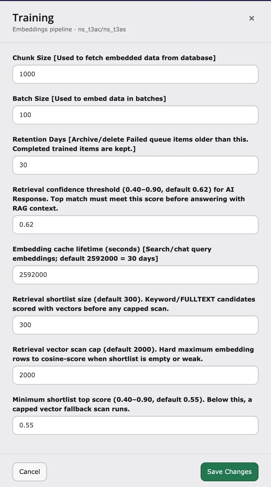

## Introduction

Before the chatbot writes an answer, it looks for matching content on your website. The **Retrieval confidence threshold** decides how good a match must be before the chatbot uses it.

- **Higher value** – stricter. Fewer made-up or off-topic answers, but more "no answer found".
- **Lower value** – more answers, but some may use content that fits less well.

The default **0.62** works for most websites.

## Change the value

1. Go to **AI Universe → AI Foundation → AI Features**.
2. Open the **Training** card.
3. Enter a value between **0.40** and **0.90** in **Retrieval confidence threshold**.
4. Save.
5. Clear all caches.
6. Ask the chatbot a few questions.

<Note>
You don't need to train your content again after changing this value.
</Note>

## Tuning guide

| Value | Effect |
| --- | --- |
| 0.58 – 0.60 | More answers. Try this if good questions often get "no answer". |
| 0.62 (default) | Balanced. |
| 0.65 – 0.70 | Stricter. Try this if answers often use unrelated content. |

<Accordion title="For developers: how the score is calculated">
AI Chatbot gives every match from your content a score. It answers from your content only if the best score reaches the threshold.

- Setting key: `retrievalConfidenceThreshold` (from 0.40 to 0.90, default 0.62).
- The score of a match is the higher of two values: how similar it is to the question, and its search ranking.
- A match that contains a word from the question can also pass with a lower score (at least 0.45).
</Accordion>

{/* Original text before the 8 Oct 2026 simplification (kept for reference):

Retrieval confidence threshold is a global T3CS setting that controls how strong
a vector match must be before **T3AC** (chatbot) treats retrieved content as
reliable enough for RAG (retrieval-augmented generation).

It replaces a former hard-coded value (`0.62`) with a configurable option in
**AI Foundation → AI Features → Training**.

Set **Retrieval confidence threshold** under **AI Foundation → AI Features →
Training** (Embeddings pipeline — `ns_t3ac`).

## Property reference

| Property | Value |
| --- | --- |
| Setting key | `retrievalConfidenceThreshold` |
| Allowed range | `0.40` – `0.90` (values outside range are clamped) |
| Default | `0.62` |

## Purpose

Reduce answers built on weak or unrelated chunks (hallucination risk), while
avoiding false “no results” when the best match is good but reranking lowered
the displayed score below cosine similarity.

| Threshold | Effect |
| --- | --- |
| `0.58` – `0.60` | More answers; good when top matches often sit around `0.60`–`0.65` |
| `0.62` (default) | Balanced strictness |
| `0.65` – `0.70` | Stricter; fewer weak-context answers, more “no confident match” behavior |

<Note>
Changing the threshold does not require re-training embeddings; flush caches
and retest queries.
</Note>

## How the score is calculated

For each retrieved chunk, the gate uses:

**Item confidence** = `max(score, similarity)`

- **similarity** — cosine similarity between query and chunk embedding
- **score** — hybrid / reranked value (can be lower than similarity)

The top confidence among accessible chunks is compared to
`retrievalConfidenceThreshold`.
*/}

{/* Detailed developer notes (moved here on 2026-10-08 to keep the page short; not shown on the website):

<Accordion title="For developers: how the score is calculated">

Setting key: `retrievalConfidenceThreshold`. Allowed range `0.40`–`0.90` (values outside are clamped), default `0.62` (previously hard-coded).

For each retrieved chunk: **item confidence** = `max(score, similarity)`, where **similarity** is the cosine similarity between query and chunk embedding, and **score** is the hybrid / reranked value (can be lower than similarity). The top confidence among accessible chunks is compared to the threshold.

## Confidence gate passes if either

- Top confidence ≥ threshold, **or**
- **Term-anchored bypass:** at least one accessible chunk has confidence ≥
`0.45`, confidence ≥ `0.38` (absolute floor), and at least one extracted
query term appears in chunk content or path (word boundaries; path/hyphen-aware).

</Accordion>
*/}
