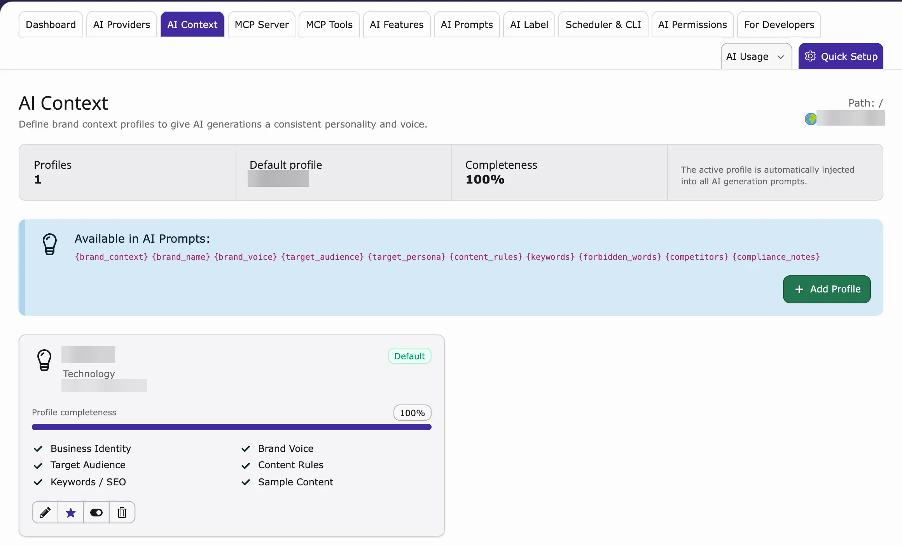
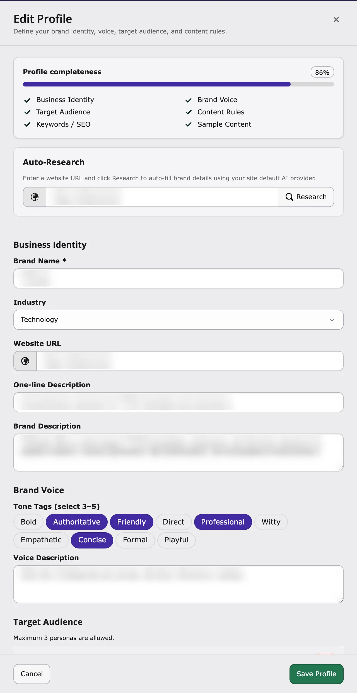

## Purpose

**AI Context** is a short profile of your company: who you are, who you write for and how you sound. The AI adds it to every request, so texts from all AI extensions match your brand – without editors typing the same instructions again and again.

**Path:** **AI Universe → AI Foundation → AI Context**

<iframe src="https://app.supademo.com/embed/cmrbp3jz80eaiqmo5zuj6gb0e?utm_source=link" loading="lazy" title="T3AF AI Context Demo" allow="clipboard-write; fullscreen" frameBorder="0" webkitallowfullscreen="true" mozallowfullscreen="true" allowfullscreen></iframe>

Store your **brand profile** once. T3AF injects it into prompts for consistent, on-brand results across all connected extensions.

AI Context — brand profiles, completeness, and prompt variables.

## Setup (3 steps)

1. Go to **AI Universe → AI Foundation → AI Context**.
2. Fill in the fields about your business (see below).
3. Click **Save**. AI extensions use it from the next AI request.

Edit profile — auto-research and business identity fields.

## What to store

- **Company name** — For example Finance Company GmbH
- **Industry** — For example financial services
- **Audience** — For example SME owners in Germany
- **Brand voice** — Professional, clear, trustworthy
- **Key messages** — Digital-first, personal service
- **SEO keywords** — finance, banking, loans
- **Language style** — German formal (Sie) or simple English

## Content Rules

**Content Rules** are writing rules for the AI, for example:

- Always: use the Oxford comma
- Never: use slang

## Why it matters

Without context, AI texts sound generic. With context, they match your brand and your market.

## When to update AI Context

- Rebrand or new product line
- New target market (for example expand from DE to EN)
- Compliance change (formal Sie required everywhere)
- After [AI Prompts](/en/latest/ExtNsT3AF/Configuration/AIPrompts/Index) changes still produce off-brand text

## Scenario: multi-language site

Set language style to “German formal (Sie) for DE; simple English for EN”. Add brand terms that must stay untranslated. Connected translation features will respect this context.

See also [AI Prompts](/en/latest/ExtNsT3AF/Configuration/AIPrompts/Index) for task-specific instructions.

{/* Original text before the 8 Oct 2026 simplification (kept for reference):

**Path:** T3AF > AI Context

Follow this interactive walkthrough, then continue with the details below.

**Content Rules** are writing instructions for the AI, for example:

They are added into the AI prompt as text.

Without context, AI output sounds generic. With context, text matches your brand and market. Every editor benefits without retyping instructions.

1. Open T3AF > AI Context
2. Fill business identity fields
3. Save — extensions use it automatically on the next AI request
*/}
