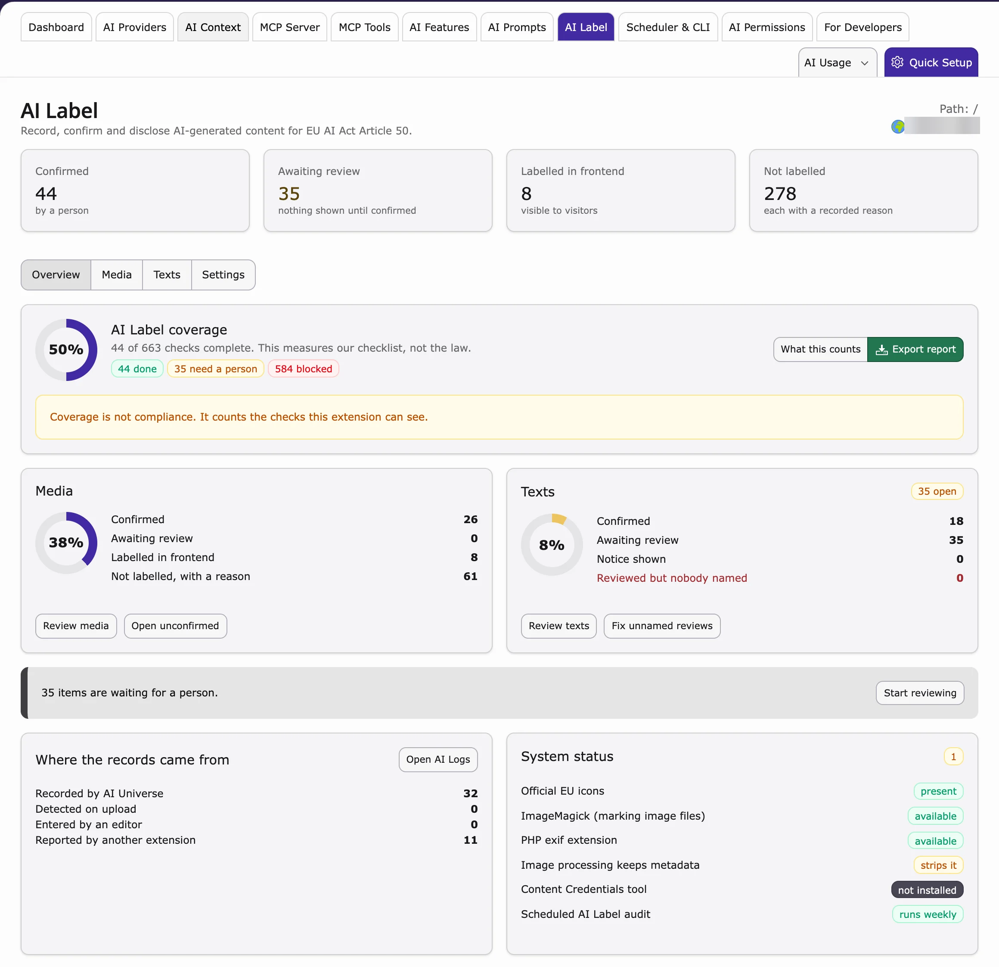

## Purpose

**AI Label** helps you mark content that was written or changed by AI, as the **EU AI Act (Article 50)** requires. Your team records which pages, texts and images were made with AI, a person confirms it, and visitors see a small "AI generated" label.

**Path:** **AI Universe → AI Foundation → AI Label**

<iframe src="https://app.supademo.com/embed/cmt8jvbrj0r0bqmvh7s9pw5zg?embed_v=2&utm_source=embed" loading="lazy" title="Configure and Manage AI Labels" allow="clipboard-write; fullscreen" frameBorder="0" webkitallowfullscreen="true" mozallowfullscreen="true" allowfullscreen></iframe>

<Warning>
AI Label is a tool, not legal advice. A high score in the module means your internal checks pass – not that your website is legally compliant.
</Warning>

## Who uses it

- **Editors** – check pages, content elements and images touched by AI, confirm them and name a responsible person where needed.
- **Administrators** – set up how labels look and which rules apply.
- **Compliance / legal** – export evidence reports.

## Quick start: show an AI label on your website

1. Your developer loads the AI label TypoScript once (see [Frontend labels](#frontend-labels)).
2. Go to **AI Universe → AI Foundation → AI Label**.
3. Open the **Media** or **Texts** tab.
4. Click the edit icon on a record.
5. Set **AI involvement** to **AI generated** or **AI modified**.
6. For texts only: set **Matter of public interest** to **Yes**.
7. Check **What a visitor will see**.
8. Click **Confirm**.
9. Open the page on your website and check the label.

Details: [Activate visitor labels](#activate-visitor-labels-text-vs-media).

## Module layout

### Overview tab

- **Scoreboard** – four numbers: Confirmed, Awaiting review, Labelled in frontend, Not labelled.
- **AI Label coverage** – a checklist score. Export a CSV report from here.
- **Media / Texts cards** – progress and quick links.
- **Where records came from** – AI Universe, upload detection, editor or other extensions.
- **System status** – EU icon pack, image tools and the scheduled audit task.

### Media tab

Your files (images and other media), with a folder tree on the left and filters at the top.

For each file you can:

- **Edit** (open icon) – edit the AI Label fields and preview the visitor label.
- **Confirm** – confirm it in your name (for this version only).
- **Clear** – remove the confirmation (you can undo for 10 minutes).

### Texts tab

The same for **pages**, **content elements** and any extra tables added in Settings.

<Tip>
Rows marked **"reviewed, nobody named"** need a responsible person. A review tick without a name documents nothing. Use **Assign responsible person**.
</Tip>

### Settings tab

How labels look and which rules apply. Most websites can keep the defaults.

<Accordion title="Frontend label appearance">

| Setting | Options | Effect |
| --- | --- | --- |
| **Position on media** | Bottom right (default), bottom left, top right, top left | **Frontend (image overlay only).** Positions the badge inside the image wrapper when **Mark the image file** is set to **Overlay on the image**. Does not move text badges on content elements — those stay inline after the element body. |
| **Size** | Medium (default), small, large | **Frontend.** CSS classes `nst3af-ailabel--size-*`; icon height 32px (medium), 24px (small), 48px (large). Applies to content-element badges and image overlays. |
| **Wording beside the icon** | Show in site language (default), icon only | **Frontend.** **Icon only** shows the EU icon (`alt` / `aria-label` still carry the wording). **Show in site language** shows the short label text only — no icon — in the current site language (`locallang.xlf` overlays, for example `de.locallang.xlf`). |
| **Mark the image file itself** | Content element only (default), overlay on the image, written into the image file | **Frontend (partial).** **Content element only** — badge after the content element only (no overlay on ``). **Overlay on the image** — badge on each confirmed AI-generated file in Fluid Styled Content image rendering. **Written into the image file** — stamps the EU icon onto **processed** image copies when ImageMagick is available. Originals are not rewritten. Without ImageMagick, use overlay instead. |

</Accordion>

<Accordion title="Machine-readable marking and rules">

| Setting | Options | Effect |
| --- | --- | --- |
| **Machine-readable marking** | IPTC digital source type (default), IPTC plus JSON-LD, off | **Frontend / files.** **IPTC** writes Digital Source Type (`trainedAlgorithmicMedia`) onto confirmed media when ImageMagick is available. **IPTC plus JSON-LD** also injects page JSON-LD when text rules show a label. **Off** skips both. |
| **Label media of unknown origin** | No (default), yes | **Frontend.** When yes, confirmed media with involvement `origin_unknown` shows a visitor badge (reason `unknown_origin`). |
| **Second information layer** | Off (default), on | **Frontend.** When on, the badge is wrapped in `
` with a second line of **visitor-facing** involvement wording only (machine reason codes such as `rule_default` stay in evidence export and backend lists). |
| **Also record on these tables** | Comma-separated table names (empty by default) | **Backend.** Extra tables are merged with the defaults `pages`, `tt_content` and `sys_file_metadata` (they are never replaced). After save, run **Maintenance → Analyze Database Structure** so the AI Label columns exist on those extra tables. |

</Accordion>

<Accordion title="Automatic confirmation">

| Setting | Options | Effect |
| --- | --- | --- |
| **Confirm when OUR extension recorded it** | Off (default), on for media, on for text, on for media and text | **Backend.** Auto-confirms bind from `ns_t3ai` / `ns_t3aa` / `ns_t3af` for the chosen domain (media, text, or both). EXTCONF `ailabelAutoConfirmSources` is still an extra allow-list. |
| **Confirm when DETECTED on upload** | Off (default), on | **Backend.** When on, recording source `detected_upload` (files whose IPTC Digital Source Type already signals AI) is auto-confirmed. Hold rules still apply. |
| **When auto-confirm is on, still hold for a person** | Public-interest texts (default) | **Backend.** Settings `autoConfirmHold` plus EXTCONF `ailabelHoldList` / `AutoConfirmSettingsService` block auto-confirm for public-interest text even when a source is allow-listed. |
| **Automatically record human review and responsible person** | (disabled checkbox) | **Never available** by design — responsible person stays manual. |

Per-folder media defaults are configured via EXTCONF `ailabelFolderDefaults` (not on the Settings form).

</Accordion>

Settings are saved in **AI Label → Settings** and stored in `tx_nst3af_extension_setting` (extension key `ns_t3af`). Defaults live in `Configuration/ExtensionSettings/fields.typoscript`.

## Record drawer fields

- **AI involvement** — not reviewed, no AI, AI generated, AI modified, origin unknown, suggestion
- **Created on** (read-only) — content creation date vs legal cutoff
- **Matter of public interest** — text records only; editor decision (gate, not a master switch — see [Activate visitor labels](#activate-visitor-labels-text-vs-media))
- **Reviewed by a named person** — required when human review applies
- **Labelling** — automatic / always / do not label
- **Reason for not labelling** — exemption vocabulary (compliance-controlled)
- **Detected on upload** (read-only) — detection hints for media
- **What a visitor will see** — live preview of label decision

Saving the drawer does not confirm the record. Click **Confirm** too.

## Bulk actions

Select several rows with the checkboxes, then choose:

- Confirm
- No AI involved
- Do not label
- Set public interest
- Assign responsible person
- Clear confirmation
- Undo last bulk action (10-minute window)

## Evidence export

Download a CSV report for internal audits, from the action bar or the coverage card on **Overview**.

- **CSV** — **evidence-relevant** records only (recording source set, involvement other than `not_reviewed`, or confirmed), with reason codes and confirmation metadata — not a dump of every `pages` / `tt_content` / `sys_file_metadata` row
- **Scope by module tab** — Media exports `sys_file_metadata` only; Texts exports `tt_content` + `pages`; Overview and Settings export all three

Use for internal audits; reason codes are machine-readable (for example `rule_default`, `editorial_control`, `unreviewed`).

## How records get AI metadata

1. **Automatically** – when an AI extension creates or changes content, it is recorded.
2. **On upload** – files that already carry an AI mark are suggested (a person still confirms).
3. **By hand** – editors set the fields in the drawer or in the **AI Label** tab of a page, content element or file.

<Accordion title="For developers: how extensions record AI use">
Your extension can mark a record as AI-generated, so the AI label appears automatically.

- When you save a page, content element, file or your own record that was created with AI, call `AiLabelBindHelper`.
- Editors can also set the label by hand in the **AI Label** tab.
- Examples: [Extension integration](/en/latest/ExtNsT3AF/DeveloperGuide/ExtensionIntegration/Index).
</Accordion>

## Activate visitor labels (text vs media) {#activate-visitor-labels-text-vs-media}

There is no single switch that turns on all labels. Each record needs the right fields, and the frontend TypoScript must be loaded (see [Frontend labels](#frontend-labels)).

<Note>
Setting **Matter of public interest** to **Yes** alone does **not** show a label. It is only needed for texts, and texts still need the other steps.
</Note>

### Prerequisite (both domains)

1. Include frontend TypoScript (Site Set `nitsan/ns-t3af-label` **and** `@import`, or classic static template “AI Foundation labels”).
2. Flush caches after changing TypoScript or Site Sets.
3. Open the record in the AI Label drawer and check **What a visitor will see** before expecting anything on the live page.

### Media (files / `sys_file_metadata`)

Public interest does **not** apply.

1. Set **AI involvement** to **AI generated** or **AI modified** (or **Always** under Labelling).
2. Click **Confirm** (unconfirmed media never shows a visitor label).
3. Optional — Settings: **Mark the image file** (badge after CE vs overlay on the image), stamp size/position.
4. **Origin unknown** only labels when Settings **Label unknown origin** is **Yes**.

A named reviewer does **not** hide media labels (Art. 50(4)).

### Text (pages / content elements)

1. Set **AI involvement** to **AI generated** or **AI modified** (not “not reviewed” / “no AI”).
2. Set **Matter of public interest** to **Yes** (required gate; **No** = no visitor label).
3. Human review:
   - Leave **Reviewed by a named person** unchecked → label can show after confirm, **or**
   - Check it **and** enter a **responsible person** → label is **suppressed** (editorial control), **or**
   - Check it **without** a name → incomplete; treat as needing a name (see Texts tab highlight).
4. Click **Confirm** so the disclosure is intentional for that version.
5. Verify **What a visitor will see** in the drawer, then check the frontend.

### Quick checklist

| Step | Media | Text |
| --- | --- | --- |
| Frontend TypoScript / Site Set | Required | Required |
| AI involvement (generated / modified) | Required | Required |
| Matter of public interest = Yes | Not used | Required gate |
| Confirm | Required (no confirm → no label) | Required for a deliberate disclosure |
| Named reviewer | Does not hide label | Hides label when name is set |
| Drawer preview | Use before live check | Use before live check |

## Frontend labels {#frontend-labels}

When a record is **confirmed** and the rules pass, visitors see:

- **Icon only** — EU AI label icon (bundled SVG set)
- **Show in site language** — short text only (for example “AI generated”, “AI modified”), no icon
- Size and (for image overlays) position from Settings — see tables above

Labels appear after a content element, or on the image itself (when **Mark the image file** is **Overlay on the image**). Media and text follow different rules – see above.

<Accordion title="For developers: load and render the labels">
The labels only show on the website when the AI Foundation TypoScript is loaded.

- **Site sets (TYPO3 v13.4 and newer):** add `nitsan/ns-t3af-label` to the `dependencies` of your site set **and** `@import` the file `EXT:ns_t3af/Configuration/TypoScript/setup.typoscript`.
- **Classic templates:** include the static template **AI Foundation labels**.
- **Your own templates:** use `<ail:label record="{data}" />` or `<ail:label file="{image}" />`.
</Accordion>

## TCA integration

Editors can also use the **AI Label** tab on pages, content elements and file metadata. It has the same fields as the drawer.

## Security & permissions

Uses standard backend login and module access. Confirmation always records the current backend user id. Bulk undo is scoped per user session cache.

{/* Original text before the 8 Oct 2026 simplification (kept for reference):

**AI Label** helps your team **record, confirm, and disclose** AI-generated or AI-modified content for **EU AI Act Article 50** workflows.

**Path:** AI Foundation > AI Label

AI Foundation provides the **technical tooling** — coverage scores, review lists, visitor-facing badges, and evidence export. It does **not** guarantee legal compliance. A high coverage number means internal checks pass, not that your site is compliant.

- **Editors** — review AI-touched pages, content elements, and media; confirm or adjust involvement; assign a named reviewer where required.
- **Administrators** — configure label appearance, auto-confirm rules, and which extension tables participate.
- **Compliance / legal** — export evidence reports with machine-readable reason codes per record.

- **Scoreboard** — four KPI cards: Confirmed, Awaiting review, Labelled in frontend, Not labelled.
- **AI Label coverage** — checklist score with collapsible details (what counts, blind spots). Export CSV report from here.
- **Media / Texts cards** — domain progress rings and quick links.
- **Where records came from** — counts by recording source (AI Universe, upload detection, editor, other extensions).
- **System status** — EU icon pack, ImageMagick/EXIF, scheduled audit task.

- **Folder tree** (fileadmin) — browse FAL folders; badge shows open items.
- **Filters** — search, involvement, label state, file type, confirmed-by, dates, recording source, reason code.
- **Table** — one row per file metadata record.
- **Row actions:**
  - **Edit (open icon)** — slide-in drawer to edit AI Label fields and preview visitor label.
  - **Confirm** — mark as confirmed by the current backend user (this content version only).
  - **Clear** — remove confirmation (undo snapshot kept for 10 minutes via bulk undo when applicable).

Same filter/action pattern for **pages**, **content elements**, and optional extension tables configured in Settings.

Highlights **“reviewed, nobody named”** rows — a human-review tick without a responsible person name documents nothing; use bulk **Assign responsible person** or the drawer.

#### Frontend label appearance

#### Machine-readable marking and rules

#### Automatic confirmation

Each edit drawer shows:

Saving the drawer updates the record; it does not auto-confirm unless you also click **Confirm**.

For a full text-vs-media activate path, see [Activate visitor labels](#activate-visitor-labels-text-vs-media).

Select rows with checkboxes, then:

From the action bar or Overview coverage card:

Visitor badges are **not** turned on by a single Settings toggle. Each record must pass its domain rules, and the site must include the frontend TypoScript (see [Frontend labels](#frontend-labels) below).

**Common misconception:** setting **Matter of public interest** to **Yes** alone does **not** show a label. That field is only a **gate for text** (pages / content). It does nothing for media, and text still needs involvement, confirmation, and the review rules below.

Named human review does **not** hide media labels (Art. 50(4)).

When rules pass and a record is **confirmed**, visitors may see:

**Two badge locations:**

Media and text follow **different rules** — media labels are not suppressed by a named human reviewer; text labels require public interest and review rules.

Editors can also use the **AI Label** tab on:

- Page records
- Content elements
- File metadata

Same fields as the module drawer.
*/}

{/* Detailed developer notes (moved here on 2026-10-08 to keep the page short; not shown on the website):

<Accordion title="For developers: how extensions record AI use">

1. **AI Foundation capture** — every provider response stores a generation correlation id.
2. **Bind on save** — integrating extensions call `AiLabelBindHelper` (or `AiLabelRecorderInterface`) when a page, content element, file, or custom table row is persisted after AI generation.
3. **Upload detection** — optional signals on file import (suggestions only until a person confirms).
4. **Manual** — editors set fields in the record drawer or TCA **AI Label** tab on pages, content, and file metadata.

See [Extension integration](/en/latest/ExtNsT3AF/DeveloperGuide/ExtensionIntegration/Index) for third-party bind patterns.

</Accordion>

<Accordion title="For developers: load and render the labels">

Visitor badges render after the TypoScript in `EXT:ns_t3af/Configuration/TypoScript/setup.typoscript` is included. Use the checklist above to activate a record; this section covers **how** badges are rendered.

**Site Set (TYPO3 v13.4+):** add `nitsan/ns-t3af-label` to your own set's `dependencies` **and** `@import` that setup file. A dependency listing alone does not load TypoScript.

**Classic templates:** include static “AI Foundation labels” (Web > Template).

- **Content element** — drop-in partial after the element body when labelling rules pass. In **Overlay on the image** mode, media CTypes (`image`, `textmedia`, `textpic`) **skip** this CE badge so visitors see a single mark on the image; non-media CTypes still use the drop-in.
- **Image overlay** — only when **Mark the image file** is **Overlay on the image** and the file is confirmed AI-generated; position applies here.

Custom templates can use `<ail:label record="{data}" />`, `<ail:label file="{image}" />`, `<ail:recordState>`, `<ail:fileState>`, or the `nst3af-label` DataProcessor.

Fluid Styled Content ships an image partial override (`Resources/Private/Partials/FluidStyledContent/Media/Rendering/Image.html`) that wraps the badge when overlay mode is enabled.

</Accordion>
*/}
