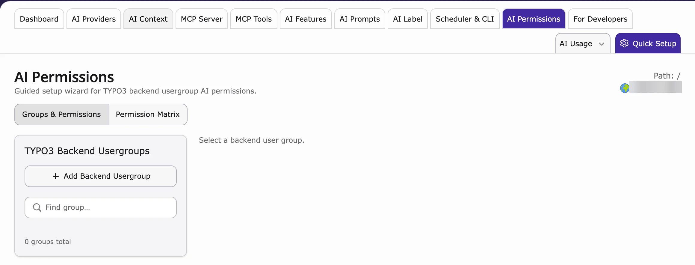

**AI Permissions** decides which editors may use which AI tools. For example, give interns and clients safe AI access, but keep API keys and settings for administrators only.

**Path:** **AI Universe → AI Foundation → AI Permissions**

Only **TYPO3 administrators** can open this module. The rules apply to every backend user.

<iframe src="https://app.supademo.com/embed/cmrbpvc5y0g0vqmo5l30iq6mc?utm_source=link" loading="lazy" title="T3AF AI Permissions Demo" allow="clipboard-write; fullscreen" frameBorder="0" webkitallowfullscreen="true" mozallowfullscreen="true" allowfullscreen></iframe>

## Purpose

You set the permissions per **backend user group** (a group of editors in TYPO3). For each group you choose:

- **Modules** – which AI Foundation tabs and AI extensions they see.
- **Features** – which AI functions inside those modules they may use.
- **Records** – whether they may only read or also change providers, prompts, AI Context and logs.
- **Limits** – how many pages they may process at once, and monthly or daily limits for credits and requests.

## Recommended workflow

1. Create or choose a backend user group for your editors.
2. Go to **AI Universe → AI Foundation → AI Permissions**.
3. Select the group in the list on the left.
4. Go through the five steps of the wizard (see below).
5. Click **Apply** on the last step.
6. Clear all caches.
7. Log in as an editor of that group and check what they see.

## TYPO3 Backend Usergroups

The left list shows all backend user groups with their number of members and how many AI modules are set up. Use **Find group…** to search. Select a group to open the wizard.

## Guided wizard

1. **Modules** – switch AI Foundation modules and AI extensions on or off.
2. **Features** – allow single features in those modules.
3. **Records** – choose read or read/write access.
4. **Limits** – credit limits, daily request limits, batch limits, workspace and audit options.
5. **Review** – check the summary and apply.

Use **Back** / **Next** at the bottom of the wizard.

## Permission Matrix

The **Permission Matrix** tab shows all groups side by side.

- **Use / Read / On** (green check) – allowed
- **Mgr** – may manage (read and change)
- **—** – no access

Groups that are not set up yet are greyed out with a **Not configured** badge.

## What enforcement does

After you apply the permissions:

- Editors only see the AI tabs they are allowed to use.
- Without write access, the **AI Providers** list is read-only (**Test connection** still works).
- AI extensions follow the same rules. Actions that are not allowed are blocked.
- Administrators always keep full access.

## When to use this module

- Safe AI access for junior staff, clients, and freelancers
- Editors share one instance across departments
- MCP or provider management must stay admin-only
- Per-group credit or request caps are required
- Child extensions must show only allowed tabs, features, and write actions

<Accordion title="For developers: how permissions are stored">
The permissions are saved in the normal TYPO3 backend user groups, so they work like all other group rights.

- Only the AI rights are changed. Other rights of the group stay as they are.
- Your own extension can add its modules and features here: [Custom Access Catalogs](/en/latest/ExtNsT3AF/DeveloperGuide/CustomAccessCatalogs/Index).
</Accordion>

## Related

- [AI Features](/en/latest/ExtNsT3AF/Configuration/AIFeatures/Index) – the settings these permissions protect
- [AI Search permissions](/en/latest/ExtNsT3AS/Configuration/Permissions/Index) and [AI Chatbot permissions](/en/latest/ExtNsT3AC/Configuration/Permissions/Index) – the record permissions for AI Chatbot/Search

{/* Original text before the 8 Oct 2026 simplification (kept for reference):

Guided setup wizard for TYPO3 backend usergroup AI permissions.

**Path:** T3AF > AI Permissions

Follow this interactive walkthrough, then continue with the details below.

AI Permissions — configure backend usergroups and review the cross-group Permission Matrix.

Only **TYPO3 administrators** can open and change this module. Runtime enforcement still applies to every backend user.

Role-based access and permissions for AI on TYPO3: a guided wizard over backend usergroups so junior staff, clients, and freelancers get safe AI access without seeing admin-only tools.

Configure per group:

- **Module access** — Which T3AF tabs and child modules appear
- **Fine-grained feature permissions** — Which features inside those modules are allowed
- **Record-level restrictions** — Read vs read/write on providers, prompts, context profiles, logs, and other catalog records
- **Page-scope and batch limits** — Bulk page limits, scheduler batch limits, and workspace enforcement where enabled
- **Per-group credit limits** — Monthly credit caps and daily request caps

The left sidebar lists backend user groups (same shell pattern as MCP Tools).

- Search with Find group…
- Each row shows the group name, member count, and how many AI modules are configured
- Select a group to open the guided wizard for that group

Example: a group such as `ns_t3af_extended` may show `0 members` and a configured module count after you apply permissions.

After you select a group, the wizard walks through five steps:

1. **Modules** — Toggle T3AF admin modules and installed child extensions (for example AI Assistant, AI Search Hub, and other registered suite modules).
2. **Features** — Grant fine-grained feature permissions for the modules you enabled.
3. **Records** — Set record-level read or read/write access for catalog records those modules manage.
4. **Limits** — Set per-group credit limits, daily request caps, bulk/page batch limits, workspace enforcement, and audit/logging options (shown in the matrix under Credits, Workspace, and Audit).
5. **Review** — Preview the merged `be_groups` values, then apply.

Use Back / Next in the wizard footer. On Review, confirm the preview, then apply and flush caches before testing with an editor account.

Open the **Permission Matrix** tab for a cross-group overview. The subtitle shows how many groups exist and how many are configured (for example `1 groups, 1 configured`).

### Legend

- **Use / Read / On** — Allowed (green check)
- **Mgr** — Manage / read+write
- **—** — No access

### T3AF columns

Typical matrix columns for T3AF:

- Group name and member count
- Admin modules: AI Providers, MCP Server, MCP Tools, AI Features, AI Usage, AI Prompts, Scheduler & CLI, AI Context, AI Logs
- AI Safety / limits: Credits, Workspace, Audit

Child extension scope tabs appear when those extensions register an access catalog. Unconfigured groups stay dimmed with a **Not configured** badge.

After you apply permissions:

- Restricted editors only see T3AF tabs they are allowed to use
- Dashboard may show an allowed-tabs overview instead of full analytics when usage/context/MCP tabs are closed
- AI Providers create/edit/delete needs write access on the provider table; otherwise the list stays read-only (Test connection can still work)
- Child extension tabs, cards, and mutating routes follow the same grants (403 when write is denied)

Administrators always keep full access to configure AI Permissions.

1. Create or choose a backend user group for editors.
2. Open T3AF > AI Permissions.
3. Select the group and complete Modules → Features → Records → Limits → Review.
4. Check the **Permission Matrix** for that group.
5. Flush caches.
6. Log in as a user in that group and confirm hidden tabs and read-only screens match the matrix.
*/}

{/* Detailed developer notes (moved here on 2026-10-08 to keep the page short; not shown on the website):

<Accordion title="For developers: how permissions are stored">

The module writes into normal TYPO3 backend user group ACL fields (`groupMods`, `custom_options`, `tables_select`, `tables_modify`) and merges only AI-managed keys. Unrelated modules and tables already granted to the group stay intact.

The matrix columns for AI Foundation: AI Providers, MCP Server, MCP Tools, AI Features, AI Usage, AI Prompts, Scheduler & CLI, AI Context, AI Logs, plus Credits, Workspace and Audit. AI extensions add their own scope tabs when they register an access catalog.

Developer extensions can register additional modules, features, and records through [Custom Access Catalogs](/en/latest/ExtNsT3AF/DeveloperGuide/CustomAccessCatalogs/Index).

Product overview: [T3AF on GitHub](https://github.com/nitsan-technologies/ns_t3af).

</Accordion>
*/}
