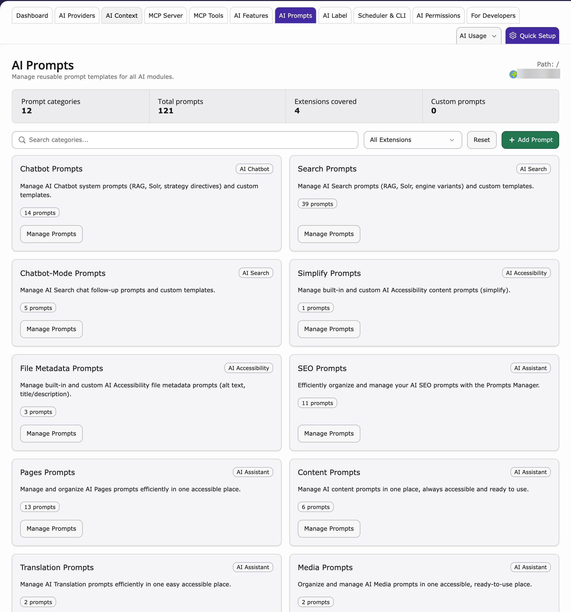

## Purpose

A **prompt** is the instruction sent to the AI, for example "Write a meta description, max 155 characters". **AI Prompts** keeps these instructions in one place, so every editor and every AI extension gets the same quality.

**Path:** **AI Universe → AI Foundation → AI Prompts**



<Note>
This page is only useful if you have an AI extension installed that uses prompts, for example:

- [AI Assistant](https://t3planet.de/t3ai-typo3-erweiterung)
- [AI Chatbot](https://t3planet.de/t3ac-typo3-erweiterung)
- [AI Search](https://t3planet.de/t3as-typo3-erweiterung)
- [AI Accessibility](https://t3planet.de/t3aa-typo3-erweiterung)

The prompts are stored in AI Foundation and used by these extensions.
</Note>

## What is a prompt?

The instruction sent to the AI. Examples:

- “Write a meta description, max 155 characters”
- “Translate to German, formal Sie”

## Manage prompts

1. Go to **AI Universe → AI Foundation → AI Prompts**.
2. Choose a category.
3. Edit the prompt text.
4. Save.
5. Test with one real request.

## Writing good prompts

1. **Be specific** — length, format, language
2. **Set tone** — formal, friendly, technical
3. **Say what to avoid** — no emojis, no hype, no legal claims
4. **Include the page goal** — SEO, translation, rewriting, or summary

## Example prompt

```
Write a friendly greeting for [audience] mentioning [topic].
```

<Tip>
Use prompts together with [AI Context](/en/latest/ExtNsT3AF/Configuration/AIContext/Index): AI Context says **who you are**, prompts say **what to do**.
</Tip>

## Reset to default

Results got worse after a change? Click **Reset to default**. Then change one thing at a time and test again.

## When to customize prompts

- SEO team has strict meta description rules
- Legal requires disclaimers in generated text
- German formal (Sie) must appear in every output
- Extension default is too generic for your industry

## When to leave defaults

- Small team still learning AI features
- You have not yet filled [AI Context](/en/latest/ExtNsT3AF/Configuration/AIContext/Index)
- Results are already good — do not over-edit

## Governance note

<Warning>
A prompt change affects all editors. Agree on big changes first, and limit who may edit prompts with [AI Permissions](/en/latest/ExtNsT3AF/Configuration/AIPermissions/Index).
</Warning>

{/* Original text before the 8 Oct 2026 simplification (kept for reference):

Central **prompt templates** for T3AF and connected extensions. Same prompt quality for every user and every extension.

**Path:** T3AF > AI Prompts

AI Prompts — prompt categories contributed by connected extensions.

<Note>
Use **AI Prompts** only when at least one child extension is installed and that extension provides prompt-based AI functionality. Examples:

T3AF stores the shared prompt templates. The child extension loads and uses them at runtime. If no prompt-enabled child extension is installed, this module has little practical effect.
</Note>

Central prompts mean **consistent quality** across your team.

1. Open AI Prompts
2. Select feature category
3. Edit template text
4. Save and test with one real request

Extensions can sync default prompts from T3AF.

Pair prompts with [AI Context](/en/latest/ExtNsT3AF/Configuration/AIContext/Index) for brand voice. Context handles who you are; prompts handle what to do.

If results worsen after edits, use **Reset to default** in the UI. Then change one variable at a time and test again.

Prompt changes affect all users. Coordinate with [AI Permissions](/en/latest/ExtNsT3AF/Configuration/AIPermissions/Index) before large template changes on production.
*/}
