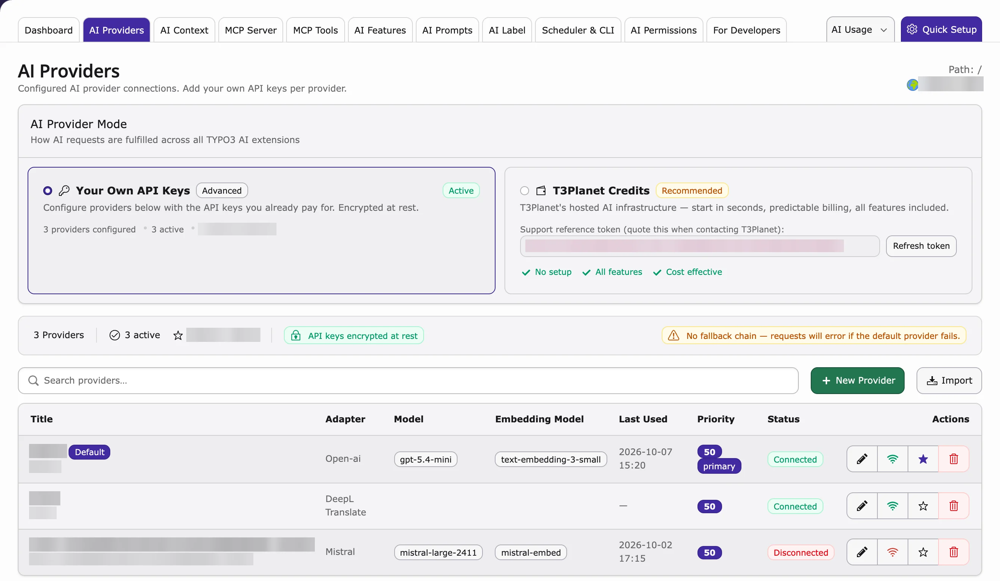
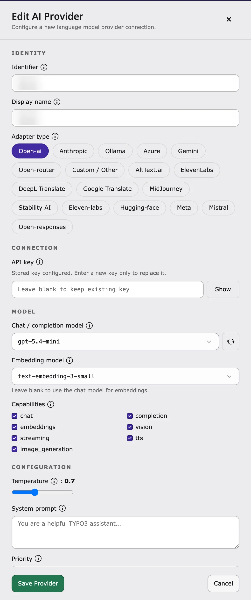

An **AI provider** is the AI service your website uses, for example OpenAI (ChatGPT), Anthropic (Claude) or Google Gemini. Without at least one working provider, no AI feature works.

**Path:** **AI Universe → AI Foundation → AI Providers**

<Tip>
No account with an AI service? Use [T3Planet Credits](/en/latest/ExtNsT3AF/T3Planet-Credit-System/Index) instead. Then you don't need your own API key. Using your own API keys stays the default.
</Tip>



## Adding a provider

{/* 1. Open AI Foundation > AI Providers.
2. Click Add provider.
3. Fill in the required fields:
  - **Display name** — Friendly label for your team (for example `OpenAI
  production`).
  - **Adapter type** — Vendor protocol (OpenAI, Anthropic, Gemini, Azure,
  Mistral, DeepSeek, xAI, Ollama, or custom OpenAI-compatible).
  - **API key** — Cloud vendors need a key. Leave empty for local Ollama.
  - **Model ID** — Completion model (for example `gpt-4o-mini`).
4. Optionally set the endpoint URL, embedding model, capabilities, temperature,
and pricing fields.
5. Click Save.
6. Enable Default on exactly one provider. */}

Before you start, get an **API key** (a secret password for the AI service) from your AI service account. See [Where to get API keys](#where-to-get-api-keys).

1. Go to **AI Universe → AI Foundation**.
2. Click the **AI Providers** tab.
3. Click **New Provider**. The **Add AI Provider** panel opens.
4. In **Adapter type**, choose your AI service (for example OpenAI, Anthropic, Gemini, Azure, Mistral, Ollama, or **Custom / Other**).
5. Enter an **Identifier** (an internal name, for example `openai-prod`) and a **Display name** (what editors see, for example `OpenAI production`).
6. Paste your **API key**.
7. Choose the **Chat / completion model** (the AI model that writes text).
8. Optional: choose an **Embedding model** (used for search). Leave it empty to use the chat model.
9. Turn on **Provider enabled**.
10. Turn on **Set as Default Provider** (for exactly one provider).
11. Click **Save**.

<Note>
**Endpoint URL** is only needed for **Custom / Other**, Ollama and Azure. A local Ollama usually needs no API key.
</Note>

<Tip>
Not sure what a field means? Click the help icon next to the field label (**Show help for this field**) for a short explanation in the drawer.
</Tip>

<Tip>
For first-time setup, use Quick Setup in the AI Foundation module
header. It walks through provider creation with fewer decisions.
</Tip>



<Accordion title="Optional fields">

You can also set **Capabilities**, **Temperature** (how creative the answers are), **System prompt**, **Priority**, prices (**Input price / 1M tokens**, **Output price / 1M tokens**, **Currency**, **Cost center**), **Allowed BE groups**, **Logging privacy** and **Prevent rerouting**. Click the help icon next to a field for an explanation.

</Accordion>

## Testing a connection

1. Save the provider.
2. Click **Test connection**.
3. Read the result: success, or an error message that tells you what is wrong.

**Test failed?** Check:

- the API key (copied completely?)
- the model name
- the **Endpoint URL** (for Ollama by default `http://localhost:11434`)
- whether your server may connect to the internet – ask your hosting provider.

<Accordion title="For developers: proxy and self-hosted models">

Self-hosted endpoints (such as Ollama) must be reachable from the TYPO3 server. Typical causes of a failed test: wrong host or port, Docker/network isolation between PHP and the model host, or blocked outbound HTTPS.

If the server reaches the internet only through a proxy, set it in `config/system/additional.php`:

```php
$GLOBALS['TYPO3_CONF_VARS']['HTTP']['proxy'] = 'http://proxy.example.com:8080';
```

</Accordion>

## Editing and deleting providers

<div className="t3-embed"><iframe src="https://app.supademo.com/embed/cmrbo0w7i0d96qmo57ifnabvz?utm_source=link" loading="lazy" title="T3AF Providers Demo" allow="clipboard-write; fullscreen" frameBorder="0" webkitallowfullscreen="true" mozallowfullscreen="true" allowfullscreen></iframe></div>

- **Edit:** click a provider in the list. Click **Test connection** again after changing the API key or model.
- **Delete:** click **Delete**. Features that used this provider then use the default provider.

<Warning>
Deleting the only default provider leaves child extensions without a global
fallback. Set another provider as Default first.
</Warning>

## Importing providers from another site

Have several websites in one TYPO3? Copy the providers from one website to another, so you don't need to enter the API keys again.

<div className="t3-embed"><iframe src="https://app.supademo.com/embed/cmul2mr5e17xnqmbaffstn3dl?utm_source=link" loading="lazy" title="T3AF Provider Import Demo" allow="clipboard-write; fullscreen" frameBorder="0" webkitallowfullscreen="true" mozallowfullscreen="true" allowfullscreen></iframe></div>

1. Go to **AI Universe > AI Foundation** and open the **AI Providers** tab.
2. In the page tree, select the site that should **receive** the providers (the
   target site).
3. Click **Import** next to **New Provider**, above the provider list.
4. The **Import providers from another site** panel opens. Under **Source
   site**, select the site you want to copy providers from. Each site is listed
   with its number of providers, for example `Home (2)`.
5. All providers of the source site are listed and selected. Clear the checkbox
   of any provider you don't want to import.
6. Click **Import selected**.

TYPO3 shows an **Import complete** message with the number of imported
providers (for example `2 provider(s) imported.`), and the imported providers
appear in the provider list of the target site.

<Note>
- Only sites that already have at least one provider appear under **Source
  site**. If no other site has providers, clicking **Import** shows *No other
  sites with providers are available to import from.*
- Importing makes a copy. The adapter, API key (still encrypted), models,
  capabilities, priority, and other settings are copied into the target site.
  Later changes on one site don't affect the other.
- If the target site already has a provider with the same identifier, the
  imported copy gets a numbered identifier (for example `openai-2`).
- An imported **Default** provider only stays the default if the target site
  doesn't have a default provider yet.
- Only backend users who are allowed to edit providers can import them.
</Note>

After importing, use **Test connection** on the imported providers to confirm
they work for the new site.

## Capabilities

Choose a model that can do what you need:

- **Chat** – write text.
- **Streaming** – show the answer while it is being written.
- **Embeddings** – needed for search, AI Chatbot and AI Search.
- **Vision** – understand images.
- **Tool use** – needed for AI assistants (MCP).

## Multiple providers — when and why

- **Test and live website** – use separate providers with separate API keys.
- **Save money** – use a cheap model as default and a better model only for important tasks in [AI Features](/en/latest/ExtNsT3AF/Configuration/AIFeatures/Index).
- **Data in the EU** – use Mistral or Azure in an EU region.

{/* [AI Features](/en/latest/ExtNsT3AF/Configuration/AIFeatures/Index#ns-t3af-ai-features) for important tasks. */}

## Troubleshooting

- **Test fails** – check the API key, model, **Endpoint URL** and the internet connection of your server.
- **Rate limit** – too many requests. Wait, or upgrade your plan with the AI service.
- **Image analysis returns nothing** – choose a model that supports **Vision**.
- **AI Foundation works but an AI extension doesn't** – check the overrides in [AI Features](/en/latest/ExtNsT3AF/Configuration/AIFeatures/Index).

{/* [AI Features](/en/latest/ExtNsT3AF/Configuration/AIFeatures/Index#ns-t3af-ai-features) for per-task overrides. */}

## Security

- Rotate keys every 90 days
- Use one key per environment (dev, staging, live)
- Restrict access via [AI Permissions](/en/latest/ExtNsT3AF/Configuration/AIPermissions/Index) {/* old link: Restrict access via [AI Permissions](/en/latest/ExtNsT3AF/Configuration/AIPermissions/Index#ns-t3af-ai-permissions) */}
- Never commit API keys to Git

## Where to get API keys

<Note>
- OpenAI: [https://platform.openai.com/api-keys](https://platform.openai.com/api-keys)
- Anthropic: [https://console.anthropic.com/](https://console.anthropic.com/)
- Google Gemini: [https://aistudio.google.com/apikey](https://aistudio.google.com/apikey)
- Mistral: [https://console.mistral.ai/](https://console.mistral.ai/)
- Azure OpenAI: [https://portal.azure.com/](https://portal.azure.com/)
</Note>

{/* More links: [Helpful Links](/en/latest/ExtNsT3AF/HelpfulLinks/Index#ns-t3af-helpful-links) */}

More links: [Helpful Links](/en/latest/ExtNsT3AF/HelpfulLinks/Index)

## For developers

Developers can connect more AI services than the ones in the list.

- **Built in:** OpenAI, Anthropic Claude, Google Gemini, Mistral AI, Ollama (local), OpenRouter and any OpenAI-compatible endpoint.
- **More services** (for example Azure, DeepSeek, xAI) work when their Symfony AI Composer package is installed.
- **Your own adapter:** see [Custom AI Providers](/en/latest/ExtNsT3AF/DeveloperGuide/CustomProviders/Index).
- API keys are stored encrypted, never as plain text.

## Related

- [AI Search installation, Step 6](/en/latest/ExtNsT3AS/Installation/Index#configure-ai-provider) and [AI Chatbot installation, Step 6](/en/latest/ExtNsT3AC/Installation/Index#configure-ai-provider)
- [AI Features](/en/latest/ExtNsT3AF/Configuration/AIFeatures/Index) – use a different provider for one feature

{/* Original text before the 8 Oct 2026 simplification (kept for reference):

Providers represent connections to AI services. Each provider stores an adapter
type, optional endpoint, encrypted credentials, models, and capability flags.

**Path:** AI Foundation > AI Providers

Follow this interactive walkthrough, then continue with the details below.

AI Providers list — configured adapters, models, connection status, and
default provider.

Without at least one working provider, no AI feature runs.

Alternatively, use [T3Planet Credits](/en/latest/ExtNsT3AF/T3Planet-Credit-System/Index) when you
want AI without configuring your own vendor API keys. Your Own API Keys stays
the default.

Edit AI Provider — adapter type, API key, chat model, and capability flags.

After saving a provider, click Test connection to verify the setup.
The test calls the provider API and reports:

- Connection status (success or failure)
- Error details on failure
- Model / capability hints when the adapter can list them

<Note>
Self-hosted endpoints (such as Ollama) must be reachable from the TYPO3
server. Typical causes of a failed test:

- Wrong host or port in Endpoint URL (default
`http://localhost:11434` for Ollama)
- Docker/network isolation between PHP and the model host
- Outbound HTTPS blocked for cloud vendors

Local adapters usually do not need an API key. Cloud adapters do.
</Note>

If your server reaches the internet only through a corporate proxy, configure
TYPO3 HTTP settings:

- Click a provider row to edit its settings in the drawer.
- Use Test connection after rotating an API key or changing the
model.
- Use Delete to remove a provider. Features that pointed at that
provider fall back to the global default (or fail until another provider is
assigned).

## Supported adapters

Built-in and discovered adapters include:

Pick a model that supports what you need. Test connection helps
validate the choice.

- **Chat** — Text generation
- **Streaming** — Live response display in the backend
- **Embeddings** — Search and similarity features
- **Vision** — Image analysis
- **Tool use** — MCP agent workflows

**Dev and live** — Separate rows with different API keys per environment.

**EU hosting** — Mistral or Azure in an EU region for data residency
requirements.

## Provider fields

### Required

### Connection

### Optional configuration

### Governance and status

**Test fails** — Check the API key, model ID, endpoint URL, and outbound
HTTPS/firewall rules.

**Rate limit** — Wait or upgrade the vendor plan.

**Vision returns empty** — Use a vision-capable model (for example GPT-4o with
vision).
*/}

{/* Detailed developer notes (moved here on 2026-10-08 to keep the page short; not shown on the website):

## For developers

<Accordion title="Supported adapters">

- `symfony.openai` — OpenAI
- `symfony.anthropic` — Anthropic Claude
- `symfony.gemini` — Google Gemini
- `symfony.mistral` — Mistral AI
- `symfony.ollama` — Local Ollama
- `symfony.openrouter` — OpenRouter
- `nst3af.openai_compatible` — Custom / OpenAI-compatible endpoints
- Additional Symfony AI bridges when their Composer packages are installed
(for example Azure, DeepSeek, xAI)

( Custom adapters: [Custom AI Providers](/en/latest/ExtNsT3AF/DeveloperGuide/CustomProviders/Index#ns-t3af-custom-ai-providers). )

Custom adapters: [Custom AI Providers](/en/latest/ExtNsT3AF/DeveloperGuide/CustomProviders/Index).

</Accordion>

<Accordion title="Provider fields (database reference)">

Fields below map to the AI Providers drawer and the
`tx_nst3af_provider` table.

**Required**

<ResponseField name="identifier" type="string" required>
Unique slug for programmatic access (for example `openai-prod`,
`ollama-local`). Must be unique.
</ResponseField>

<ResponseField name="title" type="string" required>
Display name shown in the backend and dropdowns.
</ResponseField>

<ResponseField name="adapter_type" type="string" required>
Adapter protocol identifier, for example `symfony.openai` or
`nst3af.openai_compatible`.
</ResponseField>

**Connection**

<ResponseField name="api_key" type="string">
API key for authentication. Stored as sodium ciphertext with an
`enc:v1:` prefix — raw keys are never kept in the database. Required for
cloud adapters; usually empty for local Ollama.
</ResponseField>

<ResponseField name="endpoint_url" type="string" default="Adapter default">
Custom API base URL. Required for OpenAI-compatible and Ollama-style
adapters when the default host is wrong for your network.
</ResponseField>

<ResponseField name="model_id" type="string">
Default completion / chat model ID.
</ResponseField>

<ResponseField name="embedding_model_id" type="string">
Default embedding model ID when embeddings are enabled.
</ResponseField>

**Optional configuration**

<ResponseField name="capabilities" type="string list">
Enabled capabilities: `chat`, `completion`, `embeddings`, `vision`,
`streaming`, `tool_use`.
</ResponseField>

<ResponseField name="temperature" type="float" default="0.7">
Default sampling temperature (`0.0`–`2.0`).
</ResponseField>

<ResponseField name="system_prompt" type="text">
Optional provider-level system message prepended to requests.
</ResponseField>

<ResponseField name="is_default" type="bool" default="false">
Mark as the global default. Keep exactly one default among enabled rows.
</ResponseField>

<ResponseField name="is_enabled" type="bool" default="true">
Soft on/off switch without deleting the row.
</ResponseField>

<ResponseField name="priority" type="integer" default="50">
Ordering hint (`0`–`100`) when multiple providers are listed.
</ResponseField>

<ResponseField name="be_groups" type="backend groups">
Restrict this provider to selected backend groups. Empty means available to
all groups.
</ResponseField>

<ResponseField name="privacy_level" type="string" default="standard">
Logging privacy only — how much is stored in the local request log
(`standard`, `reduced` without prompt fingerprint, or `none`). This
does not redact or block prompts, brand context, or documents sent to the
AI provider.
</ResponseField>

**Governance and status**

Optional pricing (`pricing_input_per_1m`, `pricing_output_per_1m`,
`pricing_currency`, `cost_center`), retention overrides, dashboard analytics
flags, and read-only status fields (`last_status`, `last_status_at`,
`last_status_message`, `last_used_at`) support monitoring and cost tracking.
Status fields update after Test connection and live requests.

</Accordion>

*/}
