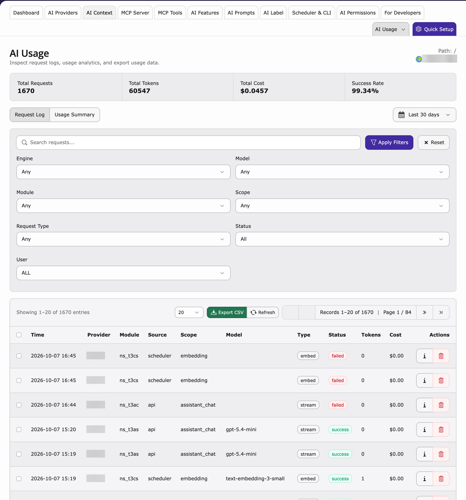
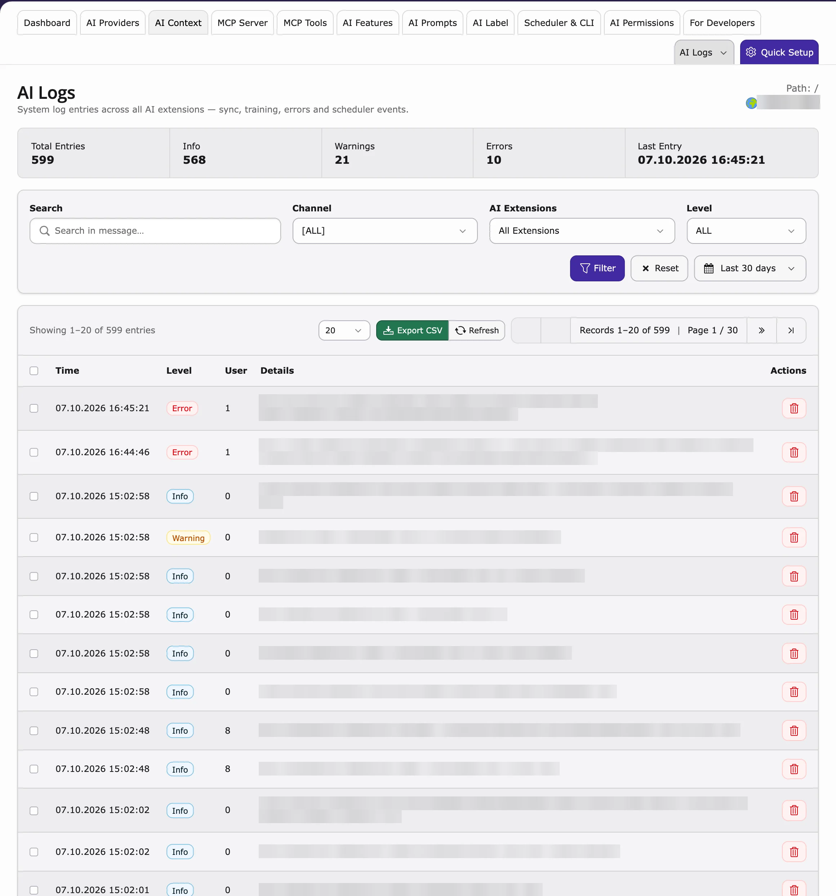

## Purpose

See every AI request on your website: how many there were, what they cost and whether they worked. Use it to control your budget and to find errors.

## AI Usage

**AI Usage** shows how much AI was used.

<div className="t3-embed"><iframe src="https://app.supademo.com/embed/cmrbpqbgz0fn3qmo5oaq6j1t9?utm_source=link" loading="lazy" title="T3AF AI Usage Demo" allow="clipboard-write; fullscreen" frameBorder="0" webkitallowfullscreen="true" mozallowfullscreen="true" allowfullscreen></iframe></div>
**Path:** T3AF > AI Usage

- **Request count** – how many AI requests in the chosen period.
- **Tokens** – how much text was sent and received (AI services bill by tokens).
- **By extension** – which AI extension used the AI (AI Assistant, AI Chatbot and others).
- **By feature** – for example `seo.meta_description`.
- **Time range** – day, week or month.



Use it to plan your budget and spot unusual spikes. Trends are also on the [Dashboard](/en/latest/ExtNsT3AF/Configuration/Dashboard/Index).

## AI Logs

**AI Logs** shows each single request.

<div className="t3-embed"><iframe src="https://app.supademo.com/embed/cmrbpsdl20frlqmo521y5if8m?utm_source=link" loading="lazy" title="T3AF AI Logs Demo" allow="clipboard-write; fullscreen" frameBorder="0" webkitallowfullscreen="true" mozallowfullscreen="true" allowfullscreen></iframe></div>
**Path:** T3AF > AI Logs

- Time, user, extension and feature
- Provider, model and tokens
- Success or failure



Use it to find out why a request failed.

## Scheduler & CLI

Background tasks and commands of AI Foundation. See [Scheduler & CLI](/en/latest/ExtNsT3AF/Configuration/Index#scheduler-and-cli).

<div className="t3-embed"><iframe src="https://app.supademo.com/embed/cmrbpsi9d0frwqmo59f50ny8s?utm_source=link" loading="lazy" title="T3AF Scheduler and CLI Demo" allow="clipboard-write; fullscreen" frameBorder="0" webkitallowfullscreen="true" mozallowfullscreen="true" allowfullscreen></iframe></div>
**Path:** T3AF > Scheduler & CLI


<Warning>
On your live website, the TYPO3 Scheduler must run every minute (a cron job on the server). Ask your hosting provider or developer.
</Warning>

<Accordion title="For developers: clear the caches">
If a change does not show up, clear the TYPO3 caches on the command line (or with **Flush all caches** in the backend).

```bash
vendor/bin/typo3 cache:flush
```
</Accordion>

## OpenAI org statistics (optional)

Set `openai_admin_api_key` in Extension Configuration for organization-level usage charts. This is **not** the chat API key. See [Configuration](/en/latest/ExtNsT3AF/Configuration/Index).

## Privacy

How much is logged depends on the provider's **Logging privacy** setting and on the limits in [AI Permissions](/en/latest/ExtNsT3AF/Configuration/AIPermissions/Index). Check these before you store full prompts and answers.

## Weekly admin habit

1. Go to **AI Universe → AI Foundation → AI Usage** and compare with last week.
2. Go to **AI Logs** and look for repeated errors (same user, same feature).
3. Errors don't go away? Send the log details to [Support](/en/latest/ExtNsT3AF/Support/Index).

## When logs show high usage

- Check [AI Features](/en/latest/ExtNsT3AF/Configuration/AIFeatures/Index) — bulk tasks may need a cheaper model
- Review group limits in [AI Permissions](/en/latest/ExtNsT3AF/Configuration/AIPermissions/Index)
- Ask editors if a script or loop triggered many requests

## When logs show failures

- Run Test connection in [AI Providers](/en/latest/ExtNsT3AF/Configuration/AIProviders/Index)
- Check vendor status and rate limits
- See [Known Problems](/en/latest/ExtNsT3AF/Troubleshooting/KnownProblems/Index) and [FAQ](/en/latest/ExtNsT3AF/Troubleshooting/FAQ/Index)

## Related

- [AI Search: AI Usage and AI Logs](/en/latest/ExtNsT3AS/Configuration/AIUsageAndLogs/Index) – open this page from the **AI Usage** menu in AI Chatbot/Search
- [AI Chatbot Usage Analytics](/en/latest/ExtNsT3AC/FeatureGuide/UsageAnalytics/Index) and [AI Search Usage Analytics](/en/latest/ExtNsT3AS/Configuration/UsageAnalytics/Index) – what visitors asked

{/* Original text before the 8 Oct 2026 simplification (kept for reference):

**Transparency** for every AI request on your TYPO3 instance. Use these screens for budget control, debugging, and compliance.

Follow this interactive walkthrough, then continue with the details below.

Shows:

- **Request count** — Total AI calls in the selected period
- **Tokens** — Input and output volume
- **By extension** — Which extension called AI (AI Assistant, AI Chatbot, and others)
- **By feature** — For example `seo.meta_description`
- **Time range** — Day, week, or month

**Use for:** budget control, team planning, anomaly detection.

Compare usage trends on the [Dashboard](/en/latest/ExtNsT3AF/Configuration/Dashboard/Index).

Follow this interactive walkthrough, then continue with the details below.

Per-request detail includes:

- Timestamp, user, extension, feature
- Provider, model, tokens
- Success or failure

**Use for:** debugging failed requests and compliance audits.

Follow this interactive walkthrough, then continue with the details below.

Scheduler & CLI — background tasks and TYPO3 console commands for T3AF.

Background jobs and CLI commands. Example:

Ensure **scheduler cron** runs every minute on production.

Log detail depends on provider privacy settings and group audit limits from [AI Permissions](/en/latest/ExtNsT3AF/Configuration/AIPermissions/Index). Configure carefully before enabling full prompt/response storage.

1. Open T3AF > AI Usage and compare the trend with last week
2. Scan T3AF > AI Logs for repeated failures (same user, same feature)
3. Escalate persistent errors to [Support](/en/latest/ExtNsT3AF/Support/Index) with log details
*/}

{/* Detailed developer notes (moved here on 2026-10-08 to keep the page short; not shown on the website):

<Accordion title="For developers: flush AI Foundation caches">

Flush T3AF caches
```
vendor/bin/typo3 ns_t3af:cache:flush
```

</Accordion>
*/}
