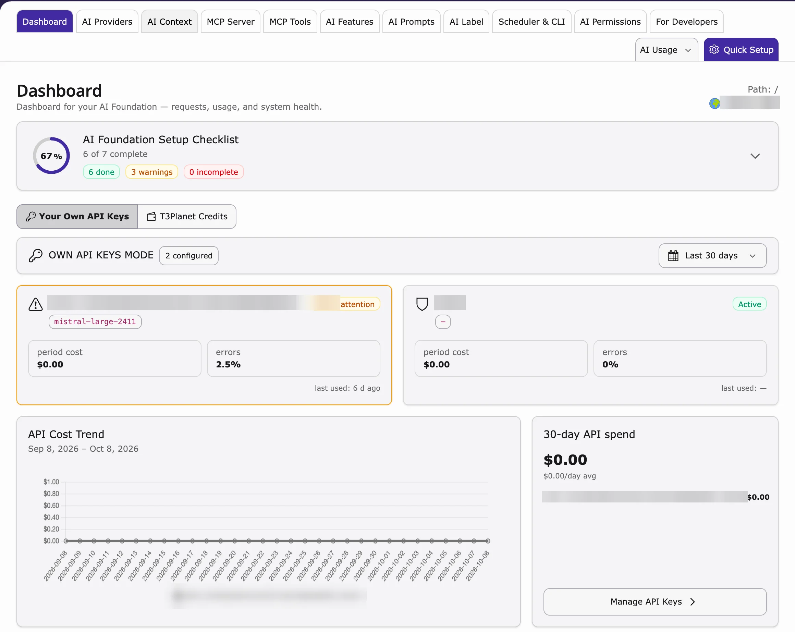
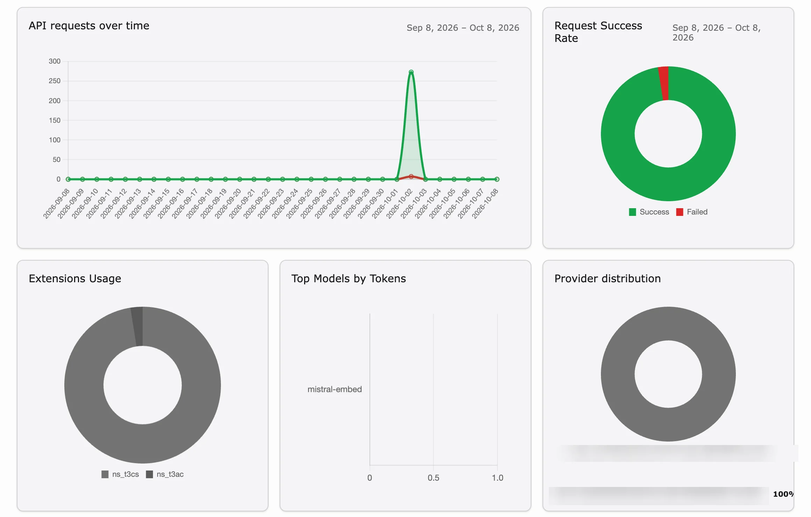
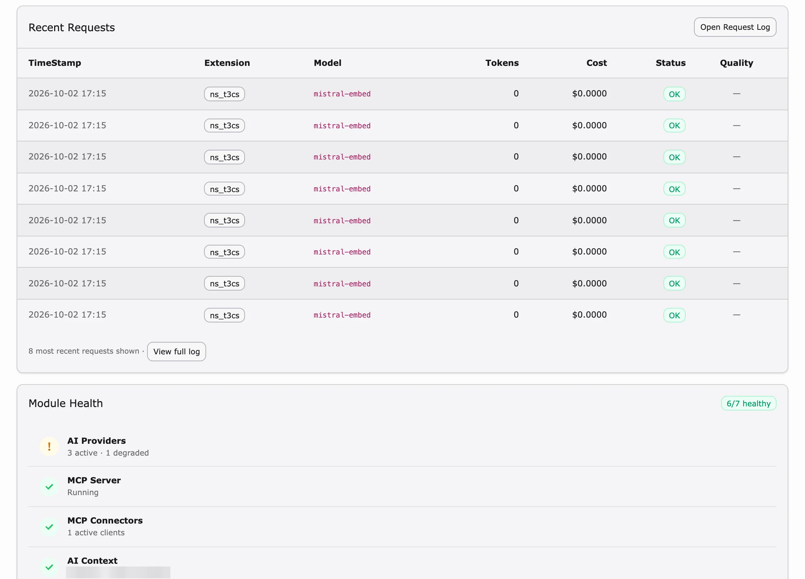

## Purpose

The **Dashboard** is the start page of AI Foundation. In one look you see whether your AI service works, how much AI was used and what it cost.

**Path:** **AI Universe → AI Foundation → Dashboard**

<iframe src="https://app.supademo.com/embed/cmrbp02gg0dysqmo5wfd0olu1?utm_source=link" loading="lazy" title="T3AF Dashboard Demo" allow="clipboard-write; fullscreen" frameBorder="0" webkitallowfullscreen="true" mozallowfullscreen="true" allowfullscreen></iframe>

The Dashboard is your **control center** for AI health on this TYPO3 instance. Open it daily for a quick status check.

Dashboard overview — setup progress, provider health, and API cost trend.

## What the dashboard shows

- **Provider status** – is your AI service connected?
- **Default provider** – which AI model is used.
- **Recent usage** – the latest requests and tokens (units the AI service bills by).
- **Quick actions** – links to **AI Providers**, **MCP Server** and other modules.

Usage analytics — requests over time, success rate, top models, and provider distribution.

Recent requests and module health — request log, costs, and subsystem status.

## Daily admin routine (2 minutes)

1. Open the **Dashboard**.
2. Check that the provider status is **green**.
3. Usage looks unusual? Open **AI Logs** – see [AI Usage & Logs](/en/latest/ExtNsT3AF/Configuration/AIUsageAndLogs/Index).

## Status meanings

- **Green** – all good.
- **Yellow** – not tested recently. Click **Test connection** in [AI Providers](/en/latest/ExtNsT3AF/Configuration/AIProviders/Index).
- **Red** – connection failed. See below.

## Quick links from the dashboard

- **AI Providers** → [AI Providers](/en/latest/ExtNsT3AF/Configuration/AIProviders/Index)
- **MCP Server** → [MCP Server](/en/latest/ExtNsT3AF/Integrations/MCPServer/Index)
- **View Logs** → [AI Usage & Logs](/en/latest/ExtNsT3AF/Configuration/AIUsageAndLogs/Index)

## Tips

- Set one clear **default provider**, so editors aren't confused.
- Test the provider after every API key change.
- Check usage once a week to control costs.

## When the dashboard shows red

1. Go to [AI Providers](/en/latest/ExtNsT3AF/Configuration/AIProviders/Index).
2. Click **Test connection** and read the error.
3. Check the status page of your AI service (OpenAI, Anthropic and so on).
4. Ask your hosting provider whether the server may connect to the internet (HTTPS).
5. Look for the exact error in [AI Logs](/en/latest/ExtNsT3AF/Configuration/AIUsageAndLogs/Index).
6. Still red? See [Known Problems](/en/latest/ExtNsT3AF/Troubleshooting/KnownProblems/Index).

{/* Original text before the 8 Oct 2026 simplification (kept for reference):

**Path:** T3AF > Dashboard

Follow this interactive walkthrough, then continue with the details below.

- **Provider status** — Connected, failed, or not tested
- **Default provider** — Active model name
- **Recent usage** — Last requests and token count
- **Quick actions** — Links to AI Providers, MCP Server, and related modules

1. Open Dashboard
2. Confirm provider status is **green**
3. Skim **AI Logs** if usage looks unusual — see [AI Usage & Logs](/en/latest/ExtNsT3AF/Configuration/AIUsageAndLogs/Index)

- **Green** — Provider OK. No action needed.
- **Yellow** — Not tested recently. Run a Test connection in [AI Providers](/en/latest/ExtNsT3AF/Configuration/AIProviders/Index).
- **Red** — Connection failed. Check API key, model ID, and outbound HTTPS.

- Set one clear **default provider** — avoids confusion for editors
- Test providers after every key rotation
- Review usage weekly for cost control

1. Open [AI Providers](/en/latest/ExtNsT3AF/Configuration/AIProviders/Index) → run **Test connection**
2. Check vendor status page (OpenAI, Anthropic, etc.)
3. Verify firewall allows outbound HTTPS
4. Check [AI Logs](/en/latest/ExtNsT3AF/Configuration/AIUsageAndLogs/Index) for the exact error message
5. See [Known Problems](/en/latest/ExtNsT3AF/Troubleshooting/KnownProblems/Index) if the issue persists
*/}
