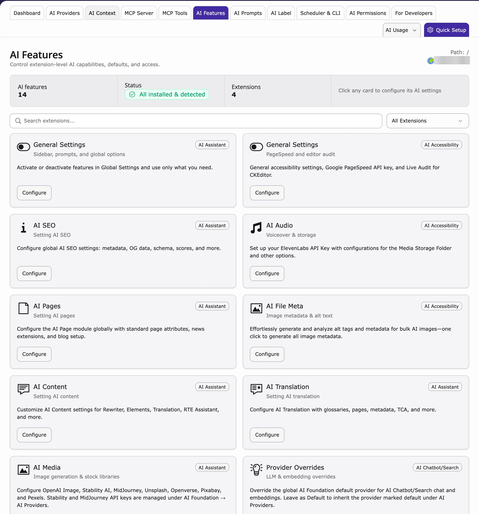
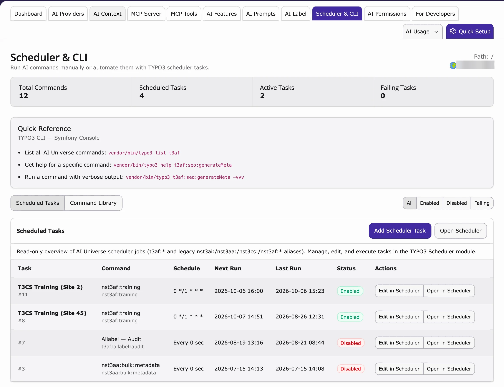

After installation, set up AI Foundation so your AI extensions (for example AI Chatbot or AI Search) can use AI. You need at least one working AI service.

You find everything in **AI Universe → AI Foundation**.

## Minimum working setup

1. Go to **AI Universe → AI Foundation → AI Providers**.
2. Add one AI service with a valid API key (password for the AI service) and a model.
3. Click **Test connection**. It must succeed.
4. Mark the provider as **Default**.
5. Optional: add DeepL or Google for translations.
6. Optional: switch on the MCP Server if your team uses AI assistants.

<Tip>
The easiest way is **Quick Setup** at the top of the AI Foundation module. It guides you through these steps.
</Tip>

## Two configuration areas

- **AI Providers** – your AI services: API keys, models and which one is the default.
- **AI Features** – a settings card for each AI extension. AI Foundation's own card is **Access & Notifications** (browser login for protected pages, and email alerts).

## AI Providers (primary)

Path: **AI Foundation → AI Providers**

Connect at least one provider, choose a model, click **Test connection** and mark exactly one as **Default**. DeepL Translate, Google, OpenAI, Anthropic, Gemini and Ollama are all added here, each as its own row.

Details: [AI Providers](/en/latest/ExtNsT3AF/Configuration/AIProviders/Index)

## Extension settings

### Access & Notifications (HTTP Basic Auth)

Path: **AI Foundation → AI Features → Access & Notifications**

Use this if parts of your website are protected by a browser login, or if you want an email when the AI service stops working.

1. Go to **AI Universe → AI Foundation → AI Features**.
2. Open **Access & Notifications**.
3. Fill in the fields you need:
   - **Enable Basic Authentication Support** – lets AI Foundation read pages behind a browser login.
   - **Basic Auth Username** / **Basic Auth Password** – the login.
   - **Enable email notification on API quota or authentication errors** – get an email when your AI budget is used up or the API key is wrong.
   - **Notification email address** – who gets the email.
4. Save.

### MCP Server

MCP options are in **AI Foundation → MCP Server → Advanced**. See [MCP Server](/en/latest/ExtNsT3AF/Integrations/MCPServer/Index).

<Accordion title="For developers: extension settings keys">
Most AI Foundation settings are made in the module. A few optional settings are keys of the extension `ns_t3af`.

- **Translation:** `deepl_api_key`, `google_api_key`, `defaultModelForTranslation`.
- **OpenAI usage charts:** `openai_admin_api_key` (not the chat API key).
- **MCP Server:** `enableMcpServer`, `mcpBasePath` (default `/mcp`), `requireAuth`, `accessTokenLifetime`. Change them preferably in **AI Foundation → MCP Server → Advanced**.
- **Basic Auth:** `basicAuthEnabled`, `basicAuthUsername`, `basicAuthPassword`.
</Accordion>

## Per-feature providers

Path: **AI Foundation → AI Features**

Use a different AI service for one task, for example SEO, Pages, Content or Translation. See [AI Features](/en/latest/ExtNsT3AF/Configuration/AIFeatures/Index).

## AI Label

Path: **AI Foundation → AI Label**

Mark content that was written or changed by AI, as required by the EU AI Act (Article 50). See [AI Label](/en/latest/ExtNsT3AF/Configuration/AILabel/Index).

## Scheduler & CLI

Path: **AI Foundation → Scheduler & CLI**

A read-only list of all AI background tasks and commands, for example **T3CS Training (Site N)** from AI Chatbot/Search. Use it to check that the tasks run.

- At the top: **Total Commands**, **Scheduled Tasks**, **Active Tasks** and **Failing Tasks**.
- **Scheduled Tasks** – each task with its schedule, last and next run and status. Filter with **All**, **Enabled**, **Disabled** and **Failing**.
- **Quick Reference** and **Command Library** – the available commands (for developers).
- To change a task, click **Add Scheduler Task**, **Open Scheduler**, **Edit in Scheduler** or **Open in Scheduler**. This opens the TYPO3 **Scheduler** module.

{/* SUPADEMO NEEDED: AI Foundation Scheduler & CLI tab */}

**Related:** [AI Search training task](/en/latest/ExtNsT3AS/Configuration/TrainingCenter/Index#scheduler) · [AI Chatbot training task](/en/latest/ExtNsT3AC/FeatureGuide/DataSource/Index#scheduler)

## For Developers

Path: **AI Foundation → For Developers**

An overview for developers who want to build their own AI features on top of AI Foundation: how extensions, providers and MCP clients fit together, and a **Starter Kit** with a link to the Developer Guide. See [Developer Guide](/en/latest/ExtNsT3AF/DeveloperGuide/Index).

## Security checklist

- Give admin access only to people who need it.
- Use HTTPS on your live website.
- Change your API keys every 90 days.
- Use [AI Permissions](/en/latest/ExtNsT3AF/Configuration/AIPermissions/Index) for large teams.
- Never send API keys by email or store them in Git.

## When to reconfigure

- After changing an API key – click **Test connection** again.
- After installing a new AI extension – check [AI Features](/en/latest/ExtNsT3AF/Configuration/AIFeatures/Index).
- Before switching on MCP on your live website – read the security part of [MCP Server](/en/latest/ExtNsT3AF/Integrations/MCPServer/Index).
- After renewing your license key – check that it is still valid.

{/* Original text before the 8 Oct 2026 simplification (kept for reference):

Configure **T3AF** after installation. You need a minimum working setup before connected extensions can use AI.

This section also covers the T3AF backend modules used day to day: providers, context, prompts, features, AI Label, usage, and access control.

**AI Providers** — Path: T3AF > AI Providers. API keys, models, and defaults.

**AI Features** — Path: T3AF > AI Features. Per-site cards for connected extensions. AI Foundation's own card is **Access & Notifications** (Basic Auth and quota email alerts). MCP options are on T3AF > MCP Server > Advanced.

1. One AI provider with a valid key and model
2. Test connection passes
3. Provider marked **Default**
4. (Optional) DeepL or Google keys for translation APIs
5. (Optional) MCP enabled if you use AI agents

Path: T3AF > AI Providers

Connect at least one provider, set a model, run Test connection, and mark exactly one row as Default.

DeepL Translate, Google, OpenAI, Anthropic, Gemini, and Ollama are provider rows here — not a separate key list.

Full field reference: [Provider fields](/en/latest/ExtNsT3AF/Configuration/AIProviders/Index). Guide: [AI Providers](/en/latest/ExtNsT3AF/Configuration/AIProviders/Index)

T3AF stores translation helpers, Basic Auth, notifications, and MCP switches in extension settings (including `enableMcpServer`). Prefer T3AF > MCP Server > Advanced for MCP options.

### Translation (optional)

### OpenAI usage statistics (optional)

Path: T3AF > AI Features → **Access & Notifications**

Access & Notifications — Basic Auth and API quota email alerts.

- **Enable Basic Authentication Support** — Let AI Foundation fetch URLs protected by HTTP Basic Auth (`basicAuthEnabled`)
- **Basic Auth Username** (`basicAuthUsername`)
- **Basic Auth Password** (`basicAuthPassword`)
- **Enable email notification on API quota or authentication errors**
- **Notification email address** — Recipient for quota or auth-error emails

Full guide: [MCP Server](/en/latest/ExtNsT3AF/Integrations/MCPServer/Index)

Path: T3AF > AI Features

Override the default provider per task: SEO, Pages, Content, Translation.

Path: T3AF > AI Label

Record, confirm, and disclose AI-generated or AI-modified content for EU AI Act Article 50 workflows. Covers module tabs, settings, visitor labels, bulk actions, and evidence export.

Full guide: [AI Label](/en/latest/ExtNsT3AF/Configuration/AILabel/Index)

- Limit backend admin access
- Use HTTPS in production
- Rotate API keys every 90 days
- Enable [AI Permissions](/en/latest/ExtNsT3AF/Configuration/AIPermissions/Index) for large teams
- Never store keys in Git or email

- After key rotation — run **Test connection** again
- When adding a new child extension — check [AI Features](/en/latest/ExtNsT3AF/Configuration/AIFeatures/Index)
- Before enabling MCP in production — read [MCP Server](/en/latest/ExtNsT3AF/Integrations/MCPServer/Index) security section
- After OSS license key renewal — confirm the key is still valid
*/}

{/* Detailed developer notes (moved here on 2026-10-08 to keep the page short; not shown on the website):

<Accordion title="For developers: extension settings keys">

**Extension settings** — Translation APIs, Basic Auth, notifications, and MCP switches (including `enableMcpServer`). Prefer T3AF > MCP Server > Advanced for MCP options. These keys live in T3AF settings, not the classic TYPO3 Admin Tools > Settings > Extension Configuration form.

Where a classic Extension Configuration form is still used for optional keys, open Admin Tools > Settings > Extension Configuration and select `ns_t3af`.

**Translation (optional)**

- `deepl_api_key` — DeepL translation
- `google_api_key` — Google translation
- `defaultModelForTranslation` — Default translation model

**OpenAI usage statistics (optional)**

- `openai_admin_api_key` — Organization usage charts (not the chat API key)

**Access & Notifications keys:** `basicAuthEnabled`, `basicAuthUsername`, `basicAuthPassword`.

**MCP Server**

- `enableMcpServer` — Master switch (default: on)
- `mcpBasePath` — HTTP endpoint (default: `/mcp`)
- `requireAuth` — Require login (default: on)
- `accessTokenLifetime` — OAuth token TTL

</Accordion>
*/}
