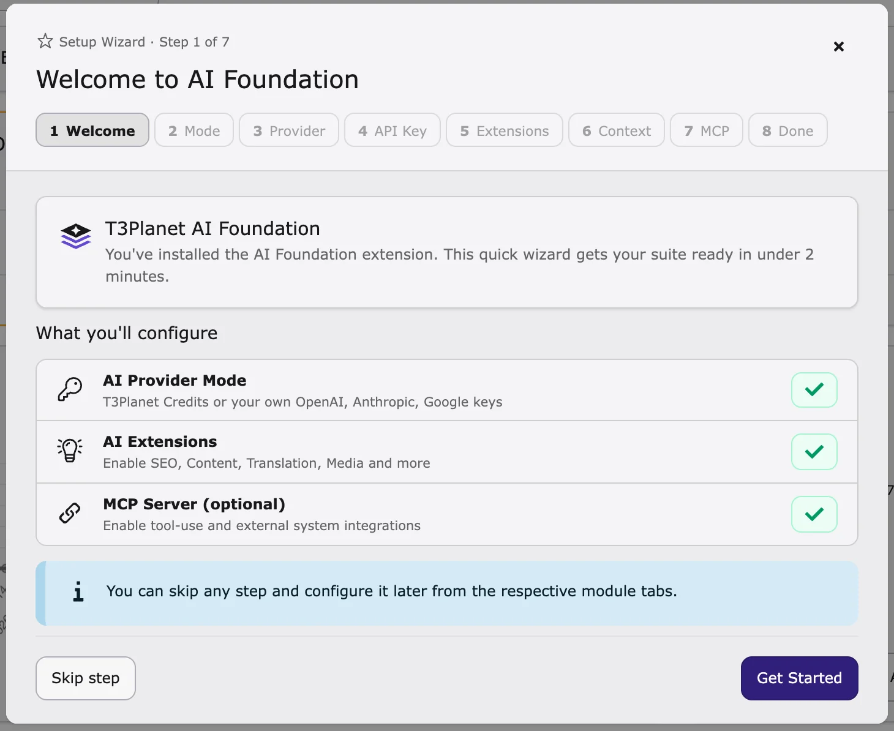

## Quick start

This page shows you how to install AI Foundation and connect your first AI service. AI Foundation is free (open source, GPL-2.0-or-later) and needs a free license key.

<div className="t3-embed"><iframe src="https://app.supademo.com/embed/cmrbnnxgy0cp3qmo5e1ciofeq?utm_source=link" loading="lazy" title="AI Foundation Quick Setup Demo" allow="clipboard-write; fullscreen" frameBorder="0" webkitallowfullscreen="true" mozallowfullscreen="true" allowfullscreen></iframe></div>

**In short**

1. Install the **License Manager** (`ns_license`).
2. Install **AI Foundation** (`ns_t3af`).
3. Activate your free license key in the **T3Planet Shop**.
4. Open **AI Universe → AI Foundation** and click **Quick Setup**.
5. Connect your AI service in **AI Providers**.



Quick Setup wizard — guided first-time configuration in the AI Foundation module.

<a id="requirements"></a>

### Requirements

Your developer or hosting provider can check these:

- **TYPO3** 12.4 LTS, 13.4 LTS or 14.x
- **PHP** 8.2 or higher (8.3 recommended), with the `sodium` extension
- **Database** MySQL 8.0+ or MariaDB 10.3+
- **Internet access** from the server to your AI service (HTTPS)
- **Composer** 2.x (if your website uses Composer)

**Required TYPO3 extensions**

- **License Manager** (`ns_license`) – checks your license.
- **Scheduler** – runs AI tasks in the background.
- **Workspaces** – lets AI changes be saved as drafts first.

Scheduler and Workspaces come with TYPO3. Activate them if they are off.

## Install from the backend

Use this if your website does not use Composer.

1. Go to **Admin Tools → Extensions** (on TYPO3 v14: **System → Extensions**).
2. Choose **Get Extensions**.
3. Search for `ns_license`, install and activate it.
4. Search for `ns_t3af` (or **T3AF**), install and activate it.
5. Go to **Admin Tools → Maintenance** (on TYPO3 v14: **System → Maintenance**) and run **Analyze Database Structure**. Apply all changes.
6. Clear all caches.

<Warning>
Manual installation requires manual dependency management. Composer
installation is strongly recommended.
</Warning>

## Composer installation

<Accordion title="Install with Composer (for developers)">

```bash
composer require nitsan/ns-license
composer require nitsan/ns-t3af
./vendor/bin/typo3 extension:setup
./vendor/bin/typo3 cache:flush
```

Download pages: [ns_license](https://extensions.typo3.org/extension/ns_license) · [ns_t3af](https://extensions.typo3.org/extension/ns_t3af)

</Accordion>

### Activate your OSS license key

1. Go to the **T3Planet Shop** module (under **Admin Tools**, on TYPO3 v14 under **System**).
2. Open **AI Universe** > **AI Foundation**.
3. Click **Start**.

Product page: [https://t3planet.de/en/ai-foundation-for-typo3](https://t3planet.de/en/ai-foundation-for-typo3)

## Verify the installation

Check that:

- **AI Universe → AI Foundation** appears in the backend menu.
- `ns_license` and `ns_t3af` are active in **Admin Tools → Extensions**.
- **Analyze Database Structure** shows no open changes.

<Tip>
Module missing? Clear all caches. If it is still missing, ask your developer to run `./vendor/bin/typo3 extension:setup`.
</Tip>

## Next steps

1. Go to **AI Universe → AI Foundation**.
2. Click **Quick Setup** at the top of the module and follow the steps.
3. Or connect your AI service by hand in [AI Providers](/en/latest/ExtNsT3AF/Configuration/AIProviders/Index).

More: [Configuration](/en/latest/ExtNsT3AF/Configuration/Index#ns-t3af-configuration).

{/* Original text before the 8 Oct 2026 simplification (kept for reference):

The recommended way to install this extension is via Composer.

AI Foundation is 100% OSS (GPL-2.0-or-later). Activate it with an OSS
license key. Use it on development and production.

Install the license extension first (if it is not already present), then
AI Foundation (`EXT:ns_t3af`):

Install via Composer

Classic TYPO3 sites can also install from the
[TYPO3 Extension Repository (TER)](https://extensions.typo3.org/extension/ns_t3af).

After installation:

1. Activate the extensions in Admin Tools > Extensions.
2. Open AI Foundation > Dashboard and confirm the module group is
available.
3. Connect providers and API keys in AI Foundation > AI Providers.
4. Complete guided options with Quick Setup in the AI Foundation
module header.
5. Clear caches in Admin Tools > Maintenance.

Follow this interactive walkthrough for Quick Setup, then continue with the
details below.

Continue with [Configuration](/en/latest/ExtNsT3AF/Configuration/Index#ns-t3af-configuration) for providers, MCP, and
day-to-day module setup.

Ensure your system meets these requirements:

- **TYPO3** — 12.4 LTS, 13.4 LTS, or 14.x
- **PHP** — 8.2 or higher (8.3 recommended), including `ext-sodium`
- **Composer** — 2.x
- **Database** — MySQL 8.0+ or MariaDB 10.3+
- **Network** — Outbound HTTPS for AI provider API calls

### Required Extensions

Install and activate these extensions before AI Foundation:

- **ns_license** — License activation and license-key validation
- **scheduler** — Background AI jobs and scheduled tasks
- **workspaces** — Draft workspaces, MCP workflows, and safe content editing

`scheduler` and `workspaces` ship with TYPO3. Activate them if they are
not already enabled.

### Install the license extension

`EXT:ns_license` must be installed first. AI Foundation depends on it for
license checks. The extension is available on the
[TYPO3 Extension Repository](https://extensions.typo3.org/extension/ns_license).

Install ns_license via Composer

```bash
composer require nitsan/ns-license
```

Or use Admin Tools > Extensions > Get Extensions, search for
`ns_license`, install and activate it, then flush caches.

### Install AI Foundation

`EXT:ns_t3af` must be installed after `EXT:ns_license`. Find it on the
[TYPO3 Extension Repository](https://extensions.typo3.org/extension/ns_t3af).

Install AI Foundation via Composer

```bash
composer require nitsan/ns-t3af
```

Or use Admin Tools > Extensions > Get Extensions, search for
`ns_t3af` (or **T3AF**), install and activate it, then flush caches.

An OSS license key is required to activate AI Foundation. After you install
`EXT:ns_t3af`, go to **T3Planet Shop** backend module >
**AI Universe** > **AI Foundation** and click **Start** before
you continue with configuration.

#### Activate the extension

Confirm `ns_t3af` is active in Admin Tools > Extensions.

#### Set up the database and clear caches

Extension setup and cache flush

```bash
./vendor/bin/typo3 extension:setup
./vendor/bin/typo3 cache:flush
```

## Manual installation

If you cannot use Composer, install both extensions from the TER in this order:

1. Open Admin Tools > Extensions > Get Extensions.
2. Search for `ns_license`, install and activate it, then flush caches.
3. Search for `ns_t3af` (or **T3AF**), install and activate it.
4. Run **Analyze Database Structure**.
5. Flush caches again.

Confirm that:

- `ns_license` and `ns_t3af` are listed as active in
Admin Tools > Extensions
- The **AI Foundation** module group appears in the backend sidebar
- **Analyze Database Structure** reports no pending changes for `ns_t3af`

If the module is missing, flush caches and run
`./vendor/bin/typo3 extension:setup` again.

Open AI Foundation > AI Providers to connect at least one provider,
then review [Configuration](/en/latest/ExtNsT3AF/Configuration/Index#ns-t3af-configuration).
*/}
