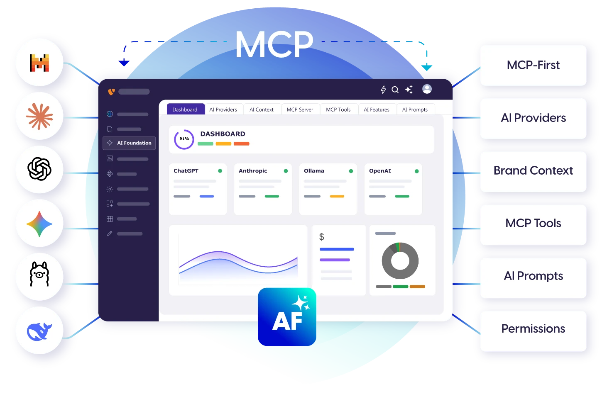

## EXT:ns_t3af

## Overview

**AI Foundation** connects your TYPO3 website to an AI service such as OpenAI (ChatGPT), Claude or Gemini. All T3Planet AI extensions – for example AI Chatbot and AI Search – use this one connection. You set up the AI once, and every AI extension can use it.

Editors usually don't work in AI Foundation directly. They use the AI extensions. Administrators set up AI Foundation in **AI Universe → AI Foundation**.

AI Foundation is free and open source (GPL-2.0-or-later). Activate it with a free license key in **T3Planet Shop** > **AI Universe** > **AI Foundation** > **Start**.

### Key capabilities

- **AI Providers** – connect your AI service. Your API keys (passwords for the AI service) are stored encrypted.
- **T3Planet Credits** – optional: use AI without your own AI account.
- **AI Context** – describe your brand voice once, so all AI texts sound like you.
- **AI Prompts & Features** – ready-made instructions for the AI, and a choice of AI service per feature.
- **Usage & Logs** – see how much AI was used and what it cost.
- **AI Permissions** – decide which editors may use which AI features.
- **MCP Server** – optional: let AI assistants such as Cursor or Claude Desktop work with TYPO3.
- **Quick Setup** – a guided setup for the first start.

### All AI Foundation modules

You find these in the TYPO3 backend under **AI Universe → AI Foundation**, in this order:

- [Dashboard](/en/latest/ExtNsT3AF/Configuration/Dashboard/Index) – setup progress, provider status and costs at a glance.
- [AI Providers](/en/latest/ExtNsT3AF/Configuration/AIProviders/Index) – connect AI services with your own API keys, or use [T3Planet Credits](/en/latest/ExtNsT3AF/T3Planet-Credit-System/Index).
- [AI Context](/en/latest/ExtNsT3AF/Configuration/AIContext/Index) – your brand profile (voice and tone).
- [MCP Server](/en/latest/ExtNsT3AF/Integrations/MCPServer/Index) – connect AI assistants such as Cursor or Claude Desktop.
- [MCP Tools](/en/latest/ExtNsT3AF/Integrations/MCPTools/Index) – what AI assistants may do, and which tools are switched on.
- [AI Features](/en/latest/ExtNsT3AF/Configuration/AIFeatures/Index) – settings cards for each AI extension.
- [AI Prompts](/en/latest/ExtNsT3AF/Configuration/AIPrompts/Index) – reusable instructions for the AI.
- [AI Label](/en/latest/ExtNsT3AF/Configuration/AILabel/Index) – mark AI-generated content (EU AI Act Article 50).
- [Scheduler & CLI](/en/latest/ExtNsT3AF/Configuration/Index#scheduler-and-cli) – all AI background tasks in one list.
- [AI Permissions](/en/latest/ExtNsT3AF/Configuration/AIPermissions/Index) – which editor groups may use what.
- [For Developers](/en/latest/ExtNsT3AF/Configuration/Index#for-developers) – a starter kit for building your own AI features.
- [AI Usage and AI Logs](/en/latest/ExtNsT3AF/Configuration/AIUsageAndLogs/Index) – requests, tokens (units the AI service bills by), costs and error messages.
- [Quick Setup](/en/latest/ExtNsT3AF/Installation/Index#quick-start) – guided first-time setup.

<Note>
[AI Chatbot](/en/latest/ExtNsT3AC/Introduction/Index) and [AI Search](/en/latest/ExtNsT3AS/Introduction/Index) build on AI Foundation. They use its providers, AI Features cards, permissions and logs.
</Note>

### Helpful Links

<Note>
- Product: [https://t3planet.de/en/ai-foundation-for-typo3](https://t3planet.de/en/ai-foundation-for-typo3)
- Get support: [https://t3planet.de/support](https://t3planet.de/support)
- License activation: [https://docs.t3planet.de/en/latest/License/Index.html](/en/latest/License/Index)
</Note>

## Video Tutorials

Short interactive demos. Watch one, then read the matching page for details. Best practised on a test copy of your website.

### Dashboard overview

<iframe src="https://app.supademo.com/embed/cmrbp02gg0dysqmo5wfd0olu1?utm_source=link" loading="lazy" title="T3AF Dashboard Demo" allow="clipboard-write; fullscreen" frameBorder="0" webkitallowfullscreen="true" mozallowfullscreen="true" allowfullscreen></iframe>

Start here for a high-level tour of the AI Foundation Dashboard.

Next: [Dashboard](/en/latest/ExtNsT3AF/Configuration/Dashboard/Index)

### Install and Quick Setup

<iframe src="https://app.supademo.com/embed/cmrbnnxgy0cp3qmo5e1ciofeq?utm_source=link" loading="lazy" title="T3AF Quick Setup Demo" allow="clipboard-write; fullscreen" frameBorder="0" webkitallowfullscreen="true" mozallowfullscreen="true" allowfullscreen></iframe>

Learn how to activate AI Foundation and complete first-time setup.

Next: [Installation](/en/latest/ExtNsT3AF/Installation/Index)

### Configure AI providers

<iframe src="https://app.supademo.com/embed/cmrbo0w7i0d96qmo57ifnabvz?utm_source=link" loading="lazy" title="T3AF Providers Demo" allow="clipboard-write; fullscreen" frameBorder="0" webkitallowfullscreen="true" mozallowfullscreen="true" allowfullscreen></iframe>

Connect vendors, save credentials, and verify provider health.

Next: [AI Providers](/en/latest/ExtNsT3AF/Configuration/AIProviders/Index)

### MCP Server

<iframe src="https://app.supademo.com/embed/cmrbp5q660ej4qmo546ztyk1h?utm_source=link" loading="lazy" title="T3AF MCP Server Demo" allow="clipboard-write; fullscreen" frameBorder="0" webkitallowfullscreen="true" mozallowfullscreen="true" allowfullscreen></iframe>

Connect Cursor and other MCP clients to your TYPO3 instance.

Next: [MCP Server](/en/latest/ExtNsT3AF/Integrations/MCPServer/Index)

### AI Permissions

<iframe src="https://app.supademo.com/embed/cmrbpvc5y0g0vqmo5l30iq6mc?utm_source=link" loading="lazy" title="T3AF AI Permissions Demo" allow="clipboard-write; fullscreen" frameBorder="0" webkitallowfullscreen="true" mozallowfullscreen="true" allowfullscreen></iframe>

Control usergroup access, modules, features, and credit limits.

Next: [AI Permissions](/en/latest/ExtNsT3AF/Configuration/AIPermissions/Index)

### Usage and cost control

<iframe src="https://app.supademo.com/embed/cmrbpqbgz0fn3qmo5oaq6j1t9?utm_source=link" loading="lazy" title="T3AF AI Usage Demo" allow="clipboard-write; fullscreen" frameBorder="0" webkitallowfullscreen="true" mozallowfullscreen="true" allowfullscreen></iframe>

Review tokens, spend trends, and request history.

Next: [AI Usage & Logs](/en/latest/ExtNsT3AF/Configuration/AIUsageAndLogs/Index)

## Credits

This extension is developed and maintained by:

**T3Planet project by NITSAN**: [https://nitsantech.de/typo3-agentur](https://nitsantech.de/typo3-agentur)

Developed with modern AI tooling by the NITSAN/T3Planet team — following TYPO3 coding standards, reviewed by certified TYPO3 developers, and tested across TYPO3 v12, v13 and v14.

{/* Original text before the 8 Oct 2026 simplification (kept for reference):

**AI Foundation** (`EXT:ns_t3af`) is T3Planet’s shared AI foundation for TYPO3. It is the central engine behind all T3Planet AI extensions.

AI Foundation connects TYPO3 to AI models, manages API keys, exposes an MCP server for AI agents, and logs every request — so your team uses AI in a safe, consistent way. Editors work through connected extensions such as AI Assistant or AI Chatbot. Admins configure everything in the **AI Foundation** backend module group.

AI Foundation is OSS (GPL-2.0-or-later) for development and production.
Activate with an OSS license key via **T3Planet Shop** >
**AI Universe** > **AI Foundation** > **Start**.

- **AI Providers** — Connect OpenAI, Claude, Gemini, and other vendors with encrypted API keys
- **T3Planet Credits** — Optional add-on for AI usage without your own vendor API keys
- **MCP Server** — Expose TYPO3 to Cursor, Claude Desktop, and other MCP clients
- **AI Context** — Store brand voice once for on-brand AI output
- **AI Prompts & Features** — Shared prompt templates and per-feature provider assignment
- **Usage & Logs** — Token usage, request history, and operational telemetry
- **AI Permissions** — Role-based access for backend usergroups, modules, features, records, and credit limits
- **Quick Setup** — Guided first-time configuration wizard

Use these interactive walkthroughs to learn **AI Foundation** setup and daily operation. Watch a demo, then return to the matching documentation page for full details.

Follow the recommended order below and practice on a staging TYPO3 instance.
*/}
