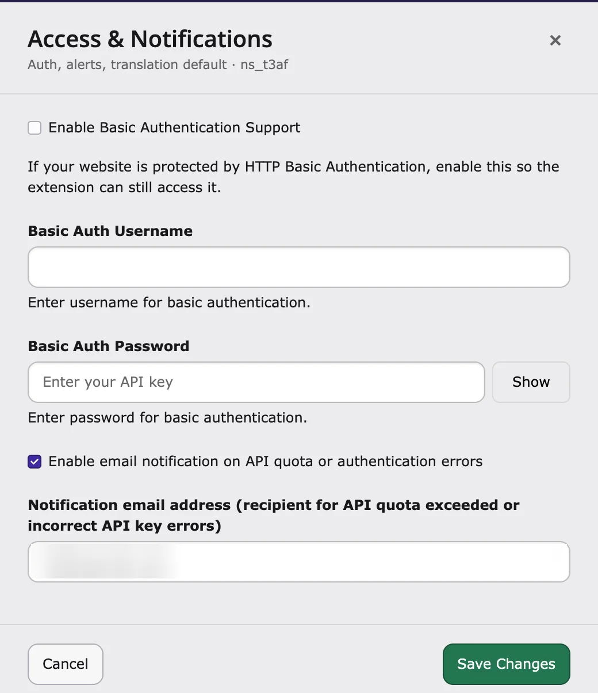

Is part of your website protected by a browser login (a username and password pop-up)? Then AI Search can only read those pages if you give it the login.

1. Go to **AI Universe → AI Foundation → AI Features**.
2. Open the **Access & Notifications** card.
3. Turn on **Basic Authentication Support**.
4. Enter the username.
5. Enter the password.
6. Click **Save**.

{/* Original text before the 8 Oct 2026 simplification (kept for reference):

If you want to crawl URLs protected by htaccess / HTTP Basic Authentication, enable **Basic Authentication Support** and enter the username and password.

Open **T3AF → AI Features → Access & Notifications**, then enable the option and save your changes.

Configure Basic Authentication under **T3AF → AI Features → Access & Notifications**.
*/}
