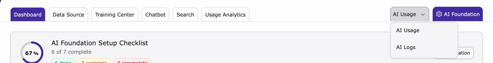

See how often the AI was used and any error messages.

1. Go to **AI Universe → AI Chatbot/Search**.
2. Click the **AI Usage** menu at the top right.
3. Choose **AI Usage** (how much AI was used) or **AI Logs** (messages and errors).
4. The page opens in AI Foundation, already filtered for AI Chatbot/Search.

{/* SUPADEMO NEEDED: AI Logs via the AI Usage menu */}

More: [AI Usage & Logs](/en/latest/ExtNsT3AF/Configuration/AIUsageAndLogs/Index). Usage Analytics shows what visitors asked; AI Usage shows how much the AI provider was used.

{/* ## 7. AILogs

**Purpose**

View log entries for the current site, including sync, training, and error events.

**What you see**

- **Search**: Use the search box (for example: `Search in message...`) to find specific log text.
- **Channel**: Filter by channel (default: `[all]`).
- **Level**: Filter by log level (for example: `Any`, Error, Warning, Info).
- **Max rows**: Set how many rows are shown per page (default: `50`).
- **Entry count**: The page shows a summary like *Showing up to 50 of 745 entries per page*.
- **Log table columns**:
- **Time**
- **Level**
- **User**
- **Details**

<iframe src="https://app.supademo.com/embed/cmrajs4hd0uedqmhxgmcj85tr?utm_source=link" loading="lazy" title="AI Logs Demo" allow="clipboard-write; fullscreen" frameBorder="0" webkitallowfullscreen="true" mozallowfullscreen="true" allowfullscreen></iframe>

## 8. AI Statistics

**Purpose**

View AI API usage statistics for the current site.

**What you see**

- **API Usage** summary for your search activity.
- **API Requests** count.
- **Tokens** usage details:
- **Total** tokens
- **Context** tokens
- **Generated** tokens

<iframe src="https://app.supademo.com/embed/cmrajqtof0u80qmhxjqczjqef?utm_source=link" loading="lazy" title="AI Statistics Demo" allow="clipboard-write; fullscreen" frameBorder="0" webkitallowfullscreen="true" mozallowfullscreen="true" allowfullscreen></iframe>
 */}
