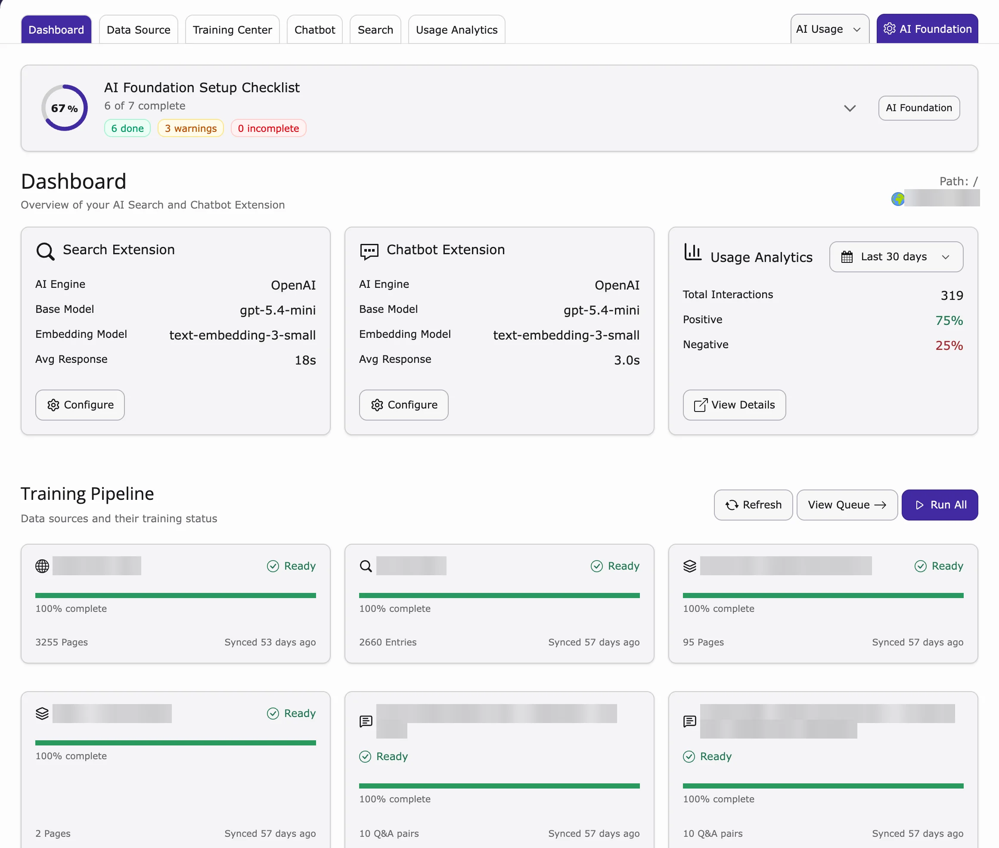

The Dashboard is the start page of the module. It shows at a glance if everything is set up and working.

<iframe src="https://app.supademo.com/embed/cmrajbhax0s8yqmhxoq4ikjrv?utm_source=link" loading="lazy" title="T3AS Dashboard Demo" allow="clipboard-write; fullscreen" frameBorder="0" webkitallowfullscreen="true" mozallowfullscreen="true" allowfullscreen></iframe>

1. Go to **AI Universe → AI Chatbot/Search**.
2. The **Dashboard** opens.

**What you see**

- **AI Foundation Setup Checklist** – what is set up and what is still missing.
- A card for each product (**Search Extension**, **Chatbot Extension**) with the AI model in use and the **Avg Response** time.
- **Usage Analytics** – how many questions visitors asked and how many liked the answers (**Positive** / **Negative**).
- **Training Pipeline** – your content sources and how far the training is. Click **Run All** to start training now.

{/* **What you see**

- Which AI/embedding model is in use (e.g. OpenAI, Gemini, Mistral, Custom).
- Status of the **Search** and **Chatbot** modules (if installed): active/inactive, AI engine, base model, embedding model.
- Status of your data sources and training (e.g. how many items are pending, completed, or failed).
- **Training Pipeline** section: data sources count, queue size, and a link to CLI reference.
- **Usage Analytics** summary (e.g. total interactions, search queries, chat sessions over the last 7 days).
- A link to the **Scheduler** to run or check the automatic training task.

**Scheduler link**

From the Dashboard you can open the TYPO3 Scheduler and locate the automatic training task (typically named **T3AF Training** for this site). Use **Run All** or **Run Task Now** to process the training queue immediately. */}
