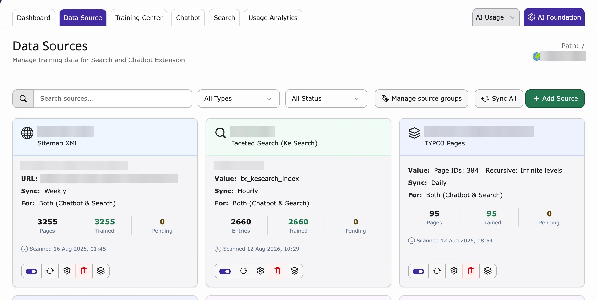

A **data source** is content that AI Search may use to answer questions, for example your website pages, PDF files or your own questions and answers.

<iframe src="https://app.supademo.com/embed/cmrajdte10somqmhxdf258tv8?utm_source=link" loading="lazy" title="T3AS Data Source Demo" allow="clipboard-write; fullscreen" frameBorder="0" webkitallowfullscreen="true" mozallowfullscreen="true" allowfullscreen></iframe>

**Add a data source**

1. Go to **AI Universe → AI Chatbot/Search → Data Source**.
2. Click **+ Add Source**.
3. Choose a **Source Type** (see the list below).
4. Fill in the fields for this type.
5. Enter a **Name**, for example `Main Website`.
6. Under **Used by**, choose **Both (Chatbot & Search)**, **Chatbot** or **Search**.
7. Choose how often the content is read again under **Sync Interval**: **Hourly**, **Daily** or **Weekly**.
8. Turn on **Enabled**.
9. Click **Save**.

**Source types**

- **TYPO3 Pages** – pages of this website. Enter the page IDs, choose how many sub-page levels to include (**Recursive**) and keep **Index mode** on **Frontend (rendered page HTML)** (the page as visitors see it).
- **Sitemap XML** – all pages listed in your sitemap, for example `https://example.com/sitemap.xml`.
- **Web Pages** – a website address. Add `/*` at the end to include only one part, for example `https://example.com/blog/*`. Turn on **Single URL** to read only this one page.
- **PDF Documents** – pick a folder with **Browse**, or upload a file with **Upload PDF** (up to 25 MB).
- **Q&A Pairs** – type a **Question** and an **Answer**. Click **Add Q&A pair** for more.
- **Text** – paste any text you want the AI to know.
- **Indexed Search**, **ke_search** and **Solr** – only shown when that extension is installed.

<Tip>
After saving, AI Search creates the background task for training by itself. You don't need to set anything up in the Scheduler.
</Tip>

<Note>
Each website has one training task. It runs at the **Sync Interval** of the data source you saved last.
</Note>

{/* SUPADEMO NEEDED: Add a TYPO3 Pages data source */}

{/* SUPADEMO NEEDED: Add PDF, Q&A and Text sources */}

**Edit or delete a source**

Use the buttons next to each source in the list to edit or delete it.

<Warning>
Deleting a data source also deletes everything the AI learned from it.
</Warning>

**Read the content again (Sync)**

- Click **Sync Now** to read one source again, or **Sync All** for all sources.
- The new content is used after the next training run (see [Scheduler](/en/latest/ExtNsT3AS/Configuration/TrainingCenter/Index#scheduler)).

## Source groups

A **source group** is a label you give to data sources, for example "Products" or "HR". On each page you can choose which groups the AI may use. This way, product pages only answer with product content.

**Create a source group**

1. Go to **Data Source**.
2. Open **Source Groups**.
3. Add, edit or delete a group.

<Note>
The group **Global** always exists and cannot be changed or deleted.
</Note>

**Add a data source to a group**

1. Edit the data source.
2. Choose the groups under **Source groups**.
3. Click **Save**.

**Choose the groups for a page**

1. Open the page in the page module.
2. Click **Edit page properties**.
3. Open the tab **AI Chatbot / Search** (called **AI Search** if only AI Search is installed).
4. Choose the groups under **Source groups**. **Global** means all sources.
5. Click **Save**.

Sub-pages use the same groups. Source groups only decide which content is used for answers. They don't change the training.

## Header and footer of your website

For **Sitemap XML** and **Web Pages** sources you can turn on **Index Site Header** and **Index Site Footer**. Then the text in your website header and footer (for example your address or main menu) is learned only once, not again on every page.

Turn them on if your header or footer contains useful information, for example contact details or opening hours.

{/* SUPADEMO NEEDED: Add Sitemap XML and Web Pages sources (Index site header / footer, Single URL) */}

**Related:** [Training Center](/en/latest/ExtNsT3AS/Configuration/TrainingCenter/Index) · [Scheduler](/en/latest/ExtNsT3AS/Configuration/TrainingCenter/Index#scheduler) · [Dashboard](/en/latest/ExtNsT3AS/Configuration/Dashboard/Index) · [AI Chatbot data sources](/en/latest/ExtNsT3AC/FeatureGuide/DataSource/Index)

{/* **Adding a data source**

1. Click **+ Add Source**.
2. Choose the **type of source**, for example:

  - **Sitemap XML** – Your sitemap URL(s) (e.g. `https://example.com/sitemap.xml`).
  - **PDF Documents** – Folder path where PDFs are stored (and optionally upload PDFs).
  - **TYPO3 Pages** – Content from specific TYPO3 pages.
  - **Web Pages** – A website URL; optionally limit to a path (e.g. `https://example.com/blog/*`).
  - **Q&A Pairs** – Manual question-and-answer content.
  - **Indexed Search / Ke Search / Solr** – If the corresponding extensions are installed and indexed content is available.

3. Fill in the requested details (URLs, folder path, page selection, etc.) and give the source a **Name** (e.g. `Main Website`) and optional **Description**.
4. Set **Sync interval**: how often content should be refreshed (e.g. **Hourly**, **Daily**, **Weekly**). **Custom** means no automatic schedule (manual sync only).
5. Set **Used by** (formerly **Type**) to control where this source is available.
6. Set **Enabled** to on if the source should be active.
7. Click **Save**.

After saving, T3AS will:

- Create or update the data source.
- Sync content into the training queue (new or changed items).
- **Automatically create** the **T3AF Training** Scheduler task for this site (if it does not exist yet) and **run it at the frequency you set** (e.g. Hourly, Daily, Weekly). You do not need to create the scheduler task manually—it is created when the source is saved and will execute according to the chosen sync interval. */}

{/* - **AI Search**
- **AI Chatbot**
- **Both AI Search and AI Chatbot** */}

{/* 1. Open the desired TYPO3 page.
2. Open **Page Properties**.
3. Go to the **AI Search** tab.
4. Find the **Source groups** field.
5. Select the Source Groups that should be available on that page. */}

{/* *Choose Source Groups under **Page Properties → AI Search** so AI Search and AI Chatbot use only those sources on that page.* */}

{/* **Sync** (per source or **Sync all**) refreshes content from the source into the training queue.

- Sync does **not** run AI training by itself.
- Training is performed by the Scheduler task or manually (see **Training Center**). */}
