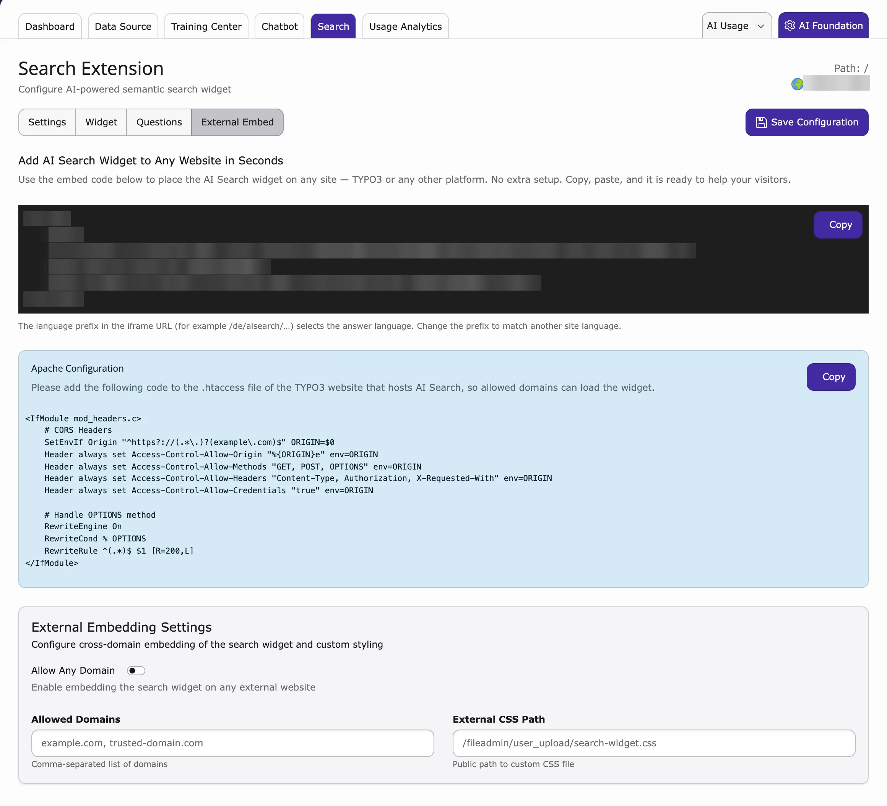

Use this to show AI Search on another website, for example your online shop.

1. Click **Save Configuration** once on the **Search → Settings** tab. The embed code appears only after that.
2. Go to **AI Universe → AI Chatbot/Search → Search → External Embed**.
3. Click **Copy** to copy the code.
4. Paste the code into the other website, just before the end of the page (before `</body>`).
5. Under **External Embedding Settings**, choose **Allow Any Domain** or enter the websites under **Allowed Domains**.
6. Optional: enter an **External CSS Path** (your own style file).
7. Click **Save Configuration**.
8. Copy the code under **Apache Configuration** and give it to your web administrator. It must be added to the `.htaccess` file of this TYPO3 website, so that the other website is allowed to load the search.

<Warning>
Only use **Allow Any Domain** if every website may use your AI Search. Each search uses your AI provider and may cost money.
</Warning>

<Note>
The embed code contains a language part, for example `/de/`. It decides the answer language.
</Note>

{/* SUPADEMO NEEDED: Search External Embed + .htaccess */}

**Related:** [AI Search plugin](/en/latest/ExtNsT3AS/FrontendPlugin/Index) · [AI answers in other search extensions](/en/latest/ExtNsT3AS/InjectingAISearchResults/Index) · [Chatbot External Embed](/en/latest/ExtNsT3AC/FeatureGuide/Chatbot/Index#external-embed) · [Permissions](/en/latest/ExtNsT3AS/Configuration/Permissions/Index)
