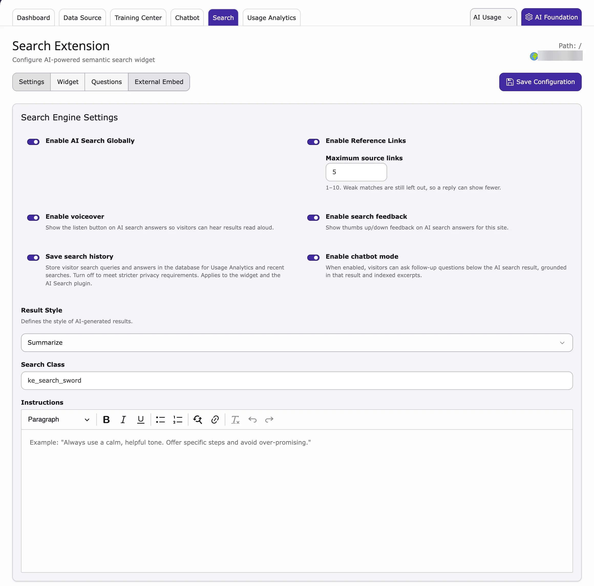
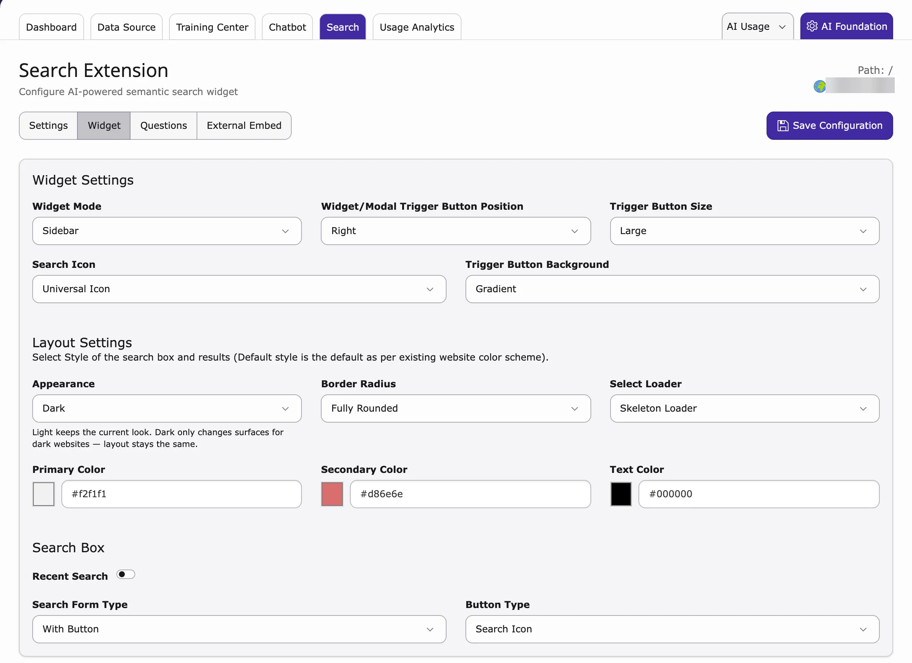
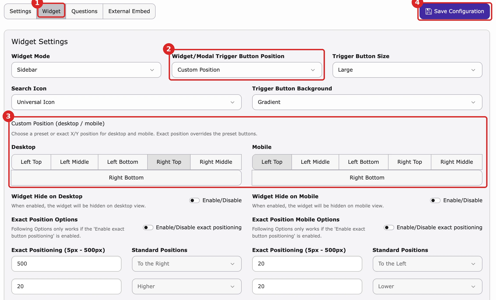
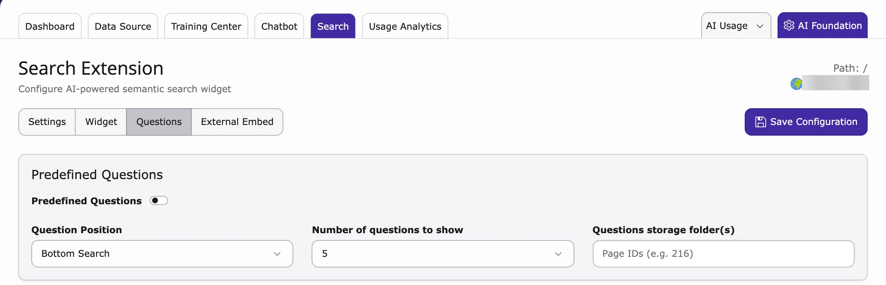

Here you switch AI Search on and choose how the search box and the answers look on your whole website.

<iframe src="https://app.supademo.com/embed/cmrajjqug0tgfqmhx211jb110?utm_source=link" loading="lazy" title="T3AS Search Global Settings Demo" allow="clipboard-write; fullscreen" frameBorder="0" webkitallowfullscreen="true" mozallowfullscreen="true" allowfullscreen></iframe>

1. Go to **AI Universe → AI Chatbot/Search → Search**.
2. Work through the tabs **Settings**, **Widget**, **Questions** and [External Embed](/en/latest/ExtNsT3AS/Configuration/ExternalEmbed/Index).
3. Click **Save Configuration**.

<Tip>
These settings apply to the whole website. To use other settings on one page, add the [AI Search plugin](/en/latest/ExtNsT3AS/FrontendPlugin/Index) to that page.
</Tip>

**Settings**

- **Enable AI Search Globally** – switches AI Search on for your website.
- **Enable Voiceover** – visitors can listen to the answer.
- **Save search history** – keeps what visitors searched, so you can see it in [Usage Analytics](/en/latest/ExtNsT3AS/Configuration/UsageAnalytics/Index).
- **Enable Reference Links** – shows links to the pages or files the answer comes from.
- **Enable Search Feedback** – visitors can rate answers with thumbs up or down.
- **Enable Chatbot Mode** – visitors can ask follow-up questions.
- **Result Style** – **Summarize** (short summary), **Short Answer** (a few sentences) or **Long Answer** (detailed).
- **Search Class** – only needed if you show AI answers in another search extension (see [AI answers in other search extensions](/en/latest/ExtNsT3AS/Configuration/SearchExtensions/Index#inject-ai-search-results)).
- **Instructions** – tell the AI how to write, for example "Answer in a friendly tone".

**Widget**

Here you choose how the search box looks and where the search button sits.

- **Widget Mode** – **Modal Box (Centered)** (a box in the middle of the screen) or **Sidebar** (a panel at the side).
- **Widget/Modal Trigger Button Position** – where the round search button sits: **Left**, **Right** or **Custom Position** (see [Change the widget position](#search-widget-position)).
- **Trigger Button Size**, **Search Icon** and **Trigger Button Background** – size, icon and colour style of the button.
- **Appearance** – **Light** or **Dark** (for dark websites).
- **Border Radius**, **Select Loader**, **Primary Color**, **Secondary Color**, **Text Color** – corners, loading animation and colours.
- **Recent Search**, **Search Form Type**, **Button Type** – options for the search box itself.

For the position of the search button, see [Change the widget position](#search-widget-position) below.

{/* SUPADEMO NEEDED: Set up the search widget (Appearance, Custom Position) */}

### Change the widget position

By default, the round search button sits at the bottom right of the screen. You can move it, separately for desktop and mobile.

1. Go to **AI Universe → AI Chatbot/Search → Search** and open **Widget**.
2. In **Widget/Modal Trigger Button Position**, choose **Left** or **Right** (bottom corner).
3. For another place, choose **Custom Position**. In the **Custom Position (desktop / mobile)** box, click a place under **Desktop** and under **Mobile**: **Left Top**, **Left Middle**, **Left Bottom**, **Right Top**, **Right Middle** or **Right Bottom**.
4. Click **Save Configuration**, then reload your website to see the button in its new place.

**More options (only with Custom Position)**

- **Widget Hide on Desktop** / **Widget Hide on Mobile** – hide the search button on that kind of device.
- **Exact Position Options** – turn on **Enable/Disable exact positioning** and enter the distance in pixels (5 to 500). With **Standard Positions** you choose **To the Left** or **To the Right** and **Lower** or **Higher**. The exact position replaces the place you clicked. For phones, use **Exact Position Mobile Options**.

**Questions**

Show example questions that visitors can click.

1. Turn on **Predefined Questions**.
2. Choose the **Question Position**: **Bottom Search** or **Top Search**.
3. Enter the **Number of questions to show**, for example `5`.
4. Under **Questions storage folder(s)**, enter the page ID of the folder that holds your question records.

{/* **Step 1:** Open the **T3AS** module.

**Step 2:** Click the **Search** tab.

**Step 3:** Configure **Settings**, **Widget**, and **Questions**. */}

{/* - **Result Style** — **Summarize** (short) or **Long Answer** (detailed) */}

{/* Style the search box and floating trigger button (for modal or floating layouts).

- **Widget Mode** — How the widget opens (e.g. `Modal Box (Centered)`)
- **Widget/Modal Trigger Button Position** — Trigger button position (e.g. `Left (bottom)`)
- **Trigger Button Size** — Size of the floating trigger button
- **Search Icon** — Icon on the search box or trigger
- **Trigger Button Background** — Background style of the trigger button
- **Select Style** — **Default Style** (site colours) or **Customized Style (plugin)**
- **Border Radius** — Corner roundness (e.g. `Semi Rounded`)
- **Select Loader** — **Skeleton Loader** or **Typing Loader** while the answer loads
- **Primary Color** / **Secondary Color** / **Text Color** — Only when **Customized Style** is selected
- **Recent Search** — Shows the visitor's previous searches in the search box
- **Search Form Type** — Input layout (e.g. `With Button`)
- **Button Type** — **Search Icon** or **With Label** */}

{/* - **Predefined Questions** — Enable suggested questions
- **Question Position** — Where they appear (e.g. `Bottom Search`)
- **Number of Questions to Show** — How many to display (e.g. `5`)
- **Questions Storage Folder(s)** — Page ID of the folder with question records (e.g. `681`) */}

{/* <Note>
These settings apply site-wide. To override them on one page, use the **T3AS Search** frontend plugin. See [../FrontendPlugin/Index](/en/latest/ExtNsT3AS/FrontendPlugin/Index).
</Note> */}
