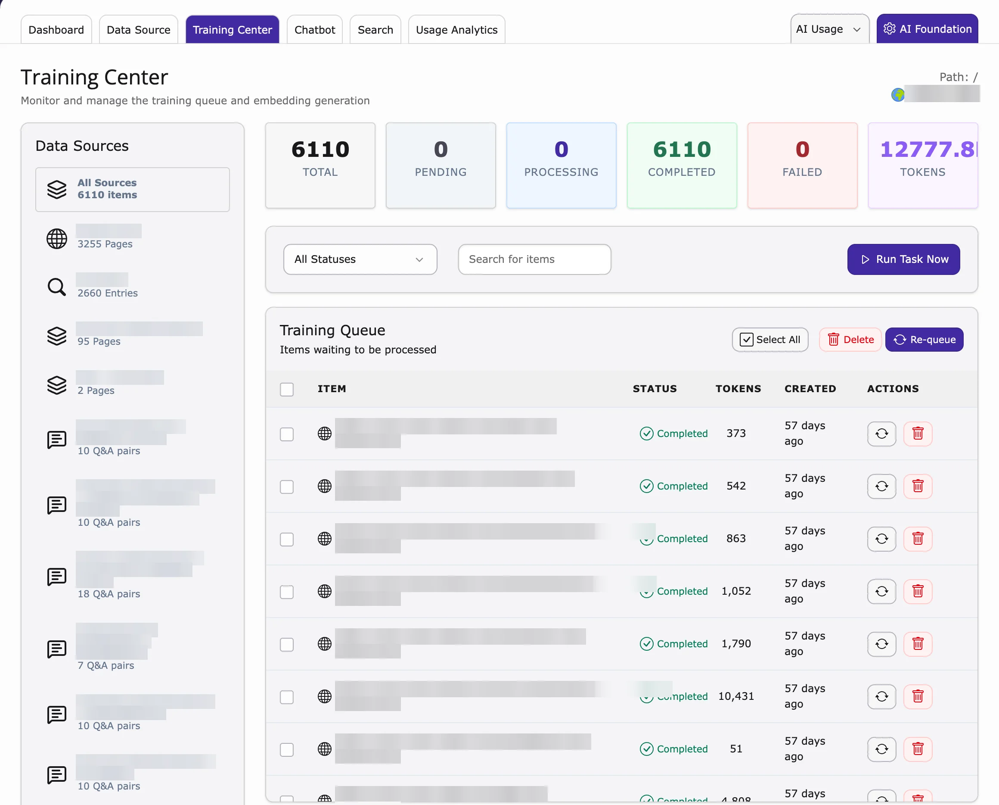

The Training Center shows every piece of content waiting to be learned, being learned, or already learned.

<iframe src="https://app.supademo.com/embed/cmrajhhoo0t19qmhxcu9sljuu?utm_source=link" loading="lazy" title="T3AS Training Center Demo" allow="clipboard-write; fullscreen" frameBorder="0" webkitallowfullscreen="true" mozallowfullscreen="true" allowfullscreen></iframe>

1. Go to **AI Universe → AI Chatbot/Search → Training Center**.
2. At the top you see the numbers: **Total**, **Pending**, **Processing**, **Completed**, **Failed** and **Tokens** (how much AI was used).
3. Below is the list of items. Use the filters to show only one source or one status.

**What the status means**

- **Pending** – waiting to be learned.
- **Processing** – being learned right now.
- **Completed** – learned. AI Search can use it.
- **Failed** – something went wrong.

**Train an item again**

1. Select the item (for example a **Failed** one).
2. Click **Re-queue**. The item goes back to **Pending**.
3. Click **Run Task Now** to start training.

**Delete an item**

1. Select the item.
2. Click **Delete**. AI Search will no longer use this content.

<Warning>
Deleted items only come back if you sync the data source again.
</Warning>

{/* SUPADEMO NEEDED: Training Center: re-queue and run */}

**Related:** [Data Source](/en/latest/ExtNsT3AS/Configuration/DataSource/Index) · [Scheduler](#scheduler) · [Dashboard](/en/latest/ExtNsT3AS/Configuration/Dashboard/Index)

{/* - **Summary counts**: Total items, Pending, Embedding (processing), Completed, Failed, and Tokens used. */}

{/* **Delete**

Removes selected queue items. */}

{/* **Run training**

Use the link to the **Scheduler** module and run the **T3AF Training** task for this site.

When the task runs, it:

- Processes all **Pending** queue items (generates embeddings).
- Runs cleanup of old completed/failed items according to the retention setting. */}

## Scheduler

Training runs in the background with the TYPO3 **Scheduler** (the TYPO3 tool that runs tasks automatically at set times).

<iframe src="https://app.supademo.com/embed/cmrakildl0wh8qmhx97rf9642?utm_source=link" loading="lazy" title="Scheduler Feature Demo" allow="clipboard-write; fullscreen" frameBorder="0" webkitallowfullscreen="true" mozallowfullscreen="true" allowfullscreen></iframe>

- Each website has one task called **T3CS Training (Site N)**. N is the page ID of your website's start page.
- AI Search creates this task for you when you save your first data source.
- To start training right away, click **Run All** on the Dashboard or **Run Task Now** in the Training Center.

When the task runs, it:

1. Reads the sources again that you marked with **Sync**.
2. Trains all new content (status **Pending**).
3. Deletes old **Failed** items after the number of days in **Retention Days**. Trained content is kept.

<Note>
**Sync** only marks content to be read again. The AI learns it when the training task runs.
</Note>

<Warning>
The Scheduler only runs if your server starts it regularly (a "cron job"). Ask your administrator or hosting provider if training never runs.
</Warning>

{/* SUPADEMO NEEDED: Scheduler task T3CS Training (Site N) */}

**Delete old visitor history automatically**

You can delete old search history (what visitors searched) after a number of days.

1. Go to the **Scheduler** module.
2. Create a new task and choose **Execute console commands**.
3. Choose `t3af:history:cleanup`.
4. Enter the number of **days** to keep (default: 90).
5. Set how often it runs on the **Timing** tab.
6. Save.

**Related:** [Data Source](/en/latest/ExtNsT3AS/Configuration/DataSource/Index) · [Scheduler & CLI in AI Foundation](/en/latest/ExtNsT3AF/Configuration/Index#scheduler-and-cli)

{/* **T3AF Training** is the shared console command `nst3af:training` (AI Foundation / T3CS). It powers automatic indexing for **AI Search (T3AS)**.

When you create a data source, T3AS will automatically create the **T3AF Training** Scheduler task for this site (if it does not exist yet) and **run it at the frequency you set** (e.g. Hourly, Daily, Weekly). You do not need to create the scheduler task manually—it is created when the source is saved and will execute according to the chosen sync interval.

From the Dashboard you can open the TYPO3 Scheduler and locate the automatic training task (typically named **T3AF Training** for this site). Use **Run All** or **Run Task Now** to process the training queue immediately. */}

{/* When the scheduler runs this task for a site, it:

1. **Syncs** enabled data sources for that site (crawl or refresh content into the **training queue**).
2. **Trains** pending queue items (chunks content and **generates embeddings** via your configured AI provider or T3Planet Credits).
3. **Cleans up** old completed/failed queue rows according to the retention setting (optional archive to CSV).

<Note>
**Sync** in the Data Sources UI only marks content for refresh. It does **not** call the AI or create embeddings by itself. Embeddings are created when **T3AF Training** runs (scheduler, CLI, or **Training Center** actions that trigger the same pipeline).
</Note> */}
