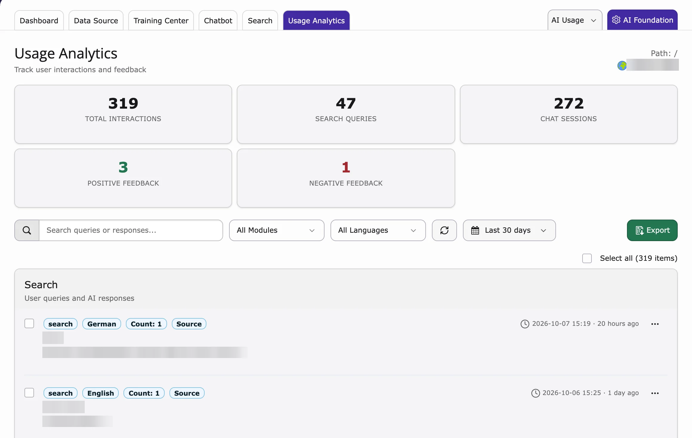

See what visitors searched, which answers they got and how they rated them.

<iframe src="https://app.supademo.com/embed/cmrakgchz0w9qqmhxlikxe9ac?utm_source=link" loading="lazy" title="T3AS Usage Analytics Demo" allow="clipboard-write; fullscreen" frameBorder="0" webkitallowfullscreen="true" mozallowfullscreen="true" allowfullscreen></iframe>

1. Go to **AI Universe → AI Chatbot/Search → Usage Analytics**.
2. Each row shows the search, a short answer, the rating, the page, language and time.
3. Click a row to see the full answer and the sources it used.
4. Use the filters (**All Modules**, **All Languages**) or the search field to find entries.
5. Click **Export** to download the list.

<Note>
You only see entries if **Save search history** is on (**Search → Settings**). Ratings only appear if **Enable Search Feedback** is on.
</Note>

Empty list? Then you see: *"No interaction logs yet. Search and Chatbot history will appear here once users start interacting."*

{/* **Step 1:** Open the **T3AS** module.

**Step 2:** Click **Usage Analytics**. */}

{/* When no data exists yet: *"No interaction logs yet. Search and search history will appear here when the modules are loaded and users interact."* */}
