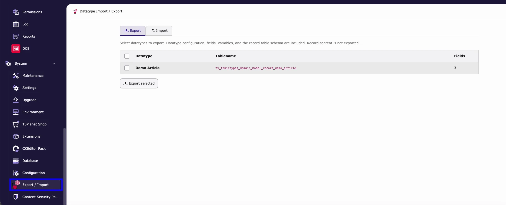
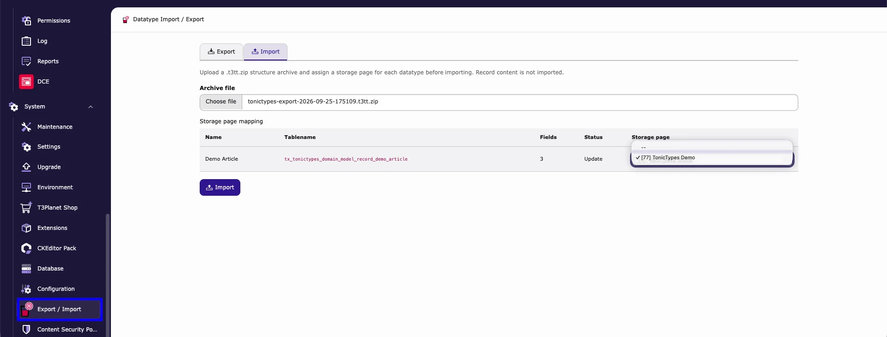

Copy a **datatype structure** (fields, variables, table schema) from one TYPO3 site to another.

| | |
| --- | --- |
| **Included in** | Free **Tonictypes Core** from **2.1.0** (not Pro-only) |
| **Module** | **System > Export / Import** |
| **File** | `.t3tt.zip` |
| **Not included** | Record content, pages, plugins |

If the export uses Pro-only field types, the target also needs `tonictypes_pro`.

## Export

1. **System > Export / Import** → **Export**  
1. Tick the datatypes  
1. **Export selected** → save the `.t3tt.zip`  

## Import

1. **System > Export / Import** → **Import**  
1. Choose the `.t3tt.zip` under **Archive file**  
1. Map each datatype to a **Storage page**  
1. Check **Status** (`Create` / `Update`) → **Import**  
1. Clear caches · run **Analyze Database Structure** if asked  

## What moves

| Yes | No |
| --- | --- |
| Datatype config, fields, template variables, table schema | Record content, page/plugin content |

## Sample on one site only

Dashboard widget **Predefined Datatype Import** loads the bundled demo datatype — not for moving custom types between projects.

## Related

[Creating a Datatype](/en/latest/TonicTypes/GettingStarted/CreatingADatatype/Index) · [Installation](/en/latest/TonicTypes/Installation/Index)
