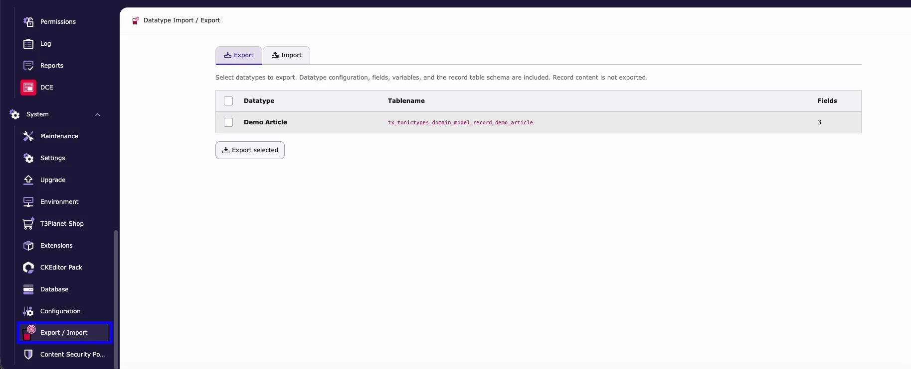
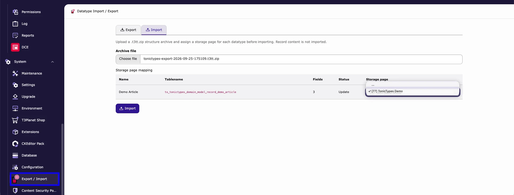

Copy a **datatype structure** (fields, variables, table schema) from one TYPO3 site to another.

Typical cases are moving a record type from a development system to production, or reusing a proven type (for example "Job offer") in a new project. Without export/import you would have to recreate every field and option by hand. The export writes the complete definition of the selected datatypes into one file; the import recreates or updates them on the target site and prepares the database table.

| | |
| --- | --- |
| **Included in** | Free **Tonictypes Core** from **2.1.0** (not Pro-only) |
| **Module** | **System > Export / Import** |
| **File** | `.t3tt.zip` |
| **Not included** | Record content, pages, plugins |

If the export uses Pro-only field types, the target also needs `tonictypes_pro`.

## Export

1. **System > Export / Import** → **Export**  
1. Tick the datatypes  
1. **Export selected** → save the `.t3tt.zip`  

Each selected datatype is exported together with its assigned fields (including their field values) and the template variables. The archive also records the Tonictypes and Tonictypes Pro versions of the source site and a checksum per datatype.

## Import

1. **System > Export / Import** → **Import**  
1. Choose the `.t3tt.zip` under **Archive file**  
1. Map each datatype to a **Storage page**  
1. Check **Status** (`Create` / `Update`) → **Import**  
1. Clear caches · run **Analyze Database Structure** if asked  

**Status** tells you what will happen for each datatype:

| Status | Meaning |
| --- | --- |
| `Create` | No datatype with this name exists on the chosen storage page. A new datatype, its fields and variables are created. |
| `Update` | A datatype with this name already exists there. It is updated. Fields are matched by their internal id or variable name, so existing fields are updated instead of duplicated. |

After the records are written, the import creates or migrates the record table. If the table already contains records, only new columns are added and destructive changes (dropping or shrinking columns) are skipped — your content is not touched. Open each imported datatype afterwards: if its **General** tab offers **Create Class** / **Update Class**, click it to generate the PHP class on this site.

## What moves

| Yes | No |
| --- | --- |
| Datatype config, fields, template variables, table schema | Record content, page/plugin content |

Record content is not part of the archive. Once the structure exists on the target, records can be moved with TYPO3's own Import/Export extension (`impexp`, `.t3d` files) like other TYPO3 records.

## Dashboard widget: Predefined Datatype Import

Core (free) ships a TYPO3 Dashboard widget, **Predefined Datatype Import**, in the widget group **Tonictypes**. It imports one bundled, ready-made datatype (table `tx_tonictypes_domain_model_record_tonictypes`) so you can explore a working setup without building fields first. It is not for moving your own datatypes between projects — use the Export / Import module above for that.

1. Open the **Dashboard** module and add the widget **Predefined Datatype Import** (group **Tonictypes**). The Dashboard system extension (`typo3/cms-dashboard`) must be installed.
1. Select a **Storage PID** (**Select storage page**). The list offers storage folders and pages that already contain datatypes.
1. Click **Import predefined datatype**. The result of the import is shown in the widget.

*Dashboard — Predefined Datatype Import*

Good to know:

- Only TYPO3 administrators can run the import.
- If the predefined datatype already exists on the site, the widget only shows that it is already present and does not import again.

## Related

[Creating a Datatype](/en/latest/TonicTypes/GettingStarted/CreatingADatatype/Index) · [Installation](/en/latest/TonicTypes/Installation/Index)
