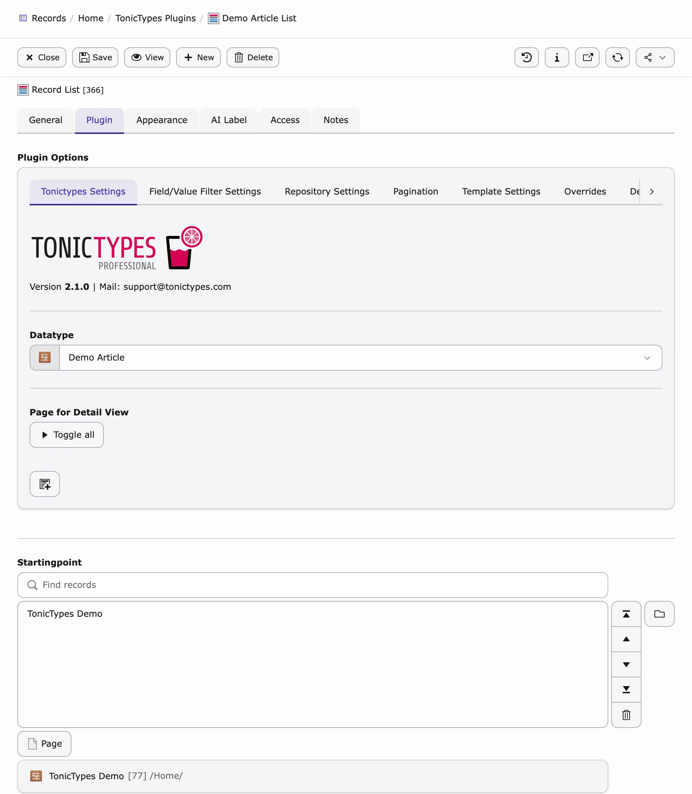
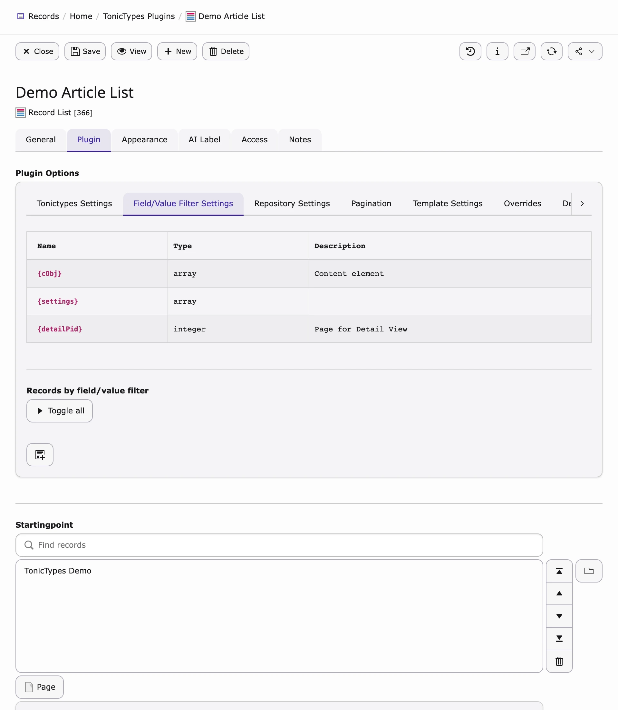
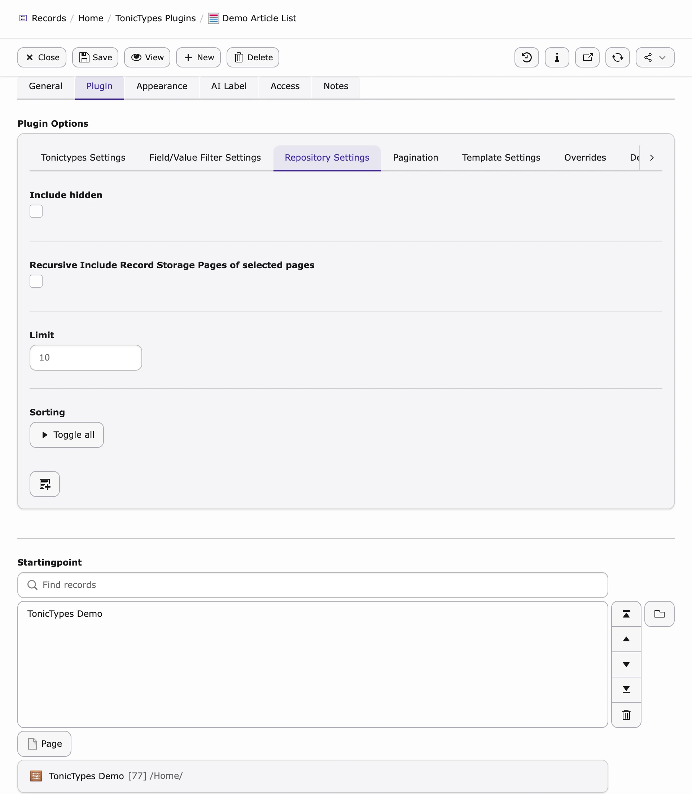
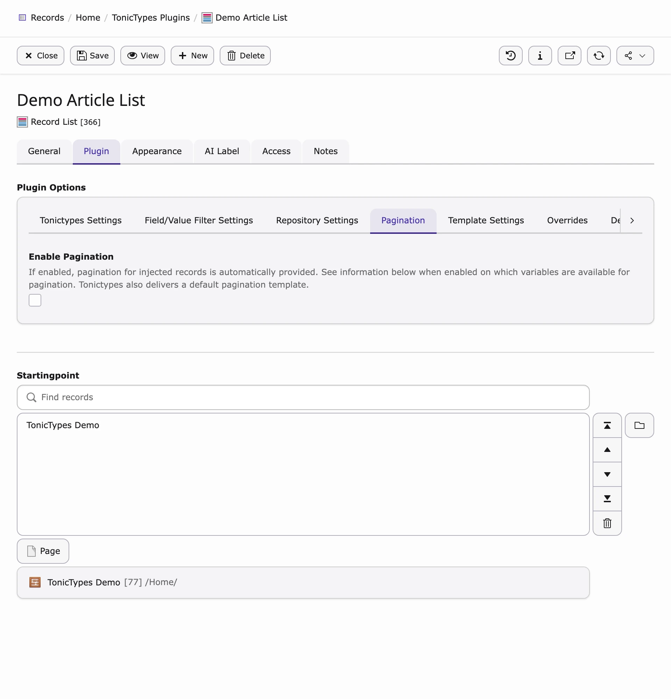

Open the plugin content element → **Plugin** tab → **Plugin Options**.

## Must set first

| Setting | Meaning |
| --- | --- |
| **Datatype** | Which record type to load |
| **Startingpoint** | Folder where those records live |
| **Template** | How to render (debug / file / inline / TypoScript) |

**Record** — only for single-record plugins (e.g. **Record Detail**): pick the record.

**Page for Detail View** — list links to a page that has **Record Dynamic Detail**.

```html
<dv:link.record record="{record}" pageUid="{detailPid}" additionalParams="{paramOne:'One'}">{record.title}</dv:link.record>
```

See [ViewHelpers](/en/latest/TonicTypes/ViewHelpers/Index).



*Startingpoint — storage page*

## Filters

**Field/Value Filter Settings** — limit which records are returned.



*Available markers for filter Fluid*

- **Filter Condition** — changes the query  
- **Condition for activating the filter** — empty = always on  

## Repository Settings



*Repository Settings*

| Option | Effect |
| --- | --- |
| **Include hidden** | Also load disabled records (respects FE preview rules) |
| **Recursive** | Also load from subpages of the Startingpoint |
| **Limit** | Max records |
| **Sorting** | One or more sort orders (can switch via Fluid / GET) |

## Pagination (Record List)



*Enable Pagination for automatic paging*

Without pagination, **Limit** alone caps how many records load at once.

## Templates

| Choice | Use when |
| --- | --- |
| **Debug Template** | First setup / debugging |
| **Custom template path** | Fluid file on disk |
| **Custom fluid code** | Inline Fluid in the plugin |
| **Configured template** | Predefined in TypoScript — [Templating](/en/latest/TonicTypes/GettingStarted/Templating/Index) |

Also: **Template Switch**, **Variable Injection**, **Render without Sitetemplate**.

## Overrides & developer

- **Overrides** — a Template Variable can replace a plugin setting when it has a value  
- **Debug** — show SQL above the output  
- **Custom Headers** — e.g. `Content-Type` for JSON/XML  
