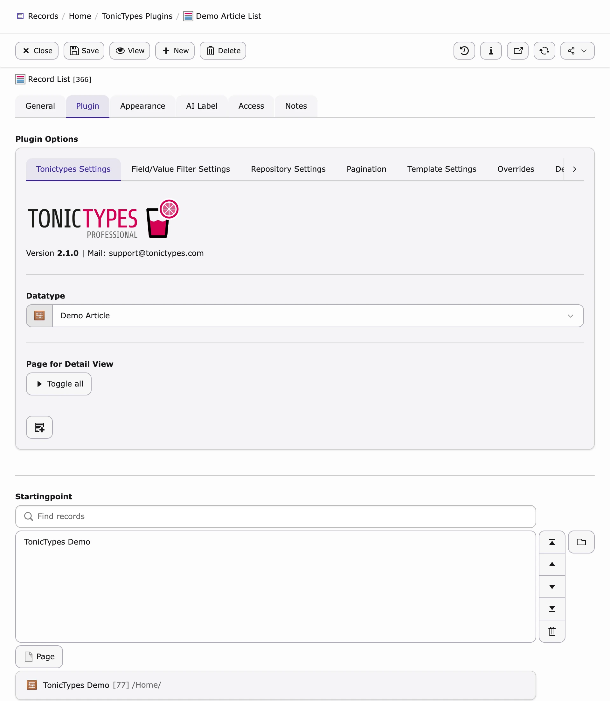
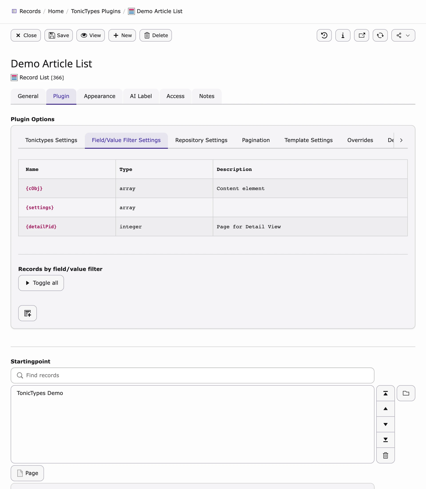
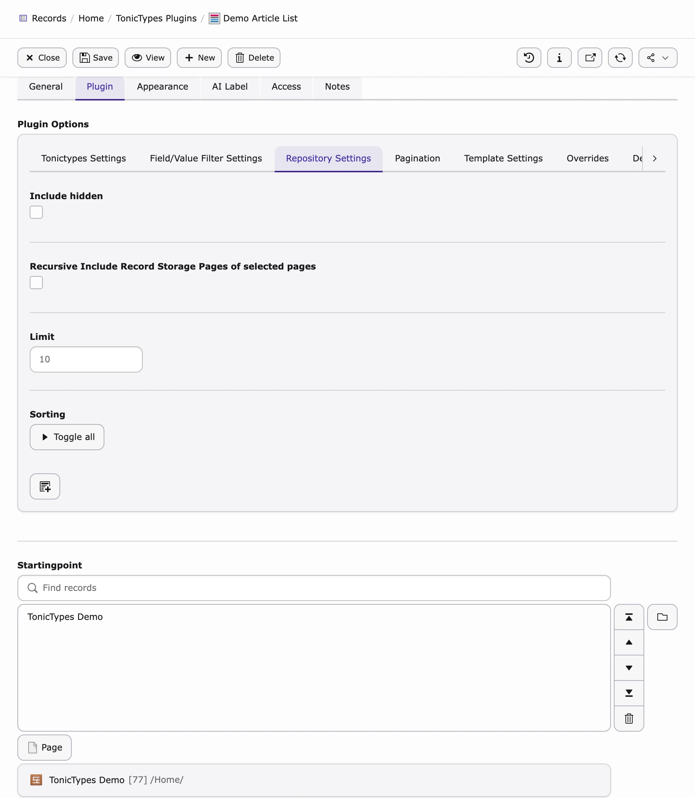
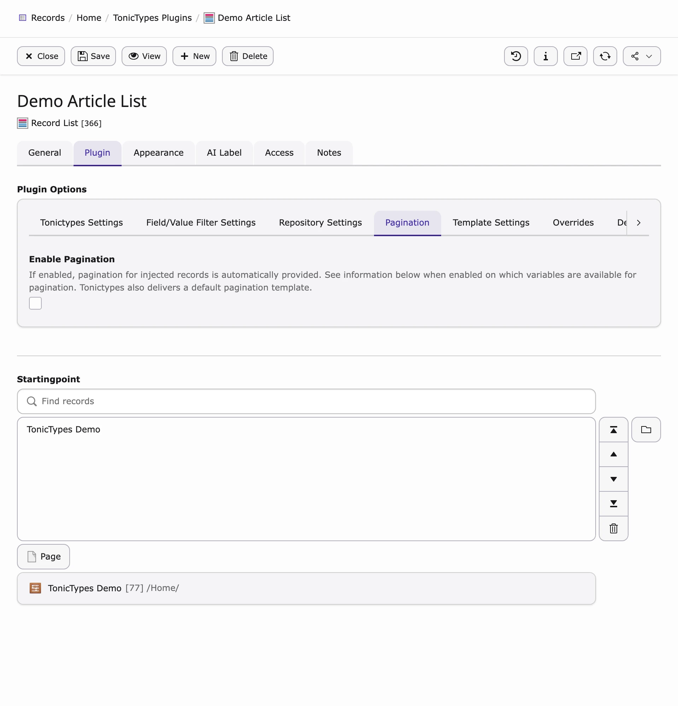

Open the plugin content element → **Plugin** tab → **Plugin Options**.

The options are grouped in sheets (sub-tabs). The **Record List** has all of them; **Record Detail**, **Record Dynamic Detail** and **Plain Fluid Template** show only the sheets that make sense for a single record or for plain Fluid. Every setting that accepts Fluid can use the injected [Template Variables](/en/latest/TonicTypes/GettingStarted/CreatingATemplateVariable/Index); the **Available Markers** box next to such settings lists them.

## Must set first

| Setting | Meaning |
| --- | --- |
| **Datatype** | Which record type to load. This decides the table that is queried and the fields you can filter and sort by. |
| **Startingpoint** | Folder where those records live. Only records stored in this folder (and its subfolders, if **Recursive** is set) are shown. |
| **Template** | How to render (debug / file / inline / TypoScript). Details in [Templates](#templates) below. |

**Record** — only for single-record plugins (e.g. **Record Detail**): pick the record.

**Page for Detail View** — list links to a page that has **Record Dynamic Detail**. You can add several entries, each with a Fluid condition; the first entry whose condition is empty or matches is used as `{detailPid}`. The conditions are checked once per plugin, so the detail page can depend on an injected Template Variable (for example the current language).

```html
<dv:link.record record="{record}" pageUid="{detailPid}" additionalParams="{paramOne:'One'}">{record.title}</dv:link.record>
```

See [ViewHelpers](/en/latest/TonicTypes/ViewHelpers/Index).



*Startingpoint — storage page*

## Filters

**Field/Value Filter Settings** — limit which records are returned.

Filters are built with a visual query builder: pick a field of the datatype, an operator (equal, contains, greater than, …) and a value. The value may be Fluid, so a filter can depend on a Template Variable — for example "category equals `{category}`" where `category` comes from the URL. The filter is applied in the database query, so it also affects the count and the pagination.



*Available markers for filter Fluid*

- **Filter Condition** — changes the query: the rules that records must match  
- **Condition for activating the filter** — empty = always on. Enter a Fluid condition, e.g. `{category}`, to apply the filter only when the visitor has chosen a category, and show all records otherwise.  

## Repository Settings

These settings control how the records are loaded from the database.



*Repository Settings*

| Option | Effect |
| --- | --- |
| **Include hidden** | Also load disabled records (respects FE preview rules). Useful for a preview page for editors; leave it off on public pages. |
| **Recursive** | Also load from subpages of the Startingpoint, when records are organised in several subfolders. |
| **Limit** | Max records. Use it for teasers such as "latest 3 articles"; **Offset** skips the first records. |
| **Sorting** | One or more sort orders (can switch via Fluid / GET). Each entry has a field, a direction and an optional Fluid condition; entries are applied in order, so the second one breaks ties of the first. |

## Pagination (Record List)



*Enable Pagination for automatic paging*

With **Enable Pagination** the list is split into pages. You choose the variables that hold the items per page and the current page number, and a **Default Page Number**. Tonictypes then provides `{p_paginator}`, `{p_paging}` and `{p_pages}` to the template and ships a default pagination template.

Without pagination, **Limit** alone caps how many records load at once.

## Templates

| Choice (UI label) | Use when |
| --- | --- |
| **Debug Template** | First setup / debugging. Prints all variables and their values instead of real markup. |
| **Select custom template path** | Fluid file on disk, e.g. in your site package. Best for version-controlled templates. |
| **Enter custom fluid code** | Inline Fluid in the plugin. Quick for small outputs; the code lives in the database. |
| **Predefined Templates** | Templates from TypoScript — [Templating](/en/latest/TonicTypes/GettingStarted/Templating/Index) |

Also:

- **Template Switch** — a list of Fluid conditions, each with its own template; the first matching condition replaces the normal template, for example a compact layout when `{view} == 'grid'`.  
- **Variable Injection** — the Template Variables this plugin makes available in its template and in its Fluid settings.  
- **Render this Template without Sitetemplate** — outputs only this plugin's result and stops, without the page around it. Use it for AJAX responses or feeds, together with **Custom Headers**.  

## Overrides & developer

- **Overrides** — a Template Variable can replace a plugin setting when it has a value. Available for **LIMIT**, **OFFSET**, **SORTING** (the field to sort by) and **ORDER** (the direction; only used together with SORTING). This lets visitors change paging or sorting via URL parameters without extra templates.  
- **Debug** — show SQL above the output  
- **Static Cache HTML Output** — cache the rendered HTML of the plugin  
- **Custom Headers** — e.g. `Content-Type` for JSON/XML. Each header can have a Fluid condition.  
