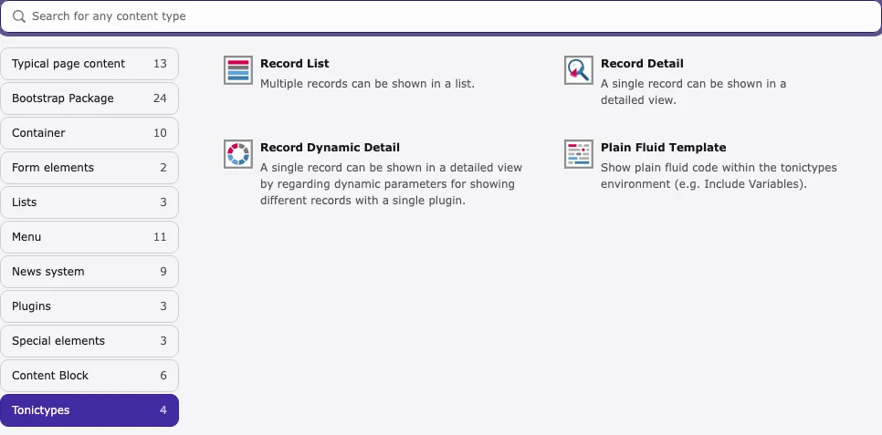

Plugins show your records in the frontend. They are normal content elements — **not** created in the Records / List module.

## Plugin types

| Plugin | Shows |
| --- | --- |
| **Record List** | Many records → `{records}` |
| **Record Detail** | One record you pick in the plugin → `{record}` |
| **Record Dynamic Detail** | One record from the URL (detail page) → `{record}` |
| **Plain Fluid Template** | Custom Fluid only (no record load) |

## Add a plugin

1. Open the **page** that should show the output.  
1. **Page** module (v14: **Content > Layout**; v12/v13: **Web > Page**).  
1. **New content element** → **Tonictypes** group.  
1. Choose **Record List**, **Record Detail**, **Record Dynamic Detail**, or **Plain Fluid Template**.

*New content → Tonictypes*

## Minimum settings

1. Save the content element once.  
1. **Datatype** — which record type  
1. **Startingpoint** — storage folder with the records  
1. **Template** — use the debug template first if unsure  

Without datatype + Startingpoint, the frontend stays empty.

For list → detail: put **Record Dynamic Detail** on the detail page, and set **Page for Detail View** on the **Record List**.

<Note>
Select a **Startingpoint** and save once before all FlexForm fields appear.
</Note>

Full FlexForm options: [Plugin configuration](/en/latest/TonicTypes/FrontendPlugins/DisplayRecordsPlugin/Index).

No fields/datatype yet? Start with [Getting Started](/en/latest/TonicTypes/GettingStarted/Index).
