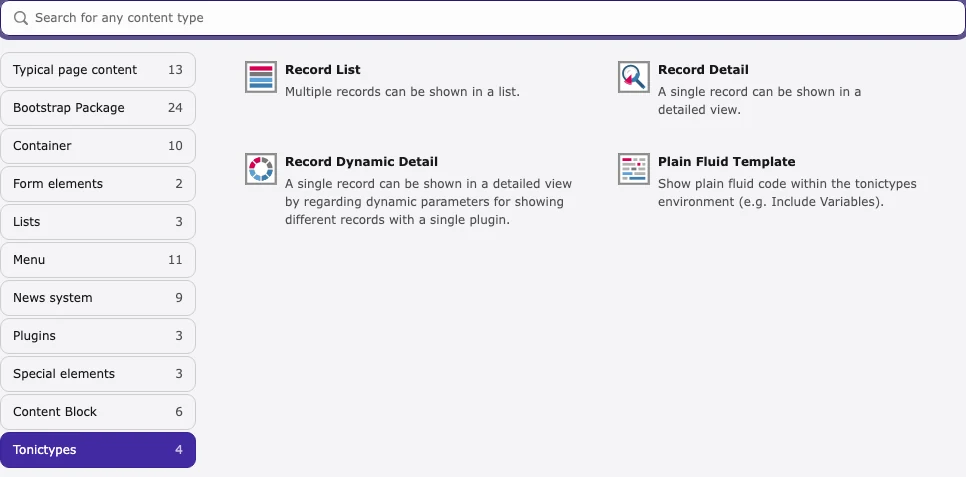

Plugins show your records in the frontend. They are normal content elements — **not** created in the Records / List module.

A plugin connects three things: a **datatype** (what kind of records), a **Startingpoint** (the storage folder where they are stored) and a **template** (how they are rendered). Because the plugin is a content element, it inherits everything TYPO3 content can do — it can be hidden, scheduled, restricted to user groups, translated, or placed in any column of any page.

## Plugin types

| Plugin | Shows |
| --- | --- |
| **Record List** | Many records → `{records}`. Use it for overview pages, teasers and archives. Supports filters, sorting, limit and pagination. |
| **Record Detail** | One record you pick in the plugin → `{record}`. Use it when a page always shows the same record, for example a featured product. |
| **Record Dynamic Detail** | One record from the URL (detail page) → `{record}`. One plugin serves every record: the record uid comes from the link created in the list. |
| **Plain Fluid Template** | Custom Fluid only (no record load). Use it to render Template Variables or ViewHelper output inside the Tonictypes environment, for example a filter form or a counter. |

## Add a plugin

1. Open the **page** that should show the output.  
1. **Page** module (v14: **Content > Layout**; v12/v13: **Web > Page**).  
1. **New content element** → **Tonictypes** group.  
1. Choose **Record List**, **Record Detail**, **Record Dynamic Detail**, or **Plain Fluid Template**.

*New content → Tonictypes*

## Minimum settings

1. Save the content element once.  
1. **Datatype** — which record type  
1. **Startingpoint** — storage folder with the records  
1. **Template** — use the debug template first if unsure  

Without datatype + Startingpoint, the frontend stays empty.

For list → detail: put **Record Dynamic Detail** on the detail page, and set **Page for Detail View** on the **Record List**.

## How list and detail work together

1. The **Record List** on the overview page renders each record with a link built by `dv:link.record` and the list's **Page for Detail View** (available in the template as `{detailPid}`).
1. The link carries the record uid as `tx_tonictypes_dynamic[record]`.
1. The **Record Dynamic Detail** plugin on the detail page reads that parameter, loads the record and renders it as `{record}`.

Both plugins need the same datatype: if the linked record belongs to a different datatype, the detail plugin shows an error message instead of the record.

<Note>
Select a **Startingpoint** and save once before all FlexForm fields appear.
</Note>

Full FlexForm options: [Plugin configuration](/en/latest/TonicTypes/FrontendPlugins/DisplayRecordsPlugin/Index).

No fields/datatype yet? Start with [Getting Started](/en/latest/TonicTypes/GettingStarted/Index).
