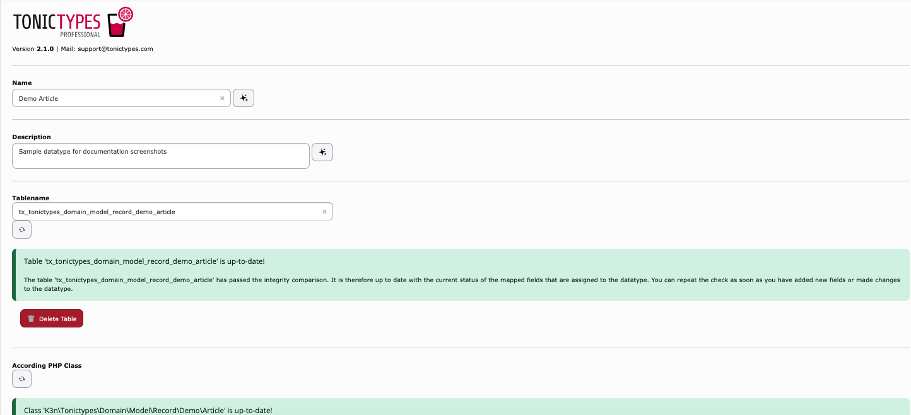

A **datatype** is one record type (for example News or Event). It lists which fields belong to that type.

## Create a datatype

1. Open your **storage folder** in **Records**.  
1. **Create new record** → **tonictypes** → **Datatype**.  
1. Set **Name** (and optional description).  
1. Open **Fields** and assign the fields (order = form order).  
1. Save, then click **Create Table** / **Update Table**.  
1. Click **Create Class** / **Update Class**.  
1. Still on this folder: **Create new** → your datatype name → add records.

*General — name, table, and class status*

## Tabs overview

| Tab | What you set |
| --- | --- |
| **General** | Name, description, table, PHP class |
| **Fields** | Which fields belong to this type |
| **Tab Configuration** | Custom backend tabs / palettes |
| **Appearance** | Icon, color, thumbnail, SEO, hide options |

### Appearance (common options)

- **Thumbnail Field** — list thumbnail  
- **Enable SEO Fields** — SEO fields on the record form  
- **Cache generated TCA** — cache TCA; clear caches after structural changes  
- **New records are disabled by default** — new records start hidden (`default_hidden`, Core 2.1+)  

## Move structures to another site

Use free Core **System > Export / Import**: [Import / Export](/en/latest/TonicTypes/ExportImport/Index).

## Next

[Template variables](/en/latest/TonicTypes/GettingStarted/CreatingATemplateVariable/Index) · [Templating](/en/latest/TonicTypes/GettingStarted/Templating/Index) · [Frontend Plugins](/en/latest/TonicTypes/FrontendPlugins/Index)
