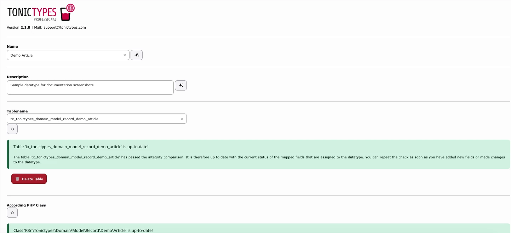

A **datatype** is one record type (for example News or Event). It lists which fields belong to that type.

The datatype is the blueprint of a record type. It decides which fields appear in the record form and in which order, how records look in the backend lists, and it owns the database table and the PHP class that hold and load the records. Editors never edit the datatype; they create records *of* the datatype.

## Create a datatype

1. Open your **storage folder** in **Records**.  
1. **Create new record** → **tonictypes** → **Datatype**.  
1. Set **Name** (and optional description).  
1. Open **Fields** and assign the fields (order = form order).  
1. Save, then click **Create Table** / **Update Table**.  
1. Click **Create Class** / **Update Class**.  
1. Still on this folder: **Create new** → your datatype name → add records.

*General — name, table, and class status*

## What Create Table and Create Class do

The **General** tab checks whether the database table and the PHP class still match the assigned fields and shows the matching button.

| Button | What happens |
| --- | --- |
| **Create Table** / **Update Table** | Creates the table `tx_tonictypes_domain_model_record_<name>` (e.g. `…_record_demo_article` for "Demo Article") or adds and alters columns so that every assigned field has one. When the table is up to date, a confirmation is shown instead. |
| **Delete Table** | Drops the table including all records of this type. Use only when you remove the datatype for good. |
| Orphan columns | Columns of fields you have removed from the datatype stay in the table (their data is kept). The check lists them so you can delete them when they are no longer needed. |
| **Create Class** / **Update Class** | Writes the Extbase model and repository into the `tonictypes` extension, e.g. `Classes/Domain/Model/Record/Demo/Article.php`. The part of the table name after `tx_tonictypes_domain_model_record_` becomes folder and class name. |
| **Delete Class and dump autoload** | Removes the generated class files. |

Run **Update Table** and then **Update Class** every time you add, remove or change fields of a datatype, and clear the caches afterwards.

## Tabs overview

| Tab | What you set |
| --- | --- |
| **General** | Logo, name, description, table, PHP class — plus the table and class checks described above |
| **Fields** | Which fields belong to this type. Pick them from the list of fields on the same storage page; the order on the right is the order in the record form. Changing the selection reloads the form. |
| **Tab Configuration** | **Disable 'General' Tab** + custom backend tabs. Create tabs with a name, an optional Font Awesome icon and colour, and assign fields to each tab — useful when a type has many fields. |
| **Appearance** | Icon, color, title divider, thumbnail field, hide options, **New records are disabled by default**, SEO fields |
| **Access** | **Hide**, **Start**, **Stop** for the datatype itself |
| **Advanced Settings** | **Cache generated TCA** |

### Appearance (common options)

- **Icon** / **Color** — how records of this type are recognised in the backend  
- **Title Divider Character** — separator used when several fields form the record title (fields marked **Use as record title** on the field)  
- **Thumbnail Field** — list thumbnail; pick an image field so editors recognise records at a glance  
- **Hide Records of this type in lists** / **Hide Button to Add new Record** — keep records out of the List module or stop editors from creating new ones there (for example when records are created by an import)  
- **Enable SEO Fields** — SEO fields on the record form, for types that get their own detail page  
- **New records are disabled by default** — new records start hidden (`default_hidden`, Core 2.1+); an editor must enable them, which suits a review step before publishing  

### Advanced Settings

- **Cache generated TCA** — cache TCA; clear caches after structural changes  

When this is on (the default), Tonictypes caches the complete generated TCA of the datatype and of all its fields. This keeps the backend fast. Turn it off only while you are changing fields a lot and do not want to clear caches after each change.

## Move structures to another site

Use free Core **System > Export / Import**: [Import / Export](/en/latest/TonicTypes/ExportImport/Index).

## Next

[Template variables](/en/latest/TonicTypes/GettingStarted/CreatingATemplateVariable/Index) · [Templating](/en/latest/TonicTypes/GettingStarted/Templating/Index) · [Frontend Plugins](/en/latest/TonicTypes/FrontendPlugins/Index)
