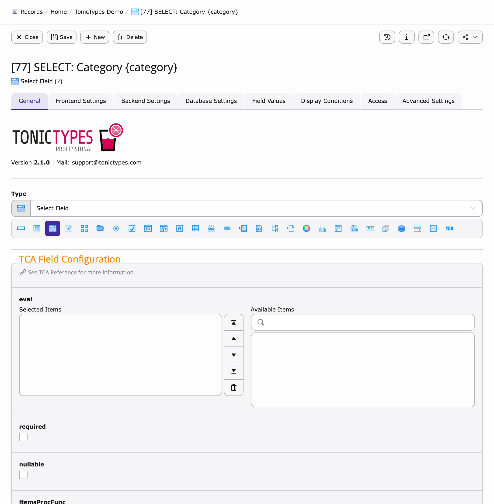
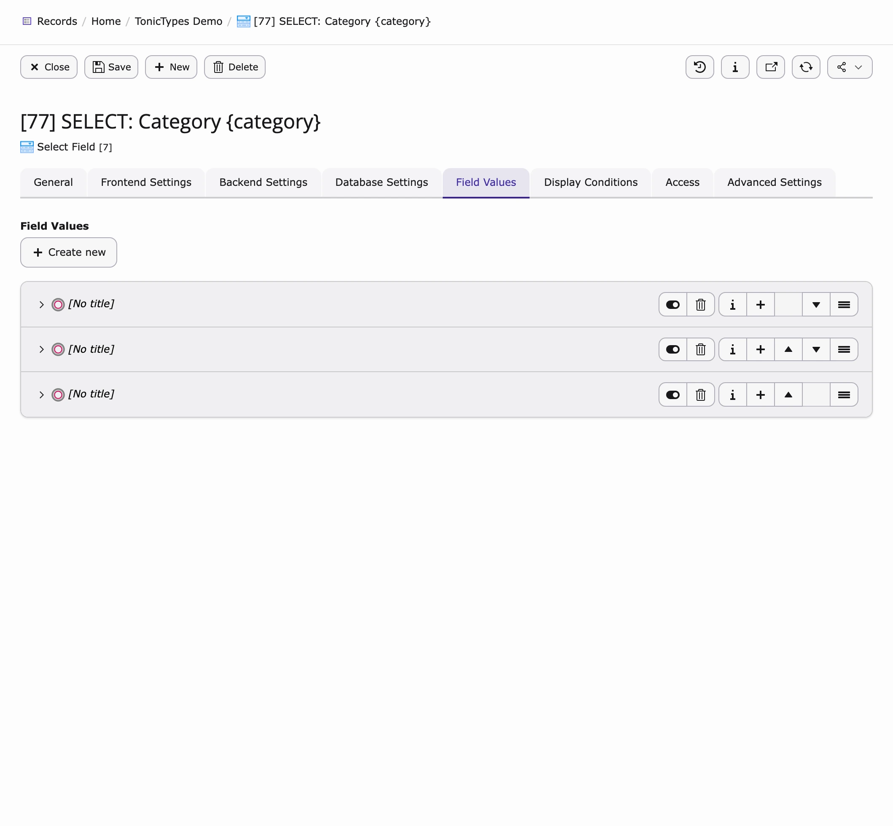
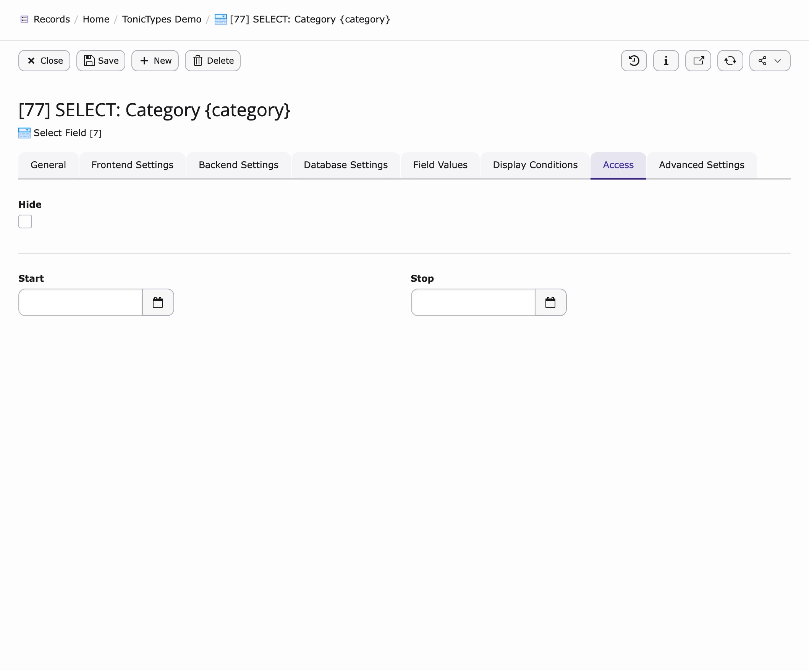
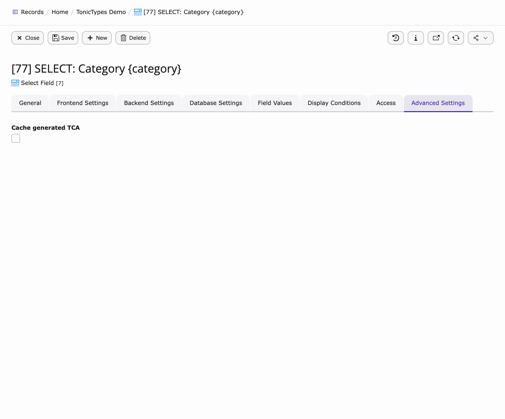

A **field** is one property of your records (title, body text, category, …). Create fields first, then attach them to a [Datatype](/en/latest/TonicTypes/GettingStarted/CreatingADatatype/Index).

## Create a field

1. Open a **storage folder** in **Records** (v14: **Content > Records**; v12/v13: **Web > List**).  
1. **Create new record** → **tonictypes** → **Field**.  
1. Set **Type** and **Frontend Label** (this also builds the Fluid variable name).  
1. Save. Repeat for each property.

*General — pick the field type*

Core includes standard types (input, textarea, select, …). Pro types (Repeater, Content, Fluid, UserFunc, …): [Tonictypes Pro](/en/latest/TonicTypes/Professional/Index).

## Main tabs (what they mean)

| Tab | Use for |
| --- | --- |
| **General** | Type + TCA options for that type |
| **Frontend Settings** | Label, variable name (`{record.yourname}`), PHP type |
| **Backend Settings** | Record title, path segment, search, exclude fields |
| **Database Settings** | Column type / index (defaults are usually fine) |
| **Field Values** | Options for select-like fields |
| **Display Conditions** | Show/hide based on other fields |
| **Access** | Hide / start / stop for the field itself |
| **Advanced Settings** | Rare type-specific options |

## Field Values (select options)

*Field Values — e.g. static options*

- **Static Value** — fixed text  
- **Database Value** — from a query  
- **TypoScript** — from TypoScript  
- **Values of all records** — values already used  

## Access

*Hide, Start, Stop*

## Advanced Settings

*Only when you need extras beyond the tabs above*

## Next

[Creating a Datatype](/en/latest/TonicTypes/GettingStarted/CreatingADatatype/Index)
