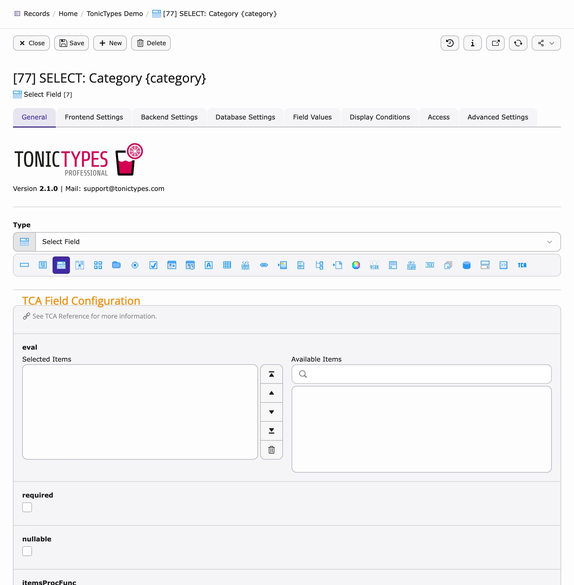
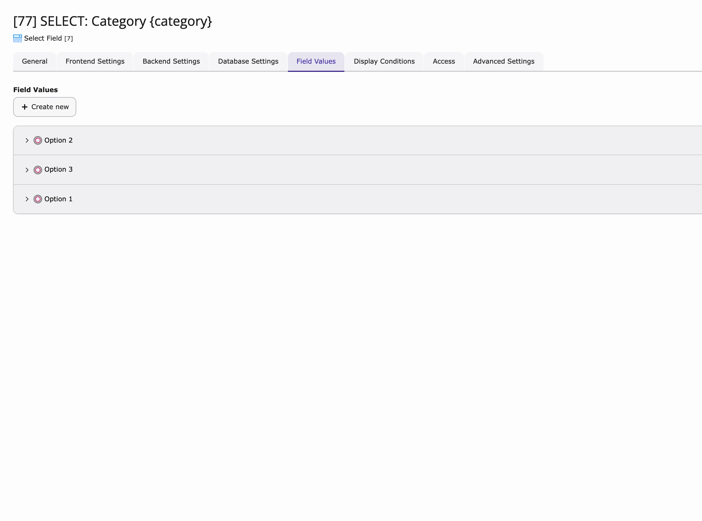
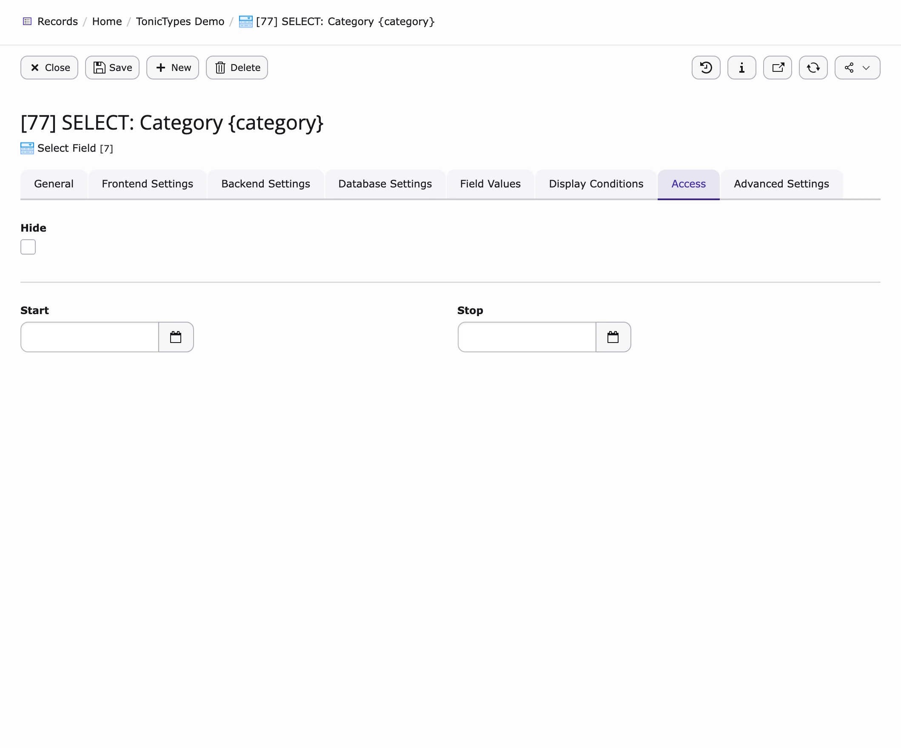
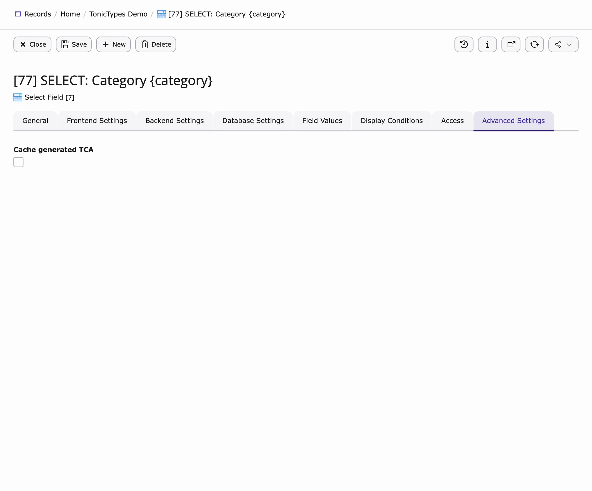

A **field** is one property of your records (title, body text, category, …). Create fields first, then attach them to a [Datatype](/en/latest/TonicTypes/GettingStarted/CreatingADatatype/Index).

Fields are stored as their own records, independent of any datatype. This has two practical effects: you can reuse one field (for example "Title") in several datatypes, and changing a field changes the form of every datatype that uses it. Each field later becomes one column in the datatype's database table and one property in its PHP class.

## Create a field

1. Open a **storage folder** in **Records** (v14: **Content > Records**; v12/v13: **Web > List**).  
1. **Create new record** → **tonictypes** → **Field**.  
1. Set **Type** and **Frontend Label** (this also builds the Fluid variable name).  
1. Save. Repeat for each property.

*General — pick the field type*

Changing the **Type** reloads the form, because every type has its own **TCA Field Configuration** options below it (for example the number of rows of a textarea, or the allowed file extensions of an image field).

In the Records list a field is labelled `[pid] TYPE: Label {variable}` — for example `[77] INPUT: Title {title}` — so you can see its storage page, type and variable name at a glance.

<Note>
A field only appears in a datatype's **Fields** selector if it is on the same storage page as the datatype and has a **Frontend Label**, a variable name and at least one **Field Value**.
</Note>

## Field types in Core

| Type | Use it for |
| --- | --- |
| **Input Field** | Short single-line text such as a title, a name or a price |
| **Textarea** | Longer plain text without formatting |
| **Rich-Text Editor (RTE)** | Formatted text with headings, lists and links |
| **Select Field** / **Multiselect Field** | Choose one / several options from a list defined in **Field Values** |
| **Radio Buttons** / **Checkboxes** | Visible options to pick one (radio) or several (checkboxes) |
| **Date Field** / **Date and Time Field** | Dates with a date picker, optionally with time |
| **Image** / **File Relations** | Images or other files from the file list (FAL) |
| **Link** | A link to a page, file, URL or e-mail address |
| **Page** / **Tree Selection** | Pick pages or items from a tree |
| **Group Field** / **Folder Field** | Relations to records of other tables / to folders |
| **Table** | Simple tabular data |
| **Code Editor** | Code snippets with syntax highlighting |
| **Color Picker** | A colour value |

Pro types (FlexForm, Content, Fluid, UserFunc, …): [Tonictypes Pro](/en/latest/TonicTypes/Professional/Index).

Developers can register their own field types under `plugin.tx_tonictypes.fieldtypes` in TypoScript (class, icon, label, FlexForm) — the Core setup contains a commented `customfieldtype` example.

## Main tabs (what they mean)

| Tab | Use for |
| --- | --- |
| **General** | The field **Type** and the **TCA Field Configuration** for that type. This decides how the input looks in the record form. |
| **Frontend Settings** | **Frontend Label** (the label editors see), **Custom Variable Name** (lowercase letters only; used in Fluid as `{record.yourname}` and as the database column name), **Frontend Type Definition** (the PHP type of the property in the generated class, e.g. `string`, `int` or a class name) and **Is Object Storage** (store several related objects of that class). |
| **Backend Settings** | **Use as record title** (value shown as the record's label in lists), **Use value as path segment** (value builds the record's URL segment), **Searchable in Backend** (included in the List module search), **Exclude for non-admin users** / **Exclude from translations**, **Palette** (put fields side by side) and **Backend Description** (help text under the field). |
| **Database Settings** | **Database Type Definition** — keep **Inherit from Tca/Field Class** unless you need a different column type (e.g. `mediumtext` for long text). **Is Index Field** adds a database index, useful for fields you filter or sort by. |
| **Field Values** | Options for select-like fields and default values — see below. |
| **Display Conditions** | Show or hide this field depending on other fields. **Request Update (onChange)** reloads the form when this field changes, so conditions on other fields react immediately. The condition itself uses TYPO3's `displayCond` syntax; **Available Field Ids** lists the fields you can refer to. |
| **Language** | Language / translation parent (only shown on multi-language sites) |
| **Access** | **Hide**, **Start**, **Stop** for the field itself |
| **Advanced Settings** | **Cache generated TCA** |

## Field Values (select options)

A **field value** is a source of values for a field. For select, radio and checkbox fields the field values become the options; for other types the value marked **Is Default** pre-fills new records.

*Field Values — titled static options (e.g. Option 1–3)*

- **Static Value** — fixed text. Write `Label|value` to show a label but store a different value (for example `Red|red`); without `|` label and value are the same.  
- **Database Value** — rows from a table: choose **Table Content**, **Column Name** and an optional **Where Clause**; the **Value Content** is Fluid, rendered once per row, so you can combine columns into a label.  
- **TypoScript** — the result of a TypoScript object, useful when options depend on site configuration.  
- **Values of all records** — values already used in existing records of this field.  

Two switches refine each value:

| Option | Effect |
| --- | --- |
| **Is Default** | This value is pre-selected / pre-filled when an editor creates a new record. |
| **Pretends to be an empty value** | The option is shown with its label, but stores an empty value — for a "Please choose" entry. |

## Access

Use **Hide** to take a field out of all record forms without deleting it, or **Start** / **Stop** to limit that to a time window. Existing record data stays in the database.

*Hide, Start, Stop*

## Advanced Settings

**Cache generated TCA** stores the generated form configuration of this field, so TYPO3 does not rebuild it on every request. The cache is refreshed when the field's type, configuration, variable name or exclude setting changes. If the datatype itself has caching enabled, all its fields are cached anyway.

*Advanced Settings — **Cache generated TCA***

## Next

[Creating a Datatype](/en/latest/TonicTypes/GettingStarted/CreatingADatatype/Index)
