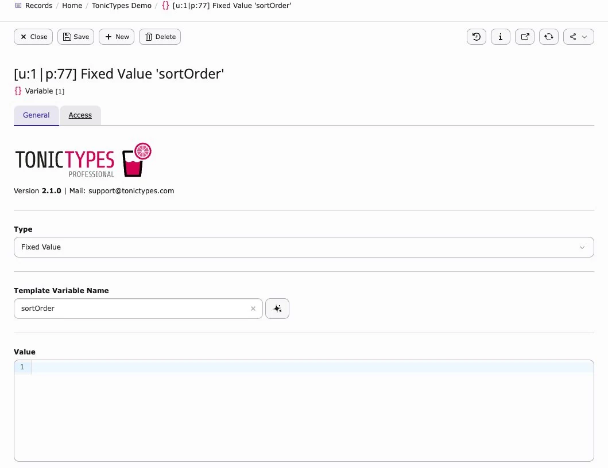
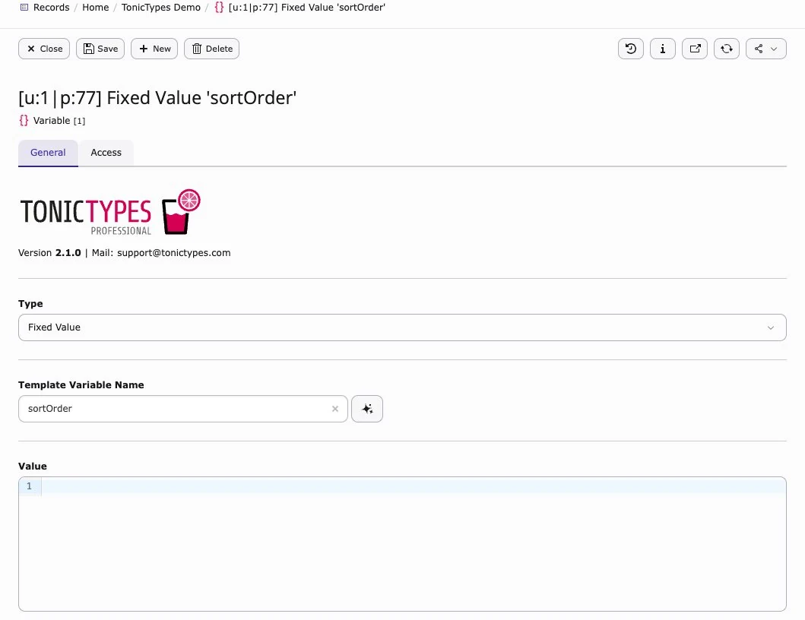

A **Template Variable** puts a dynamic value into Fluid (filters, sorting, page IDs, GET params, …).

Select it later in the plugin under **Variable Injection**.

## Create one

1. Storage folder → **Create new** → **Template Variable**  
1. Set **Template Variable Name** (Fluid name)  
1. Pick **Type** (where the value comes from)  
1. Save · enable it on the plugin  

## Types (overview)

| Type | Value from |
| --- | --- |
| Fixed Value | Static text |
| TypoScript Value | TypoScript |
| GET / POST Variable | Request |
| Database Value | Configured query |
| Frontend / Backend User | Logged-in user |
| Server / Session | PHP `$_SERVER` / FE session |
| Page | Selected page |
| User (UserFunc) | PHP function |
| Language Id | Current language |
| Dynamic Record | Record in current request |
| Extension Configuration | Ext config |
| TypoScript / Site Set settings | TS or Site Settings |
| Tonictypes Session Service | Active filters / searches |

## GET / POST extras

- Type Definition · Regular Expression · Allowed Values  
- **Value Switch** — change the value with Fluid (first match wins)

*Example: reverse a sort-order parameter*

## Next

[Templating](/en/latest/TonicTypes/GettingStarted/Templating/Index)
