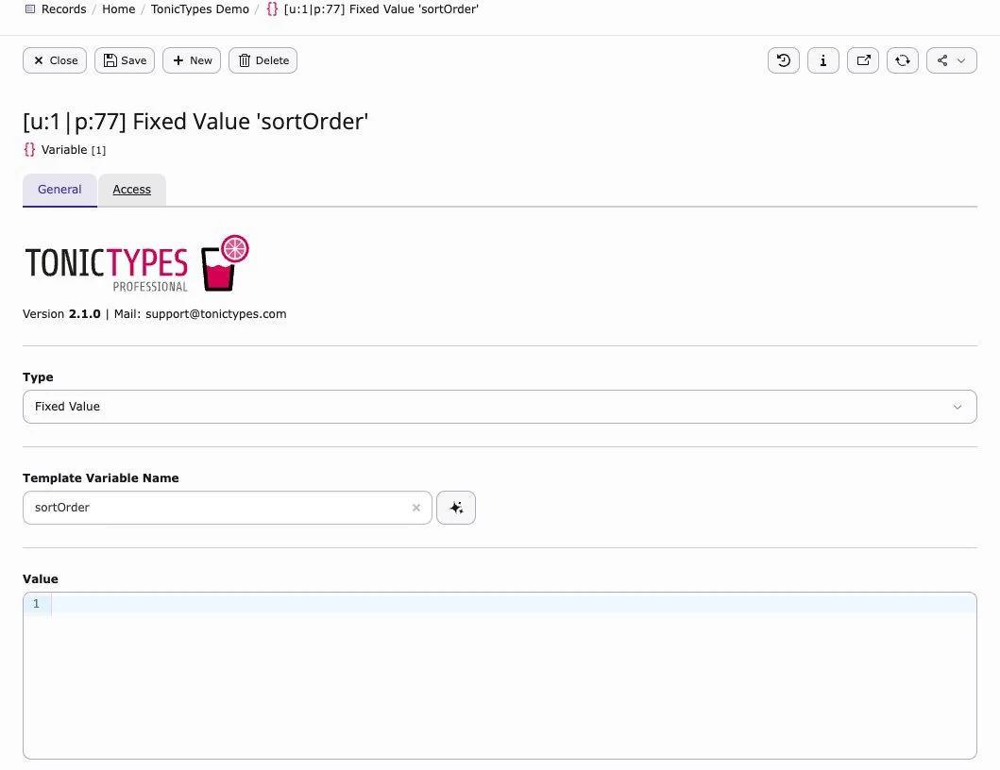
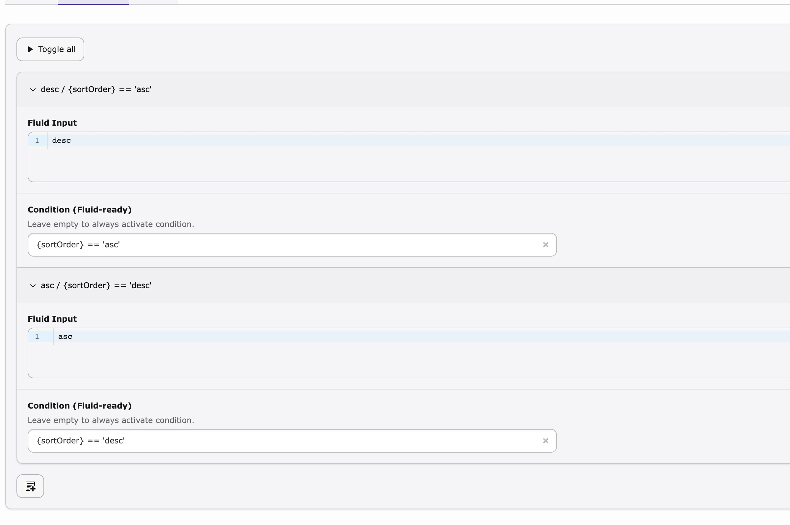

A **Template Variable** puts a dynamic value into Fluid (filters, sorting, page IDs, GET params, …).

Select it later in the plugin under **Variable Injection**.

Template variables keep logic out of your templates. Instead of reading the URL or the logged-in user inside Fluid, you define once where a value comes from, give it a name, and every plugin that injects the variable can use it — in the template as `{yourVariableName}`, and in plugin settings that accept Fluid, such as filter conditions. The value is resolved fresh on every request when the plugin renders.

## Create one

1. Storage folder → **Create new** → **Template Variable**  
1. Set **Template Variable Name** (Fluid name)  
1. Pick **Type** (where the value comes from)  
1. Save · enable it on the plugin  

The names `record`, `records`, `part`, `cObj` and `settings` are reserved by the plugins and cannot be used.

## Types (overview)

After you choose a **Type**, the form shows only the settings that type needs.

| Type | Value from | Setting you fill in · typical use |
| --- | --- | --- |
| Fixed Value | Static text | **Value** · a constant you want to change in one place, e.g. a CSS class or a limit |
| TypoScript Value | TypoScript | **Value** (TypoScript code) · reuse an existing TypoScript object or constant |
| GET / POST Variable | Request | **Parameter Name** (empty = same as the variable name) · search terms, sort order, filters from a form or link. GET, POST and GET/POST differ only in where the parameter is read from. |
| Database Value | Configured query | **Table**, **Column**, **Where Clause** · values from any database table |
| Frontend / Backend User | Logged-in user | — · show content only to logged-in users, personalise output; empty when nobody is logged in |
| Server / Session | PHP `$_SERVER` / FE session | **SERVER Environment** (e.g. the host name) / **Session Prefix Key** · values stored in the visitor's session |
| Page | Selected page | **Page** · the full page record, e.g. to link to it or show its title |
| User (UserFunc) | PHP function | **User** function · anything that needs custom PHP (trusted code only) |
| Language Id | Current language | — · switch output per language |
| Dynamic Record | Record in current request | **Datatype** · the record whose uid is in the URL of a detail link (`tx_tonictypes_dynamic[record]`), e.g. to show related content next to a detail view |
| Extension Configuration | Ext config | **Select Extension** · the extension's configuration (Extension Configuration in the Settings module) |
| TypoScript / Site Set settings | TS or Site Settings | **TypoScript path** (e.g. `plugin.tx_tonictypes.settings`) · read a value from the TypoScript tree, including Site Set settings |
| Tonictypes Session Service | Active filters / searches | — · access the filter, search and sorting state the Tonictypes plugins keep in the session |

## GET / POST extras

Values from the request come from the visitor and cannot be trusted. Tonictypes cleans each value, and these options let you restrict it further:

- Type Definition · Regular Expression · Allowed Values  
  - **Type Definition** — cast the value to Boolean, Integer, Float or String, so `?limit=abc` becomes a number  
  - **Regular Expression** — the value is dropped unless it matches the pattern  
  - **Allowed Values** — the value is dropped unless it is in the list  
- **Value Switch** tab — change the resolved value with Fluid when a condition matches (first match wins)

Each Value Switch entry has a **Condition** and a **Fluid Input**; both can use the parameter as a Fluid variable. The entries are checked from top to bottom and the first matching condition returns its rendered Fluid. The switch also runs when the parameter is missing, so you can use it to set a default. If a variable has Value Switch entries, they replace the Regular Expression and Allowed Values checks, so put your validation into the conditions.

*Value Switch — e.g. reverse a sort-order GET parameter*

Example condition: `{sortOrder} == 'asc'` → Fluid that returns `desc` (and the reverse).

### Example: sort order from the URL

1. Create a Template Variable, name `sortOrder`, type **GET Variable**, Parameter Name `order`, and add the two entries `asc` and `desc` under **Allowed Values**.
1. On the **Record List** plugin, select it under **Variable Injection**.
1. In the template, `{sortOrder}` now holds `asc` or `desc` from `?order=…`; any other value is dropped. To let such variables drive the query's sorting directly, use the plugin's **Overrides** sheet — see [Plugin configuration](/en/latest/TonicTypes/FrontendPlugins/DisplayRecordsPlugin/Index).

## Next

[Templating](/en/latest/TonicTypes/GettingStarted/Templating/Index)
