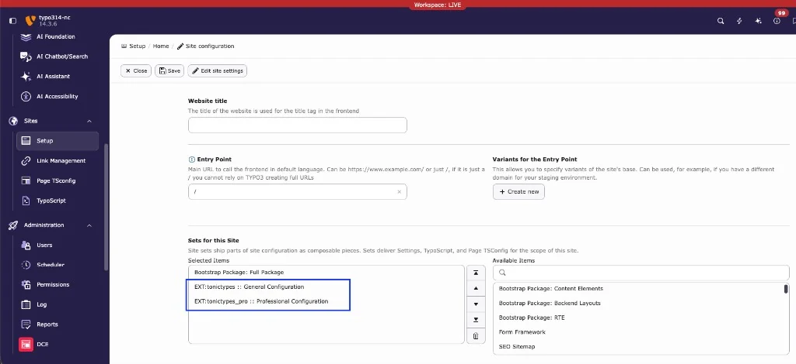
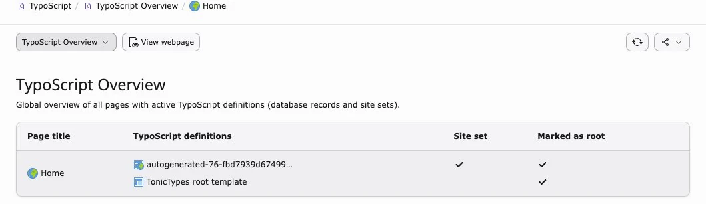
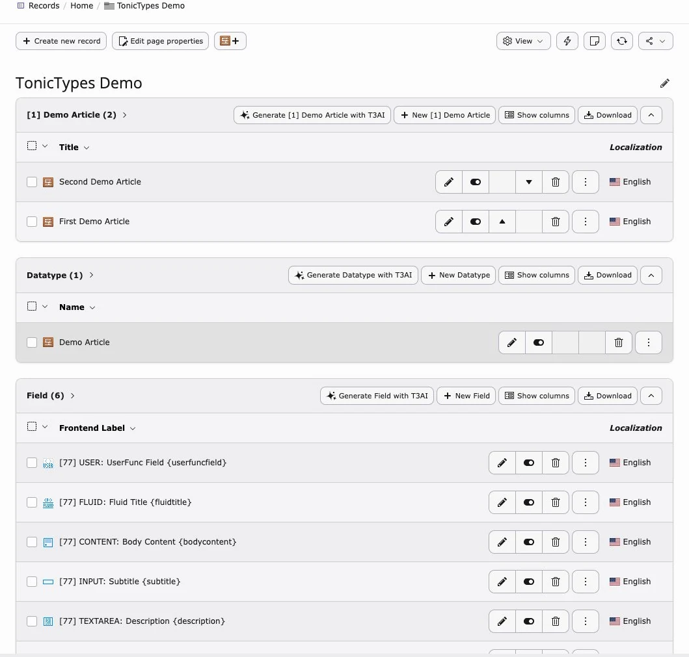
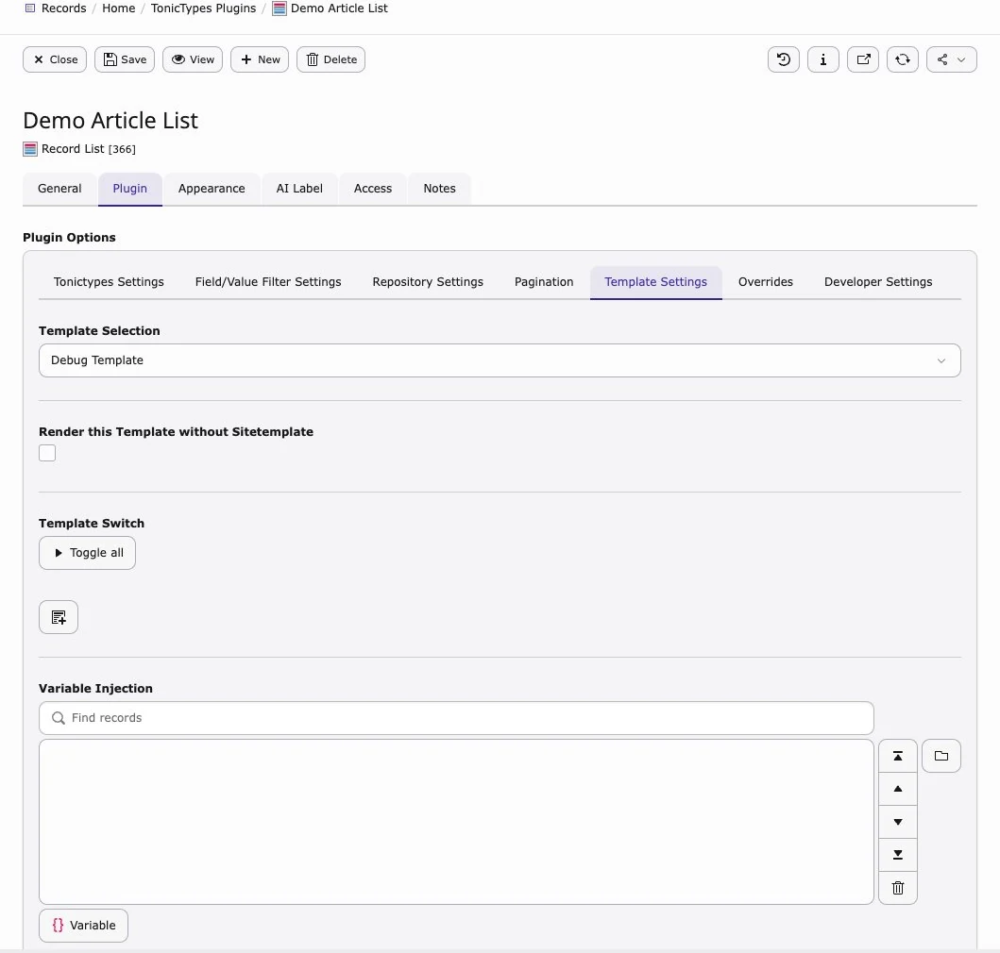

## What to install

| Package | Key | How |
| --- | --- | --- |
| **Tonictypes** (Core, required) | `tonictypes` | Free — [TER](https://extensions.typo3.org/extension/tonictypes) |
| **Tonictypes Pro** (premium) | `tonictypes_pro` | License — [License docs](/en/latest/License/Index) |

**Compatibility:** TYPO3 12.4–14.9 · PHP 8.2–8.5 · **2.1.x**  
Pro needs Core `^2.0` and `nitsan/ns-license`.

## 1. License (Pro only)

Activate Tonictypes Pro via [License documentation](/en/latest/License/Index), then install `tonictypes_pro`. Core must already be present.

## 2. Install packages

### Composer

```bash
composer require k3n/tonictypes
composer require k3n/tonictypes_pro
```

Omit the Pro line if you only use free Core.

### Extension Manager (no Composer)

1. **Admin Tools > Extensions**  
1. Update the extension list  
1. Search `tonictypes` → install Core (and Pro if licensed), or upload the TER zip  


*Search `tonictypes` — Core and Pro both listed*

Generic install videos: [Non-Composer](https://www.youtube.com/watch?v=SN5HoFQcDM4) · [Composer](https://www.youtube.com/watch?v=_7ILu4lwU-k)

## 3. Activate configuration

Use **Site Sets** (recommended on TYPO3 v13+) **or** classic TypoScript includes — not both without care. If you combine them, turn off **Clear constants** / **Clear setup** on the root template.

### Site Sets (recommended)

**Sites > Setup** → **Sets for this Site**:

- `EXT:tonictypes :: General Configuration`
- `EXT:tonictypes_pro :: Professional Configuration` (Pro only)



*Core and Pro site sets*

Or in the site `config.yaml`:

```yaml
dependencies:
  - k3n/tonictypes
  - k3n/tonictypes_pro
```

Plugin options: **Sites > Settings** (`plugin.tx_tonictypes.*`).

```bash
vendor/bin/typo3 site:sets:list
```

### TypoScript static template (classic)

1. Template module on the site root  
1. Edit template → **Includes**  
1. Include **[Tonictypes] General Configuration**  
1. For Pro: also **[Tonictypes] Tonictypes Professional**



*Static includes for Core (and Pro)*

### Clear caches

Clear all caches after install. After upgrades, run **Analyze Database Structure**.

## 4. Quick checks

| Check | What you should see |
| --- | --- |
| Extension Manager | Both packages when using Pro |
| Pro toolbar | **Create Record** + **Latest Records** (needs a published datatype + storage page) |
| DocHeader (optional) | Create buttons via Page TSconfig below |


*Create Record and Latest Records*

```typoscript
# Hide toolbar
options.tonictypes.disableTonictypesToolbarItem = 1

# DocHeader create buttons (datatype UIDs)
tx_tonictypes.docHeaderDatatypes = 1

# FE edit button for admins
options.tonictypes.enableRecordEditButton = 1
```



*Storage folder with DocHeader / records*

## Optional: predefined templates

```typoscript
plugin.tx_tonictypes.templates {
    myTemplateIdentifier {
      group = General
      icon = EXT:tonictypes/Resources/Public/Icons/Datatype/animal-dog.png
      name = My Test Template
      file = EXT:yourtemplateext/Resources/Private/Templates/Tonictypes/TemplateOne.html
    }
}
```



*Plugin template selector*

More: [Templating](/en/latest/TonicTypes/GettingStarted/Templating/Index).

### Branding (Pro)

```typoscript
options.tonictypes.customSupportEmail = support@example.com
options.tonictypes.customLogo = EXT:tonictypes/Resources/Public/Images/logo_tonictypes_pro.svg
options.tonictypes.customLogoBright = EXT:tonictypes/Resources/Public/Images/logo_tonictypes_pro_bright.svg
options.tonictypes.disableSupportMessage = 1
options.tonictypes.disableTonictypesLogo = 1
```

## Upgrade notes (2.1.x)

- PHP 8.2+  
- Export/Import is in Core from 2.1.0  
- Pro field types need `k3n/tonictypes_pro`  
- After upgrade: Analyze DB + clear caches  

## Next

[Getting Started](/en/latest/TonicTypes/GettingStarted/Index) · [Tonictypes Pro](/en/latest/TonicTypes/Professional/Index)
