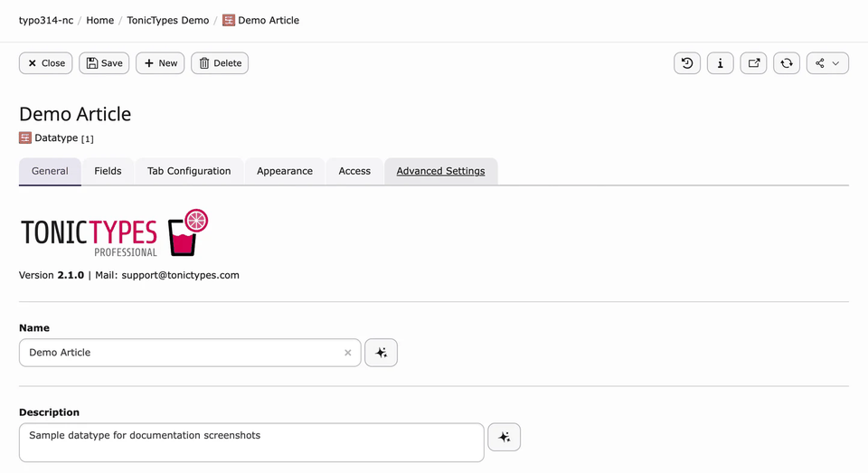
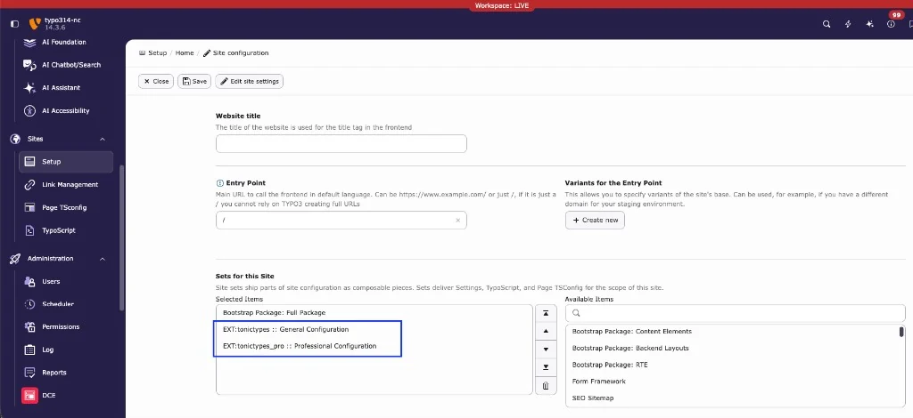
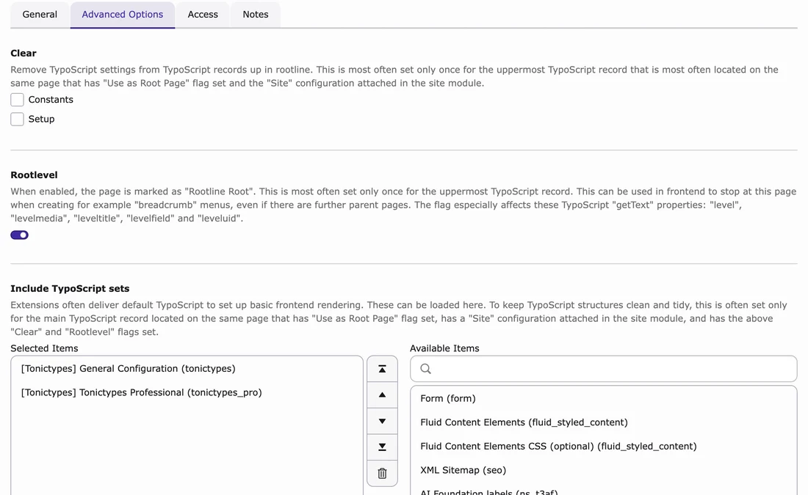
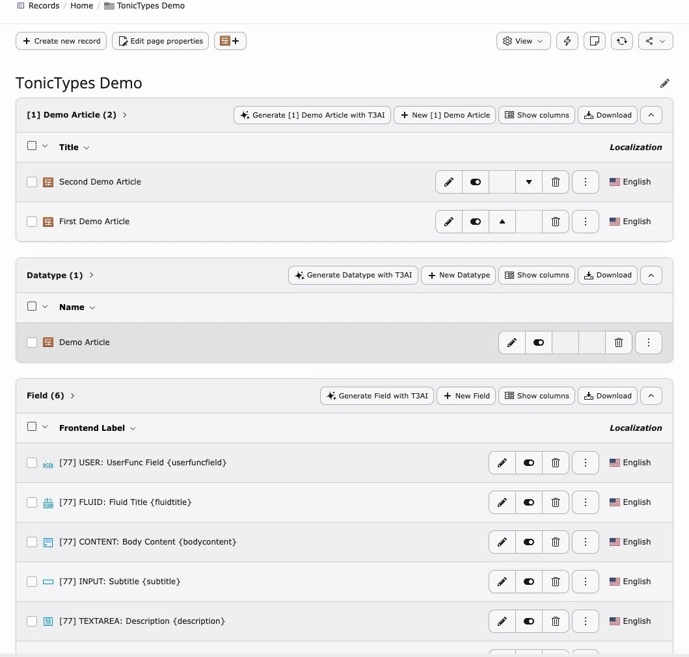
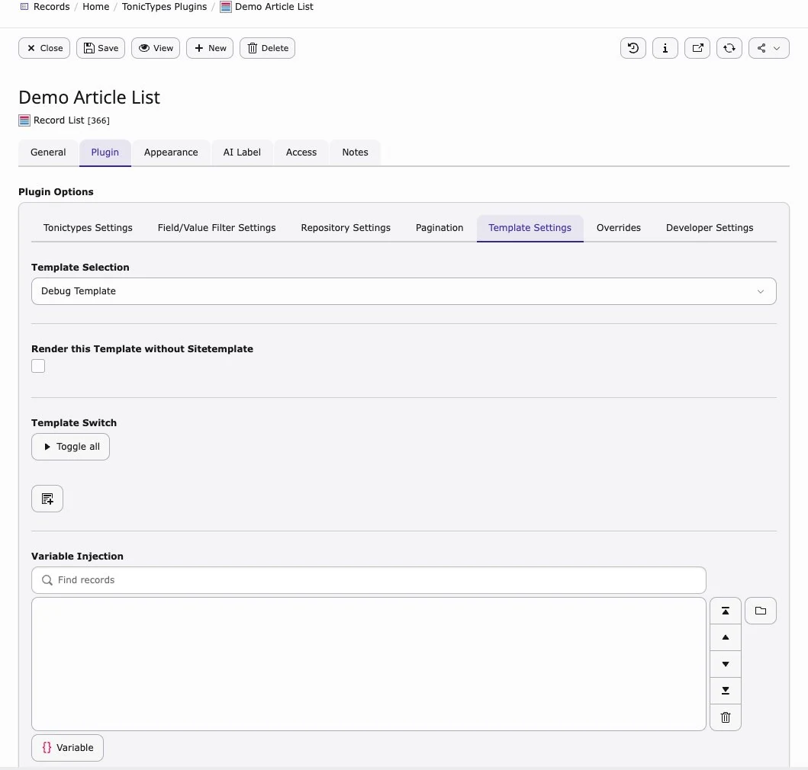

## What to install

Tonictypes is split into a free Core that contains the whole record-type engine, and the licensed Pro package that adds features on top of it. Pro depends on two helper extensions: `ns_license` checks the license, and AI Foundation provides the AI/MCP layer used by the Pro MCP tools.

| Package | Key | How |
| --- | --- | --- |
| **Tonictypes** (Core, required) | `tonictypes` | Free — [TER](https://extensions.typo3.org/extension/tonictypes) |
| **AI Foundation** (required for Pro) | `ns_t3af` | Free — [TER](https://extensions.typo3.org/extension/ns_t3af) · [AI Foundation docs](/en/latest/ExtNsT3AF/Index) |
| **Tonictypes Pro** (premium) | `tonictypes_pro` / `k3n/tonictypes_pro` | License — [License docs](/en/latest/License/Index) |

**Compatibility:** TYPO3 12.4–14.9 · PHP 8.2–8.5  

Pro requires (from `k3n/tonictypes_pro` `composer.json`): Core `k3n/tonictypes`, `nitsan/ns-license`, and **AI Foundation** `nitsan/ns-t3af`.

## 1. License (Pro only)

Activate Tonictypes Pro via [License documentation](/en/latest/License/Index), then install `tonictypes_pro`. Core and **AI Foundation** (`ns_t3af`) must already be present (or install them with Pro).

## 2. Install packages

### Composer

```bash
composer require k3n/tonictypes
composer require nitsan/ns-t3af
composer require k3n/tonictypes_pro
```

Omit the Pro and `ns-t3af` lines if you only use free Core.

Composer also installs `nitsan/ns-license` as a dependency of Pro. After the packages are installed, run `vendor/bin/typo3 extension:setup` (or open **Analyze Database Structure**) so the Tonictypes tables for fields, datatypes and variables are created.

### Extension Manager (no Composer)

1. Open Extensions — **System > Extensions** (v14) or **Admin Tools > Extensions** (v12/v13)  
1. Update the extension list  
1. Search `tonictypes` → install Core (and Pro if licensed), or upload the TER zip  


*Search `tonictypes` — Core and Pro both listed*

Generic install videos (any extension): [Non-Composer](https://www.youtube.com/watch?v=SN5HoFQcDM4) · [Composer](https://www.youtube.com/watch?v=_7ILu4lwU-k)

### Tonictypes walkthrough

After install, the flow is: create a datatype → add fields → create records → place a **Record List** plugin. Full steps: [Getting Started](/en/latest/TonicTypes/GettingStarted/Index). Product overview: [t3planet.de/tonictypes](https://t3planet.de/tonictypes).

{/* Walkthrough GIF shows the FAQ repeater, which is planned for 2.2.0 (in development, not released). Restore with the release:



*Datatype → field values → FAQ repeater on a record → then the frontend Record List output*
*/}

## 3. Activate configuration

Installing the extensions only makes their code available. The frontend plugins additionally need the Tonictypes TypoScript (template paths, field type registry, plugin settings). You load it once per site, either as a Site Set or as a static TypoScript include.

Use **Site Sets** (recommended on TYPO3 v13+) **or** classic TypoScript includes — not both without care. If you combine them, turn off **Clear constants** / **Clear setup** on the root template.

### Site Sets (recommended)

| TYPO3 | Path |
| --- | --- |
| v14 | **Sites > Setup** → edit site → **Sets for this Site** |
| v13 | **Site Management > Sites** → edit site → **Sets for this Site** |

Site Sets do not exist in TYPO3 v12 — on v12 use the [TypoScript static template](#typoscript-static-template-classic) below.

Add:

- `EXT:tonictypes :: General Configuration`
- `EXT:tonictypes_pro :: Professional Configuration` (Pro only)



*Core and Pro site sets*

Or in the site `config.yaml`:

```yaml
dependencies:
  - k3n/tonictypes
  - k3n/tonictypes_pro
```

Plugin options (`plugin.tx_tonictypes.*`):

| TYPO3 | Path |
| --- | --- |
| v14 | **Sites > Settings** |
| v13 | **Site Management > Settings** |
| v12 | Constant Editor / TypoScript constants (no Site Settings module) |

```bash
vendor/bin/typo3 site:sets:list
```

### TypoScript static template (classic)

| TYPO3 | Path |
| --- | --- |
| v14 | **Sites > TypoScript** → **Edit TypoScript Record** → **Edit the whole TypoScript record** → **Advanced Options** → **Include TypoScript sets** |
| v12 / v13 | **Site Management > TypoScript** → **Edit TypoScript Record** → **Edit the whole TypoScript record** → **Advanced Options** → **Include static (from extensions)** |

Include:

1. **[Tonictypes] General Configuration**  
1. For Pro: also **[Tonictypes] Tonictypes Professional**



*Advanced Options — Include TypoScript sets with Tonictypes Core and Pro selected*

### Clear caches

Clear all caches after install. After upgrades, run **Analyze Database Structure**.

Tonictypes caches the generated TCA of your datatypes. Clearing all caches makes TYPO3 pick up the new configuration and any datatypes that already exist (for example after an import).

## 4. Quick checks

| Check | What you should see |
| --- | --- |
| Extension Manager | Both packages when using Pro |
| Pro toolbar | **Create Record** + **Latest Records** (needs a published datatype + storage page) |
| DocHeader (optional) | Create buttons via [Page TSconfig](#page-tsconfig) below |


*Create Record and Latest Records*

### User TSconfig

Set on backend users / groups (**TSconfig** field). All keys live under `options.tonictypes.`:

| Key | Effect |
| --- | --- |
| `disableTonictypesToolbarItem` | Hides the Pro toolbar item for these users |
| `enableRecordEditButton` | Shows an edit button next to records in the frontend for logged-in admins, so they can jump straight to the record form |
| `customSupportEmail` | Replaces the support address shown in the backend (default `support@tonictypes.com`) |
| `customLogo` / `customLogoBright` | Replace the Tonictypes logo (normal and bright variant) with your own |
| `disableSupportMessage` / `disableTonictypesLogo` | Hide the support message / the logo completely |

```typoscript
# Hide Pro toolbar
options.tonictypes.disableTonictypesToolbarItem = 1

# Frontend edit button for admins
options.tonictypes.enableRecordEditButton = 1

# Branding (Pro)
options.tonictypes.customSupportEmail = support@example.com
options.tonictypes.customLogo = EXT:tonictypes/Resources/Public/Images/logo_tonictypes_pro.svg
options.tonictypes.customLogoBright = EXT:tonictypes/Resources/Public/Images/logo_tonictypes_pro_bright.svg
options.tonictypes.disableSupportMessage = 1
options.tonictypes.disableTonictypesLogo = 1
```

### Page TSconfig

Set on the page / storage folder (page properties → **Resources** → **Page TSconfig**). The listed datatypes get a create button in the module header of that page and its subpages, so editors can add a record in one click:

```typoscript
# DocHeader create buttons (datatype UIDs, comma-separated)
tx_tonictypes.docHeaderDatatypes = 1
```



*Storage folder with DocHeader / records*

More Pro UI options: [Tonictypes Pro](/en/latest/TonicTypes/Professional/Index).

## Predefined templates

Optional: define Fluid templates in TypoScript setup, then pick them in the plugin under **Predefined Templates**.

`group` sorts the template into a group in the selector, `name` and `icon` are what editors see, and `file` is the Fluid template that is rendered. Why and when to use this: [Templating](/en/latest/TonicTypes/GettingStarted/Templating/Index#predefine-templates-in-typoscript).

```typoscript
plugin.tx_tonictypes.templates {
    myTemplateIdentifier {
      group = General
      icon = EXT:tonictypes/Resources/Public/Icons/Datatype/animal-dog.png
      name = My Test Template
      file = EXT:yourtemplateext/Resources/Private/Templates/Tonictypes/TemplateOne.html
    }
}
```



*Plugin template selector*

Render the same identifier inside Fluid with `dv:template.render` — see [Templating](/en/latest/TonicTypes/GettingStarted/Templating/Index).

## Upgrade notes

**New in Core 2.2.0**

- New field types: **Email**, **Phone**, **Number**, **Slug** and **Toggle**  
- A FlexForm conversion helper for Fluid templates and `dataProcessing`  
- A **readOnly** option in the field configuration  
- Better TYPO3 v12–v14 compatibility for frontend authentication and the Query Builder  

**Unchanged:** PHP 8.2–8.5 and TYPO3 12.4–14.9. Pro needs Core, `nitsan/ns-license`, and **AI Foundation** `nitsan/ns-t3af`.

**Coming from 2.0.x:** Export/Import is in Core from 2.1.0, and the Pro-only field types moved out of Core in 2.1.0, so they need `k3n/tonictypes_pro`.

After every upgrade: run **Analyze Database Structure** and clear all caches.

## Next

[Getting Started](/en/latest/TonicTypes/GettingStarted/Index) · [Tonictypes Pro](/en/latest/TonicTypes/Professional/Index)
