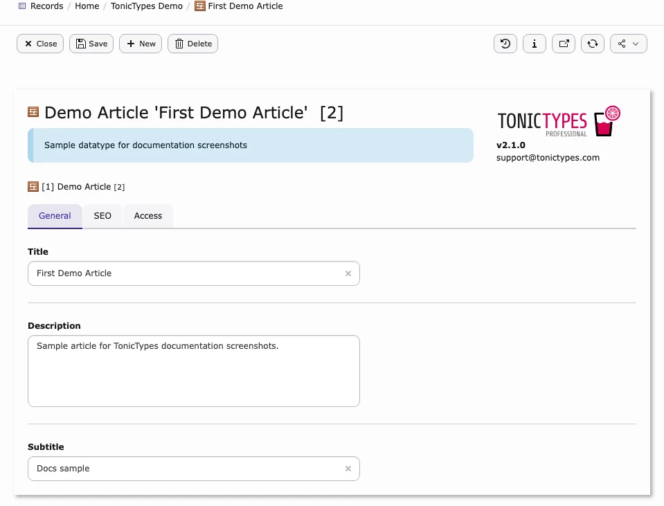
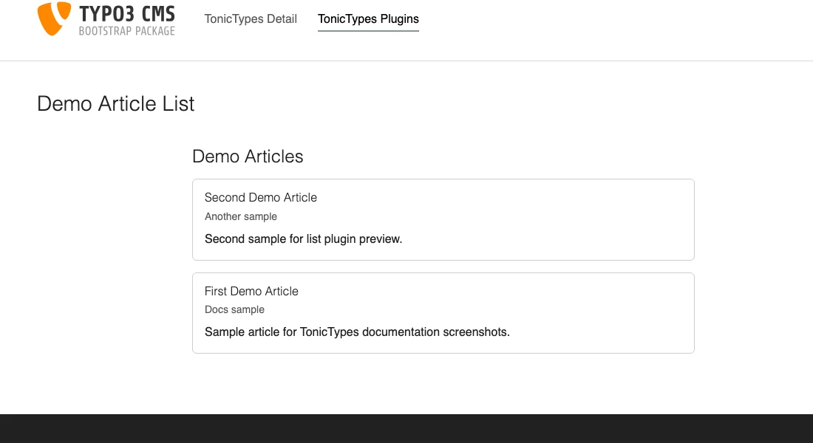

## Tonictypes

**Tonictypes** lets you build custom TYPO3 record types (News, Jobs, Events, Products, …) in the backend — without writing a separate extension for each type.

This documentation leads with **Tonictypes Pro** (`tonictypes_pro`). Free **Tonictypes** Core (`tonictypes`) is always required.

| | |
| --- | --- |
| **Premium** | Tonictypes Pro — Extension Manager: *Tonictypes Pro: Enterprise Edition* |
| **Free Core** | Tonictypes — Extension Manager: *Tonictypes* |
| **Compatibility** | TYPO3 12.4–14.9 · PHP 8.2–8.5 · **2.1.x** |

*Core and Pro after install (search `tonictypes`)*

## What does it do?

You define **fields** and a **datatype**. Tonictypes generates the database table, TCA, and PHP classes. Editors create and edit **records** like any other TYPO3 record. You output them with Fluid and the built-in **frontend plugins**.

| Concept | Meaning |
| --- | --- |
| **Field** | One property (title, text, select, image, …) |
| **Datatype** | One record type that groups those fields |
| **Record** | One entry of that datatype (editable in the List / Records module) |
| **Plugin** | Content element that lists or shows records in the frontend |

*Storage folder — records, datatype, and fields together*

*Record form generated from your fields*

*Frontend list after datatype + Startingpoint + template*

## Core and Tonictypes Pro

| | Core (free) | Pro (premium) |
| --- | --- | --- |
| Fields, datatypes, plugins, ViewHelpers | Yes | Yes (needs Core) |
| Export / import of datatype structures | Yes (from 2.1.0) | Yes |
| Advanced fields (Repeater, Content, Fluid, UserFunc, …) | — | Yes |
| Toolbar, DocHeader buttons, MCP, link handler, branding | — | Yes |

*Pro toolbar — quick create and latest records*

Pro details: [Tonictypes Pro](/en/latest/TonicTypes/Professional/Index).

## Where you work

| Task | Module |
| --- | --- |
| Fields, datatypes, template variables, records | **Records / List** on a **storage folder** (v14: **Content > Records**) |
| List / detail plugins | **Page / Layout** on a normal page → New content → **Tonictypes** |
| Site configuration | **Sites > Setup** (Site Sets) or TypoScript includes |

Do not create fields or datatypes in the Page module. Do not create plugins in the Records list.

## Helpful links

<Note>
- **Product:** [https://t3planet.de/tonictypes](https://t3planet.de/tonictypes)
- **Free Core (TER):** [https://extensions.typo3.org/extension/tonictypes](https://extensions.typo3.org/extension/tonictypes)
- **License (Pro):** [License documentation](/en/latest/License/Index)
- **Support:** [https://t3planet.de/support](https://t3planet.de/support)
</Note>

## Next steps

1. [Installation](/en/latest/TonicTypes/Installation/Index) — install Core and Pro, activate Site Sets  
1. [Getting Started](/en/latest/TonicTypes/GettingStarted/Index) — first field → datatype → records → plugin  
1. [Frontend Plugins](/en/latest/TonicTypes/FrontendPlugins/Index) — show records in the frontend  
1. [Import / Export](/en/latest/TonicTypes/ExportImport/Index) — move structures between sites  
