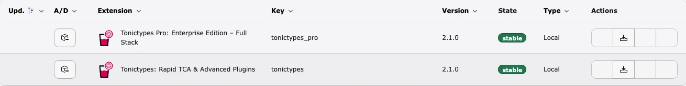
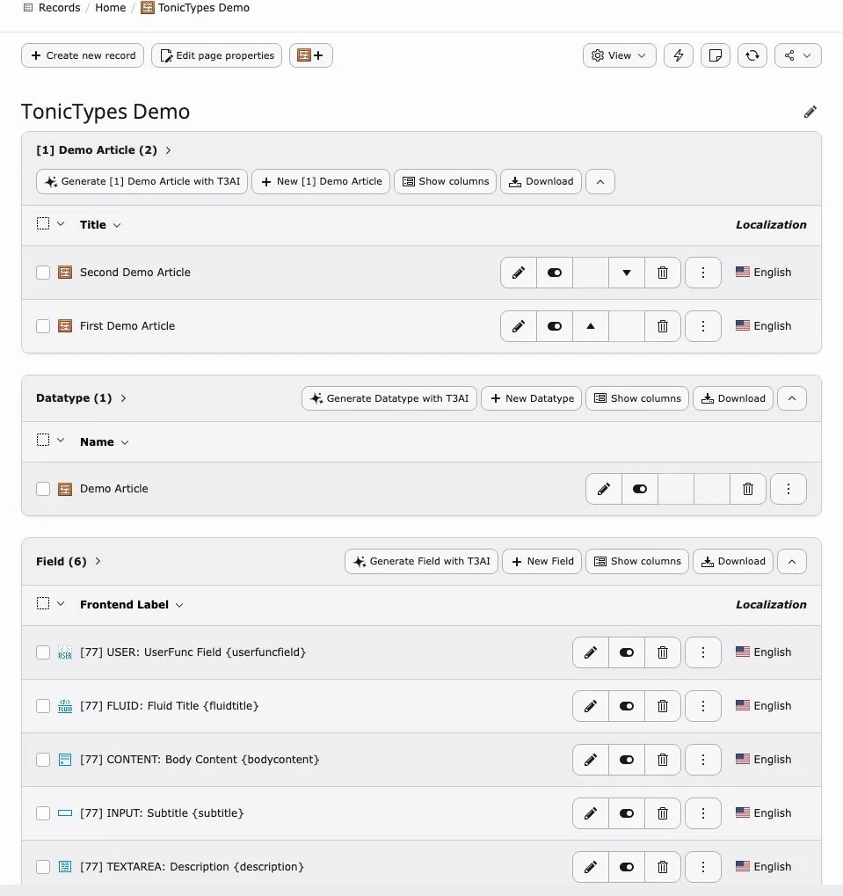
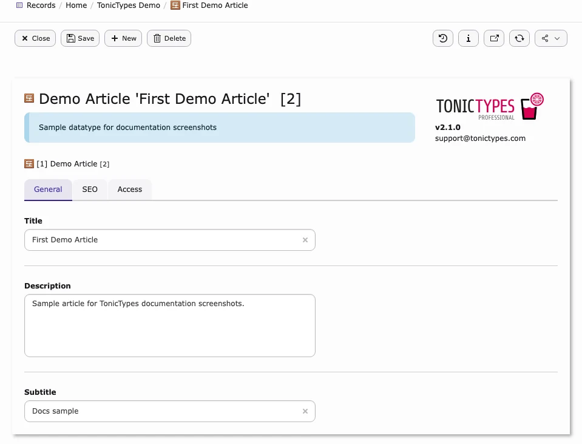
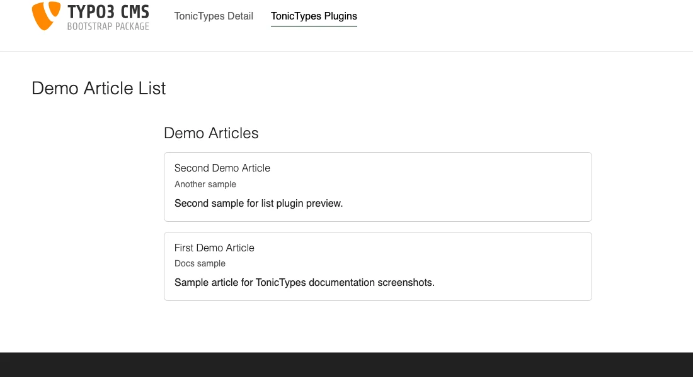

## Tonictypes

**Tonictypes** lets you build custom TYPO3 record types (News, Jobs, Events, Products, …) in the backend — without writing a separate extension for each type.

This documentation leads with **Tonictypes Pro** (`tonictypes_pro`). Free **Tonictypes** Core (`tonictypes`) is always required. Pro also requires **AI Foundation** (`EXT:ns_t3af`) and `ns_license`.

| | |
| --- | --- |
| **Premium** | Tonictypes Pro — Extension Manager: *Tonictypes Pro: Enterprise Edition – Full Stack* |
| **Free Core** | Tonictypes — Extension Manager: *Tonictypes - Rapid TCA & Advanced Plugins* |
| **Also required for Pro** | AI Foundation (`ns_t3af`) · License (`ns_license`) |
| **Compatibility** | TYPO3 12.4–14.9 · PHP 8.2–8.5 · **2.2.x** |

*Core and Pro after install (search `tonictypes`)*

## Why Tonictypes exists

Most websites need a few structured content types that TYPO3 does not ship: job offers, team members, events, products, testimonials. The classic way is to write (or generate) an extension per type and to maintain it through every TYPO3 upgrade. Tonictypes moves this work into the backend: the structure of a record type is itself stored as records, so an integrator can add, change or remove properties without touching PHP code, and the generated code stays in one extension that is maintained for you.

## What does it do?

You define **fields** and a **datatype**. Tonictypes generates the database table, TCA, and PHP classes. Editors create and edit **records** like any other TYPO3 record. You output them with Fluid and the built-in **frontend plugins**.

| Concept | Meaning |
| --- | --- |
| **Field** | One property (title, text, select, image, …). A field record stores the field type, its label, the Fluid variable name and all options. The same field can be reused in several datatypes. |
| **Datatype** | One record type that groups those fields — for example "Job" with the fields Title, Location and Salary. It owns the database table and the PHP class of that type. |
| **Record** | One entry of that datatype (editable in the List / Records module) — for example the job "Senior Developer, Berlin". |
| **Plugin** | Content element that lists or shows records in the frontend. You place it on a normal page and pick the datatype, the storage folder and a template. |

Two more terms appear throughout the documentation:

| Term | Meaning |
| --- | --- |
| **Field Value** | A value source attached to a field: the options of a select box, a default value, or values read from the database or TypoScript. See [Creating a Field → Field Values](/en/latest/TonicTypes/GettingStarted/CreatingAField/Index#field-values-select-options). |
| **Template Variable** | A named value (from the URL, the logged-in user, TypoScript, …) that a plugin injects into its Fluid template. See [Creating a Template Variable](/en/latest/TonicTypes/GettingStarted/CreatingATemplateVariable/Index). |
| **Storage folder** | A TYPO3 folder page (a sysfolder) that holds the fields, datatypes, template variables and records. Plugins read records from it via their **Startingpoint**. |

*Storage folder — records, datatype, and fields together*

## How it works behind the scenes

1. **You describe the structure.** Fields and datatypes are ordinary records in the tables `tx_tonictypes_domain_model_field` and `tx_tonictypes_domain_model_datatype`.
1. **Update Table** creates or migrates a real database table for the datatype, named `tx_tonictypes_domain_model_record_<name>` — one column per assigned field.
1. **Update Class** writes an Extbase model and a repository class into the `tonictypes` extension folder (for example `Classes/Domain/Model/Record/Demo/Article.php`). Frontend plugins and ViewHelpers use these classes to load records.
1. **At runtime** Tonictypes builds the TCA (the TYPO3 form and table configuration) for each datatype table from your field records, so the backend form always matches the current field setup. Datatypes whose table does not exist yet are skipped.
1. **The generated TCA is cached** when **Cache generated TCA** is on. That is why you clear the TYPO3 caches after structural changes.

*Record form generated from your fields*

*Frontend list after datatype + Startingpoint + template*

## Core and Tonictypes Pro

| | Core (free) | Pro (premium) |
| --- | --- | --- |
| Fields, datatypes, plugins, ViewHelpers | Yes | Yes (needs Core) |
| Export / import of datatype structures | Yes (from 2.1.0) | Yes |
| Advanced fields (Repeater, Content, Fluid, UserFunc, …) | — | Yes |
| Toolbar, DocHeader buttons, MCP, link handler, branding | — | Yes |

Core is enough for classic record types built from standard fields (input, text, select, date, image, relations, …). Choose Pro when editors need repeatable groups of fields, embedded content elements, computed Fluid output, quick access from the backend toolbar, or links to records from the rich-text editor.

*Pro toolbar — quick create and latest records*

Pro details: [Tonictypes Pro](/en/latest/TonicTypes/Professional/Index).

## Where you work

| Task | Module |
| --- | --- |
| Fields, datatypes, template variables, records | **Records / List** on a **storage folder** (v14: **Content > Records**; v12/v13: **Web > List**) |
| List / detail plugins | **Page / Layout** on a normal page → New content → **Tonictypes** (v14: **Content > Layout**; v12/v13: **Web > Page**) |
| Extensions | v14: **System > Extensions** · v12/v13: **Admin Tools > Extensions** |
| Site Sets / settings | v14: **Sites > Setup** / **Sites > Settings** · v13: **Site Management > Sites** / **Site Management > Settings** (no Site Sets in v12) |
| Static TypoScript includes | v14: **Sites > TypoScript** · v12/v13: **Site Management > TypoScript** → **Edit TypoScript Record** → **Edit the whole TypoScript record** → **Advanced Options** (v14: **Include TypoScript sets**; v12/v13: **Include static (from extensions)**) — details: [Installation](/en/latest/TonicTypes/Installation/Index#typoscript-static-template-classic) |

Do not create fields or datatypes in the Page module. Do not create plugins in the Records list.

## Helpful links

<Note>
- **Product:** [https://t3planet.de/tonictypes](https://t3planet.de/tonictypes)
- **Free Core (TER):** [https://extensions.typo3.org/extension/tonictypes](https://extensions.typo3.org/extension/tonictypes)
- **License (Pro):** [License documentation](/en/latest/License/Index)
- **Support:** [https://t3planet.de/support](https://t3planet.de/support)
</Note>

## Next steps

1. [Installation](/en/latest/TonicTypes/Installation/Index) — install Core and Pro, activate Site Sets  
1. [Getting Started](/en/latest/TonicTypes/GettingStarted/Index) — first field → datatype → records → plugin  
1. [Frontend Plugins](/en/latest/TonicTypes/FrontendPlugins/Index) — show records in the frontend  
1. [Import / Export](/en/latest/TonicTypes/ExportImport/Index) — move structures between sites  
