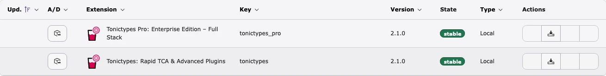
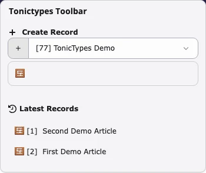
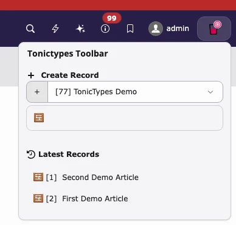
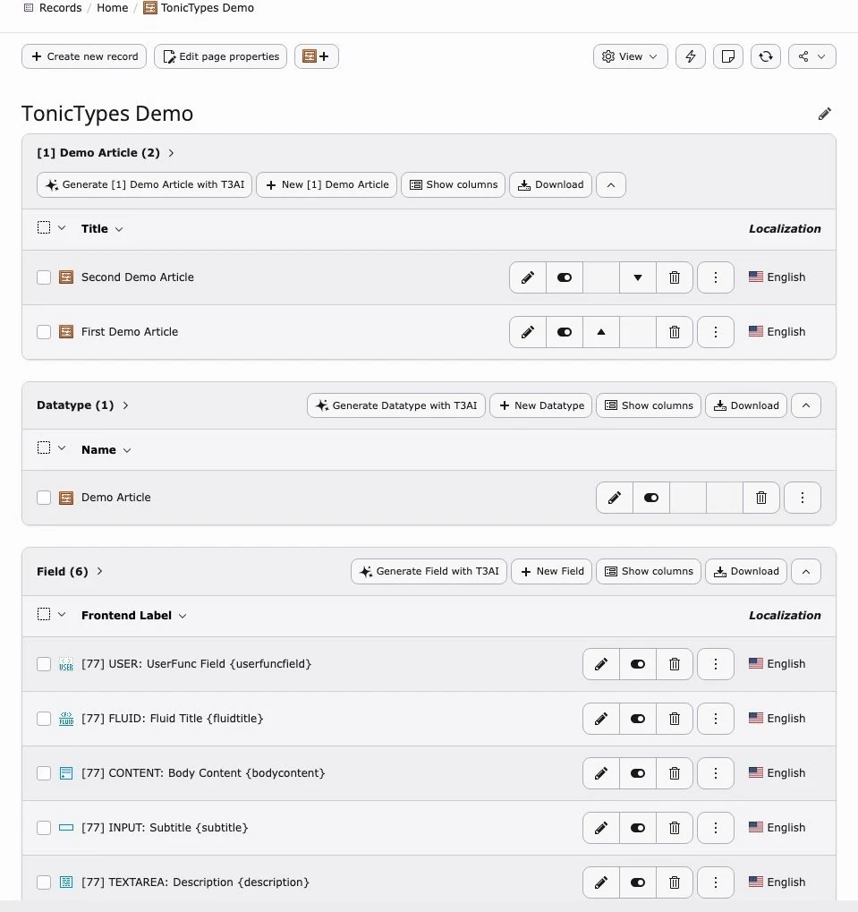
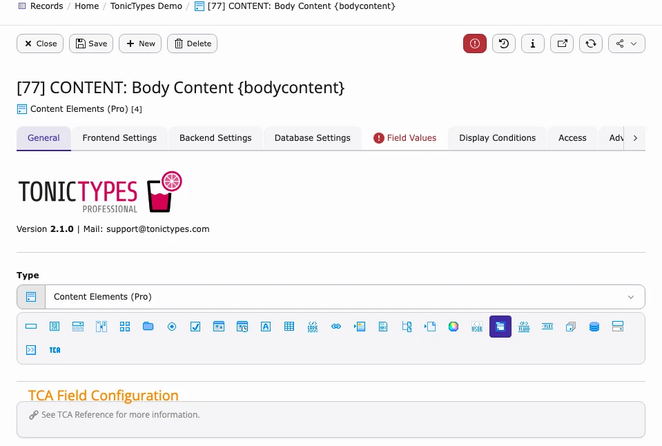
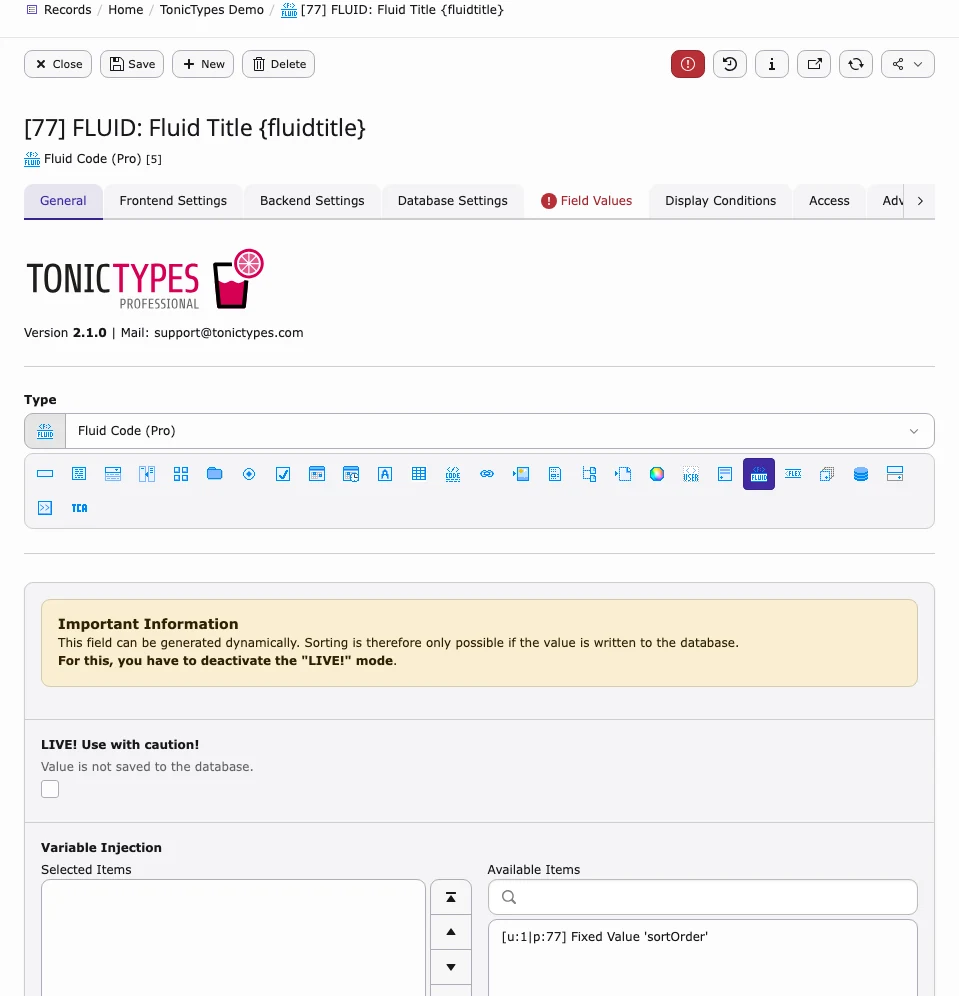
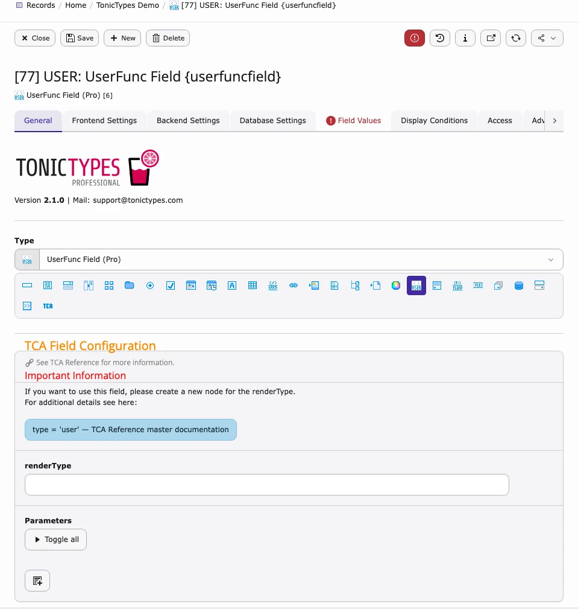

**Tonictypes Pro** is the premium package (`tonictypes_pro` / `k3n/tonictypes_pro`). Extension Manager title: *Tonictypes Pro: Enterprise Edition*.

It always needs free **Tonictypes** Core (`tonictypes`).

**Requires:** Core `^2.0` · `nitsan/ns-license` · PHP 8.2–8.5 · TYPO3 12.4–14.9

## Install

1. Activate the license: [License documentation](/en/latest/License/Index)  
1. Install Core, then Pro:

```bash
composer require k3n/tonictypes
composer require k3n/tonictypes_pro
```

1. Add Site Sets (or static templates) and clear caches — [Installation](/en/latest/TonicTypes/Installation/Index)

Site `config.yaml` example:

```yaml
dependencies:
  - k3n/tonictypes
  - k3n/tonictypes_pro
```

## What Pro adds

| Feature | Notes |
| --- | --- |
| Backend **toolbar** | Quick create + latest records |
| **DocHeader** create buttons | Page TSconfig |
| Advanced fields | Content, Fluid, UserFunc, **Repeater**, Flex, Inline, … |
| **MCP tools** | Via AI Foundation |
| Link handler, Form hooks, branding | — |

Export / Import of datatype structures is **free Core** from 2.1.0 — see [Import / Export](/en/latest/TonicTypes/ExportImport/Index).

## Screenshots

### Extensions



*Core + Pro in Extension Manager*

### Toolbar



*Create Record · Latest Records*



*Toolbar open*

```typoscript
options.tonictypes.disableTonictypesToolbarItem = 1
```

### List / DocHeader



*Records · Datatype · Fields*

```typoscript
tx_tonictypes.docHeaderDatatypes = 1
```

## Advanced field types (Pro only)

#### Content



#### Fluid



#### UserFunc



Use UserFunc only with trusted PHP.

#### Repeater

**Repeater** = repeatable groups of sub-fields inside one record. Create the Repeater field, configure children, assign it to a Datatype like any other field.

## MCP tools

| Area | Tools |
| --- | --- |
| Datatypes | `tonictypes_datatype_*` (list / get / create / update / delete / publish) |
| Fields | `tonictypes_field_*` |
| Records | `tonictypes_record_*` |

Needs AI Foundation MCP and a valid license where applicable.

## Links

- [License](/en/latest/License/Index)  
- Product: [t3planet.de/tonictypes](https://t3planet.de/tonictypes)  
- Core TER: [extensions.typo3.org/extension/tonictypes](https://extensions.typo3.org/extension/tonictypes)  
- Support: [t3planet.de/support](https://t3planet.de/support)
