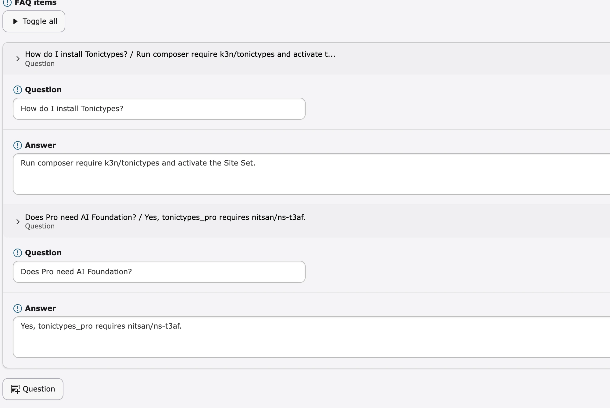
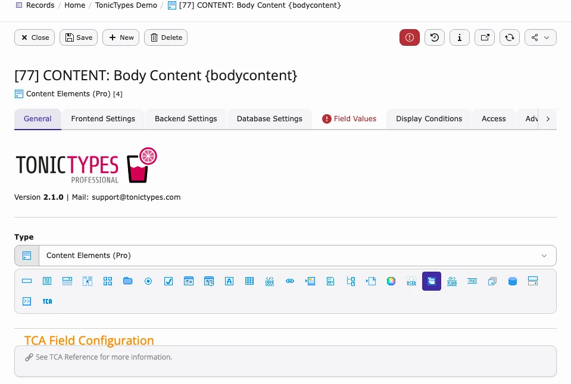
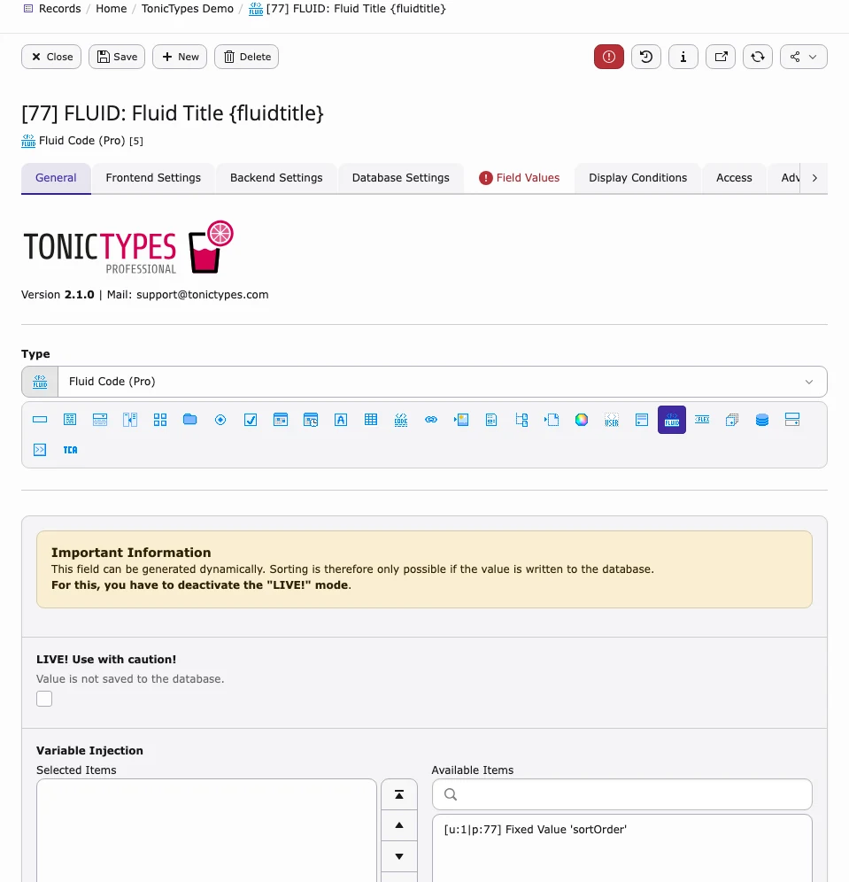
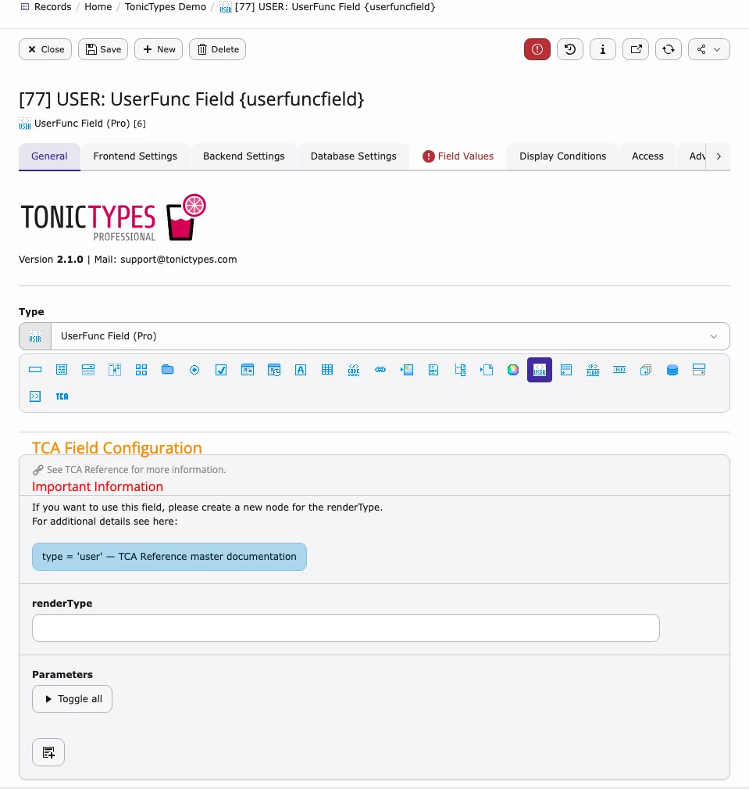
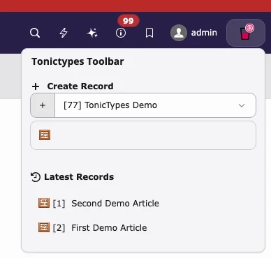
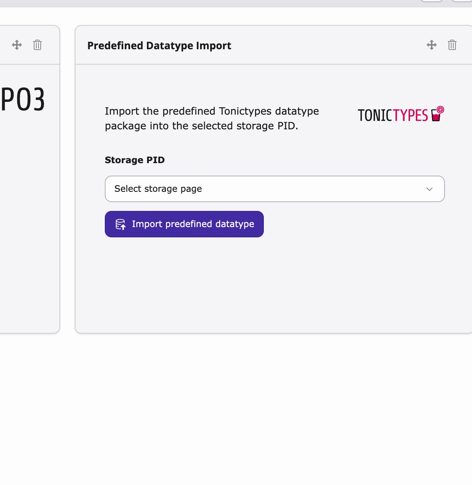
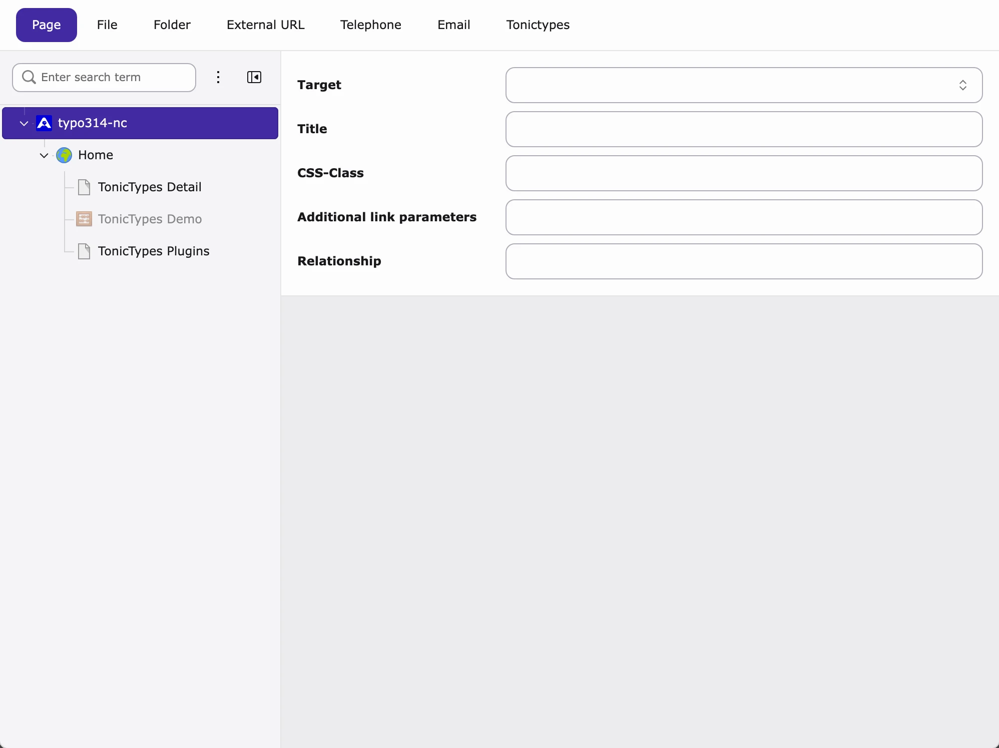

**Tonictypes Pro** is the premium package (`k3n/tonictypes_pro` / `tonictypes_pro`). Extension Manager title: *Tonictypes Pro: Enterprise Edition – Full Stack*. Vendor: Keeen GmbH.

It always needs free **Tonictypes** Core (`tonictypes`).

Pro does not replace Core; it adds to it. Everything you build with Core keeps working, and Pro contributes extra field types, backend shortcuts for editors, a link handler, branding options and AI tools. Consider Pro when editors need repeatable groups of fields, content elements inside records, or faster access to records from anywhere in the backend.

**Requires:** Core `^2.0` · `nitsan/ns-license` · **AI Foundation** (`nitsan/ns-t3af`: `^1.0 || @dev`) · PHP 8.2–8.5 · TYPO3 12.4–14.9 — full list: [Installation → What to install](/en/latest/TonicTypes/Installation/Index#what-to-install)

## Install

License activation, Composer packages ([Composer](/en/latest/TonicTypes/Installation/Index#composer)), Site Sets / `config.yaml` ([Site Sets](/en/latest/TonicTypes/Installation/Index#site-sets-recommended)), static templates, and caches: [Installation](/en/latest/TonicTypes/Installation/Index).

## What Pro adds

| Feature | Notes |
| --- | --- |
| Backend **toolbar** | Quick create + latest records — editors can add a record or open a recent one from any module, without first navigating to the storage folder |
| **DocHeader** create buttons | One-click "create" buttons for chosen datatypes in the module header of a page — [Page TSconfig](/en/latest/TonicTypes/Installation/Index#page-tsconfig) |
| **FlexForm Field (Repeater)** | Repeatable FlexForm sections (structure from a FlexForm file or inline XML) |
| Other advanced fields | Content, Fluid, UserFunc, Inline, … — see [Other advanced fields](#other-advanced-fields) |
| **MCP tools** | Let an AI assistant list, create and update datatypes, fields and records — via AI Foundation |
| **Link handler** | Link to Tonictypes records from the link browser, e.g. from the rich-text editor |
| Form hooks, branding | Replace the Tonictypes logo and support e-mail with your agency's, hide the support message — [User TSconfig](/en/latest/TonicTypes/Installation/Index#user-tsconfig) |

Datatype **Export / Import** is free Core from 2.1.0 — [Import / Export](/en/latest/TonicTypes/ExportImport/Index).

## FlexForm Field (Repeater)

The Pro field type **FlexForm Field (Pro)** stores a whole FlexForm inside one record column (`mediumtext`). With FlexForm **sections** (`<section>1</section>`) editors get repeatable rows — the "Repeater".

### Where the structure comes from

The FlexForm data structure is read from the field's **Field Values** tab:

| Field Value (type **Static Value**) | Result |
| --- | --- |
| `FILE:EXT:my_ext/Configuration/FlexForms/Faq.xml` or `EXT:my_ext/…/Faq.xml` | Uses that FlexForm file (falls back to an empty structure if the file does not exist) |
| Inline XML starting with `<T3DataStructure>` or `<?xml` | Uses the XML verbatim |

If several values exist, the one marked **Is Default** wins, otherwise the first one.

{/* Repeater presets (FAQ, Highlight, Icon + Text + Link, Custom FlexForm file) were requested in developer feedback,
    but are not present in tonictypes_pro 2.1.0 (Classes/Tca/Field/Flex.php, locallang.xlf). Confirm with Keeen GmbH before documenting:

| Preset | Typical use |
| --- | --- |
| **FAQ** | Question / answer pairs |
| **Highlight** | Highlight / callout blocks |
| **Icon + Text + Link** | Icon, short text, and link per row |
| **Custom FlexForm file** | Your own FlexForm XML |
*/}

### Example: FAQ repeater

1. **Create new record** → **Field** → Type **FlexForm Field (Pro)**, Frontend Label `FAQ`.
1. **Field Values** → add a **Static Value** with `FILE:EXT:my_sitepackage/Configuration/FlexForms/Faq.xml`.
1. Assign the field to your Datatype and **Update Table** / **Update Class**.

```xml
<T3DataStructure>
  <ROOT>
    <type>array</type>
    <el>
      <items>
        <title>FAQ items</title>
        <type>array</type>
        <section>1</section>
        <el>
          <item>
            <type>array</type>
            <title>Question</title>
            <el>
              <question><label>Question</label><config><type>input</type></config></question>
              <answer><label>Answer</label><config><type>text</type></config></answer>
            </el>
          </item>
        </el>
      </items>
    </el>
  </ROOT>
</T3DataStructure>
```

In Fluid, convert the stored XML with `dv:format.flexFormToArray` and loop over the rows (`<f:debug>` the result first to see the exact array path).



*FlexForm Field (Pro) — FAQ repeater with two rows on a Demo Article record*

## Other advanced fields

All Pro field types are chosen in the field's **Type** selector like the Core types and are marked **(Pro)**:

| Type | What it does |
| --- | --- |
| **Content Elements (Pro)** | Editors add regular TYPO3 content elements (text, images, …) inside a record, for free-form body content |
| **Fluid Code (Pro)** | Renders the Fluid from the field's **Field Values** inside the record form — for previews or computed information for editors |
| **UserFunc Field (Pro)** | Calls a PHP function to render the form element (trusted code only) |
| **Inline Elements (Pro)** / **Inline Relation Datatype (Pro)** | Child records edited inline inside the parent record, e.g. several contact persons per company |
| **FlexForm Field (Pro)** / **Dynamic Input Fields (Pro)** | Structured or repeatable input stored as FlexForm — see [FlexForm Field (Repeater)](#flexform-field-repeater) |
| **Passthrough (Pro)** / **TCA XML (Pro)** | A column without a visible form element (for values set by code) / a field configured directly with TCA |

#### Content



#### Fluid



#### UserFunc



Use UserFunc only with trusted PHP.

## Toolbar and DocHeader

Toolbar screenshot and the `disableTonictypesToolbarItem` snippet: [Installation → User TSconfig](/en/latest/TonicTypes/Installation/Index#user-tsconfig). DocHeader buttons: [Page TSconfig](/en/latest/TonicTypes/Installation/Index#page-tsconfig).



*Pro toolbar open*

## Dashboard import widget

Core ships the **Predefined Datatype Import** dashboard widget (sample datatype). Useful for demos; for moving custom types between projects use [Import / Export](/en/latest/TonicTypes/ExportImport/Index).



*Dashboard — Predefined Datatype Import*

## Link handler

Pro registers a link handler so editors can link to Tonictypes records from the TYPO3 link browser.

In the link browser a **Tonictypes** tab appears: first choose the datatype, then the record. The link stays valid when the record's title or URL changes, because it points to the record itself rather than to a copied URL.



*Link Browser — Tonictypes tab next to Page / File / Folder / …*

## MCP tools

MCP (Model Context Protocol) lets AI assistants call functions in your TYPO3 installation. With AI Foundation configured, Pro offers these tools, so you can for example ask an assistant to create a datatype with its fields, and then publish it (create table and class):

| Area | Tools |
| --- | --- |
| Datatypes | `tonictypes_datatype_*` (list / get / create / update / delete / publish) |
| Fields | `tonictypes_field_*` |
| Records | `tonictypes_record_*` |

Needs AI Foundation MCP and a valid license where applicable.

## Links

- [License](/en/latest/License/Index)  
- Product: [t3planet.de/tonictypes](https://t3planet.de/tonictypes)  
- Core TER: [extensions.typo3.org/extension/tonictypes](https://extensions.typo3.org/extension/tonictypes)  
- Core issues: [github.com/Keeen-GmbH/tonictypes](https://github.com/Keeen-GmbH/tonictypes)  
- Support: [t3planet.de/support](https://t3planet.de/support) · [support@tonictypes.com](mailto:support@tonictypes.com)
