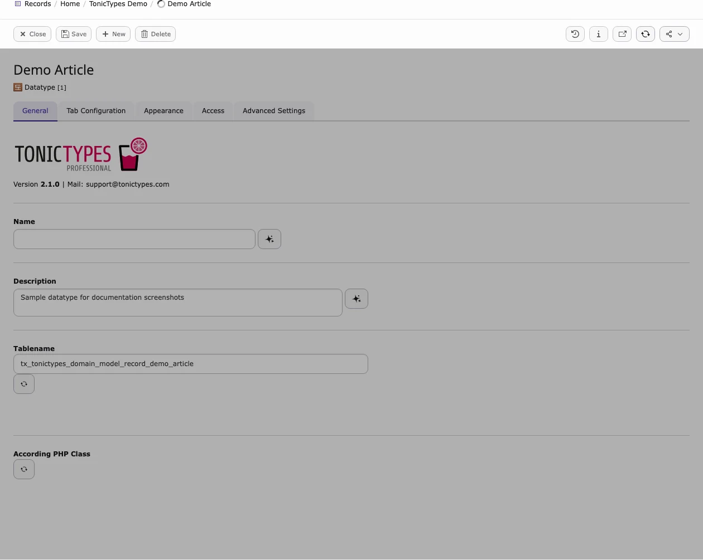

Quick visual tour. Full steps: [Introduction](/en/latest/TonicTypes/Introduction/Index).

**Where:** fields / datatypes / records → **Records** on a storage folder. Plugins → **Page** module → **Tonictypes**.

### 1. Extensions

*`tonictypes` + `tonictypes_pro`*

### 2. Storage folder

*Demo Articles · Datatype · Fields*

### 3. Datatype

*Name, table, classes*

### 4. Record edit

*Form from your fields*

### 5. Frontend

*Record List output*

### 6. Pro UI

Toolbar, DocHeader, Pro fields → [Tonictypes Pro](/en/latest/TonicTypes/Professional/Index)

## Related

[Installation](/en/latest/TonicTypes/Installation/Index) · [Getting Started](/en/latest/TonicTypes/GettingStarted/Index)
