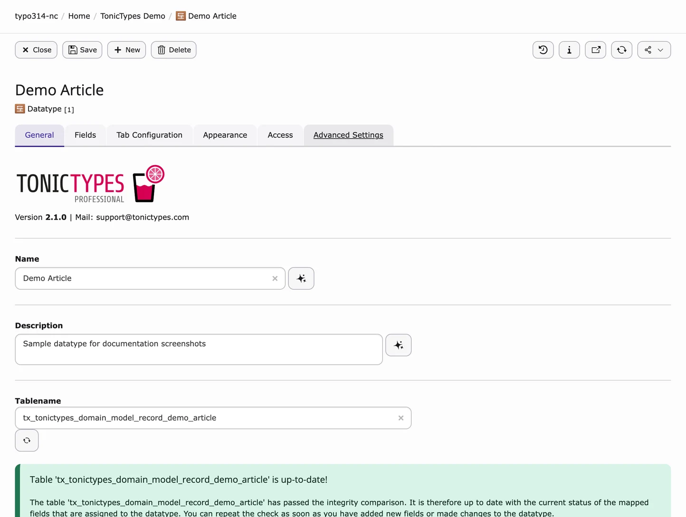

Quick visual tour. Full steps: [Introduction](/en/latest/TonicTypes/Introduction/Index).

**Where:** fields / datatypes / records → **Records** on a storage folder. Plugins → **Page** module → **Tonictypes**.

### 1. Extensions

*`tonictypes` + `tonictypes_pro`*

Both extensions installed. Core alone is enough for standard record types; Pro appears only on licensed sites.

### 2. Storage folder

*Demo Articles · Datatype · Fields*

One storage folder holds everything that belongs to a record type: the field definitions, the datatype that groups them, and the records editors create.

### 3. Datatype

*Name, table, classes*

The datatype's **General** tab shows the generated table and PHP class and whether they still match the assigned fields — see [Creating a Datatype](/en/latest/TonicTypes/GettingStarted/CreatingADatatype/Index).

### 4. Record edit

*Form from your fields*

Editors see a normal TYPO3 record form. Each field of the datatype becomes one input, in the order set on the datatype's **Fields** tab.

### 5. Frontend

*Record List output*

A **Record List** plugin on a page renders the records with a Fluid template — see [Frontend Plugins](/en/latest/TonicTypes/FrontendPlugins/Index).

### 6. Pro UI

Toolbar, DocHeader, Pro fields → [Tonictypes Pro](/en/latest/TonicTypes/Professional/Index)

## Related

[Installation](/en/latest/TonicTypes/Installation/Index) · [Getting Started](/en/latest/TonicTypes/GettingStarted/Index)
